# Amazon SageMaker로 MNIST 데이터 학습시키기

Training Machine Learning Models on Amazon SageMaker라는 블로그를 참고하였습니다. 링크는 아래 주소입니다.

https://towardsdatascience.com/training-machine-learning-models-on-amazon-sagemaker-d95bd089db0d

우선 clone을 해줍니다.

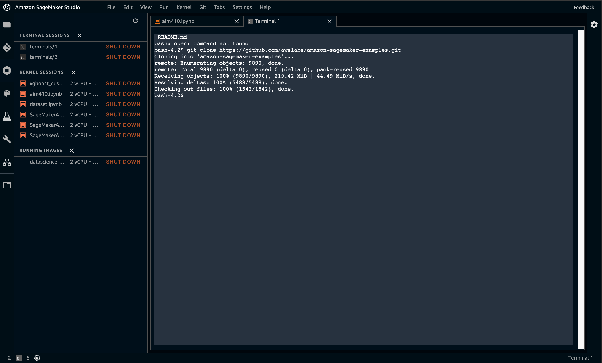

git clone https://github.com/awslabs/amazon-sagemaker-examples.git

clone 받은 파일 중 amazon-sagemaker-examples/sagemaker-debugger/mnist_tensor_plot을 open합니다.

그리고 notebook을 open합니다.

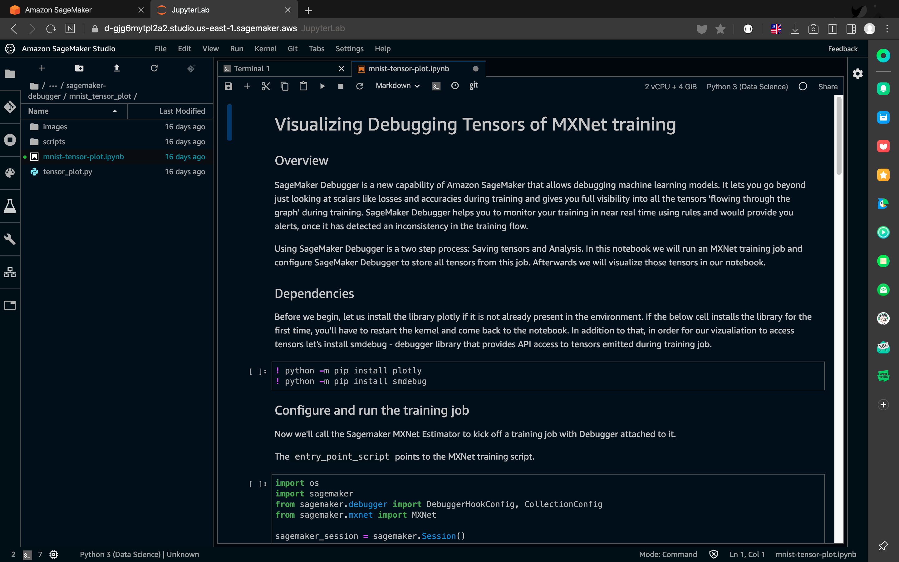

~~~ssh
! python -m pip install plotly
! python -m pip install smdebug
!pip install sagemaker
!pip install awscli
!pip install nbformat==4.3.0
~~~

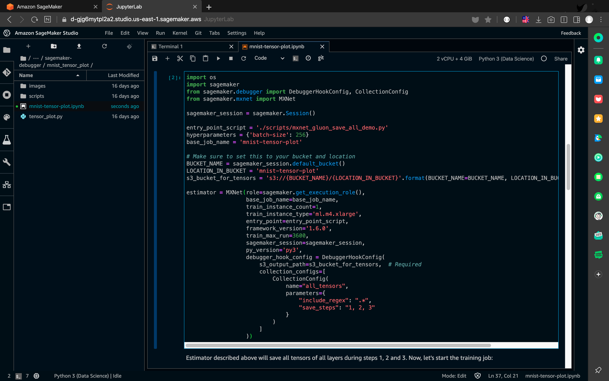

estimator 코드 입니다. training job을 configure하는 부분 입니다.

ml.m4.xlarge로 돌립니다.

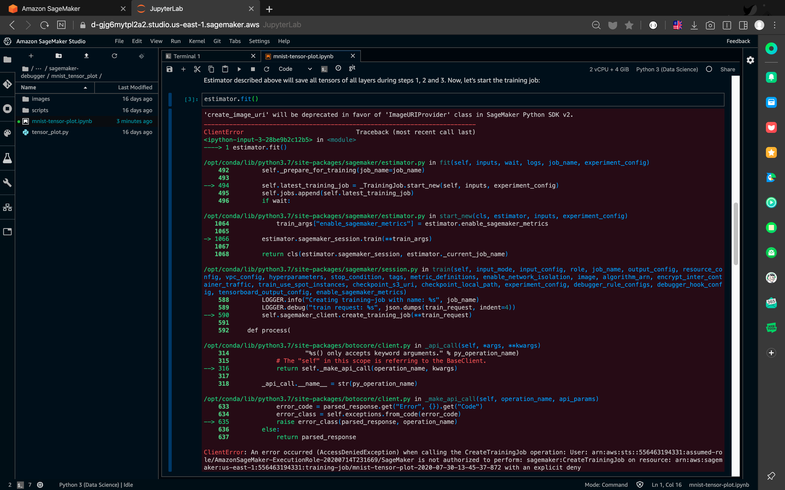

launch를 하였으나 에러가 뜹니다.

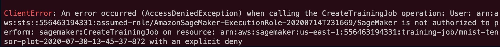

이러한 에러가 뜨네요...

- 경로설정을 잘못하였으니 당연히 에러가 납니다
- S3버킷 경로를 잘 설정해 줍시다.

# 다시

버킷을 새로 생성하여 해보겠습니다.

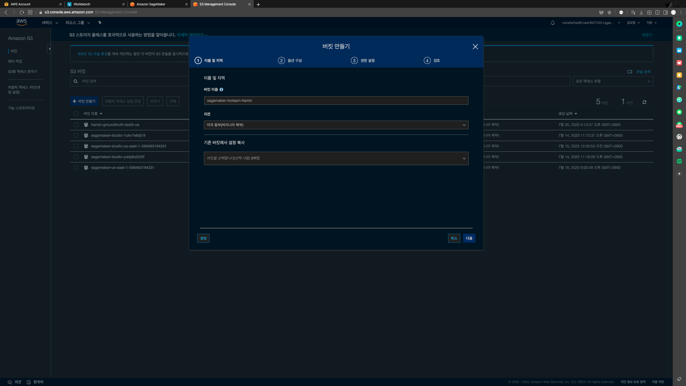

버킷 이름을 위와 같이 설정하고

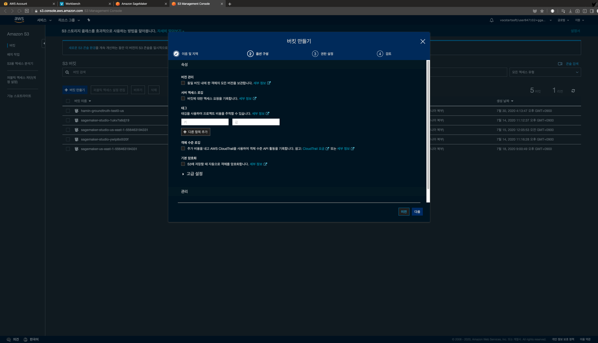

나머지 설정들을 default로 하여 

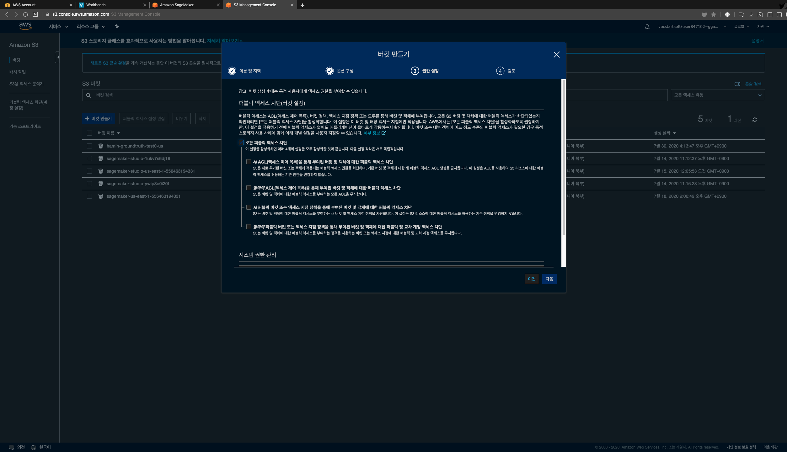

권한설정 역시 default로 합니다.

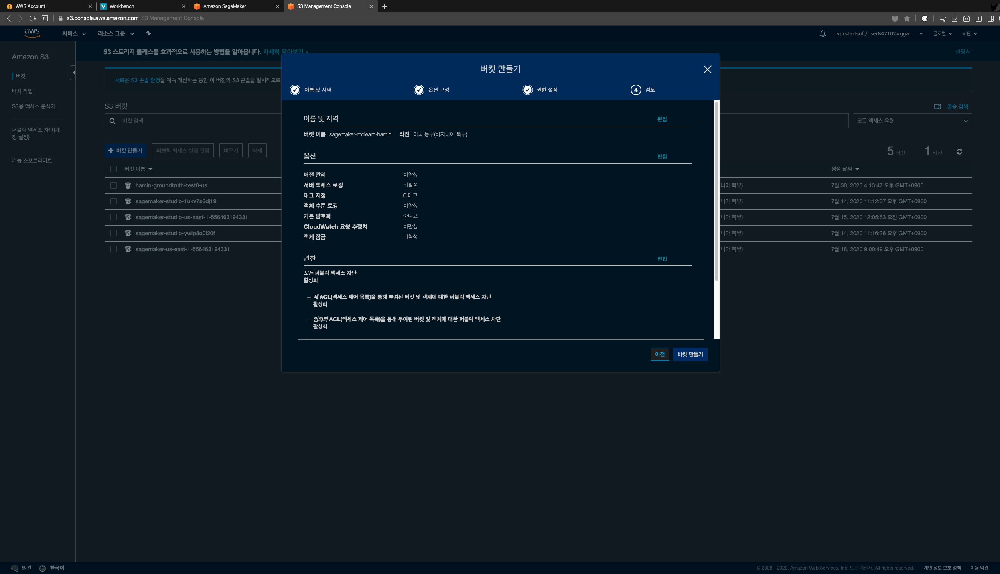

검토 역시 그대로 생성하면 됩니다.

이제 sageMaker notebook을 만들겠습니다.

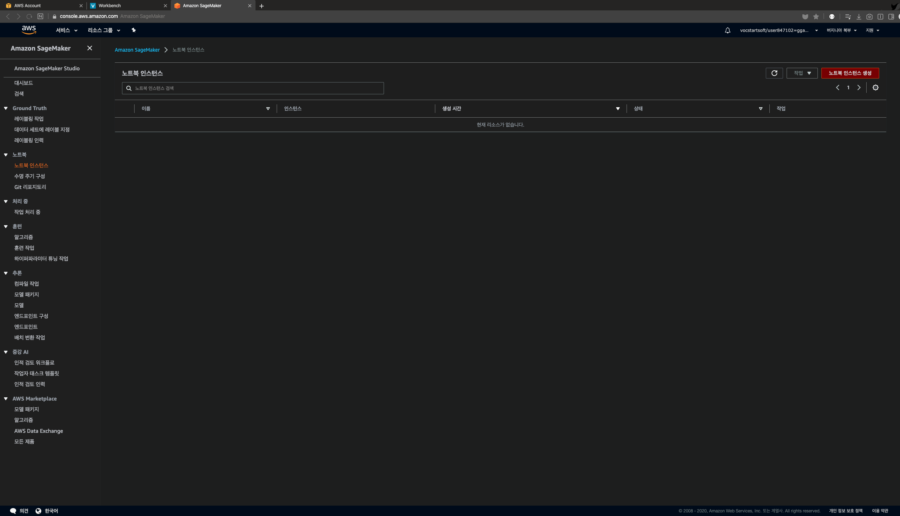

sageMaker의 노트북 인스턴스에서 새로운 노트북 인스턴스를 생성해줍니다.

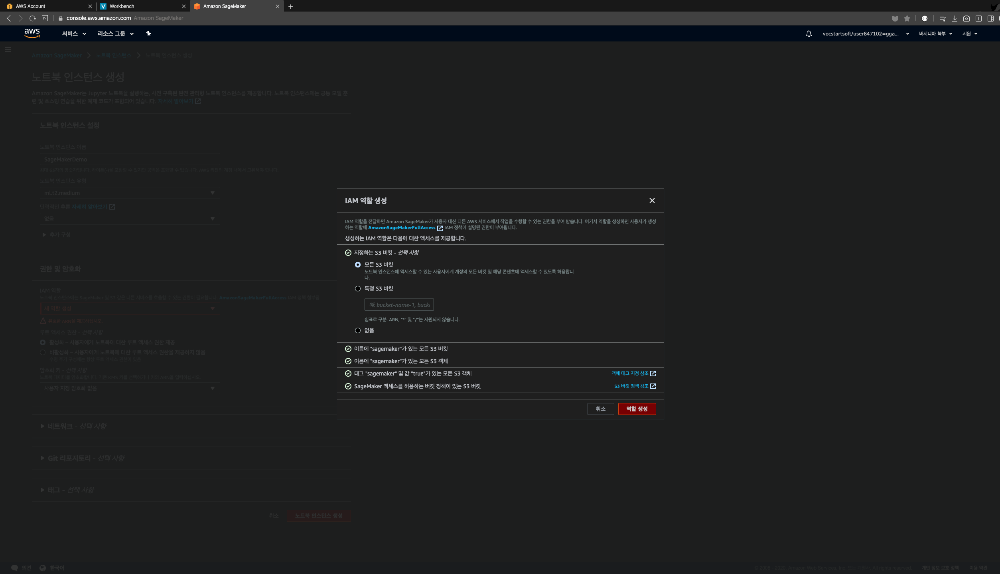

IAM 을 새로 생성합니다.

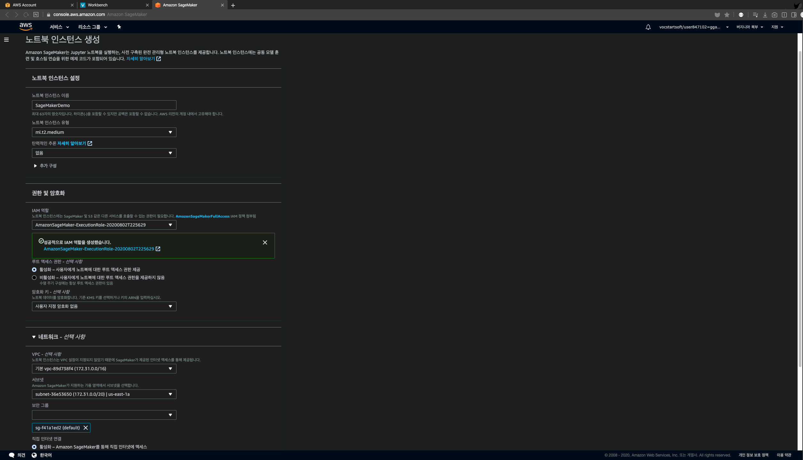

위와같이 세팅하여 노트북을 만들어줍니다.

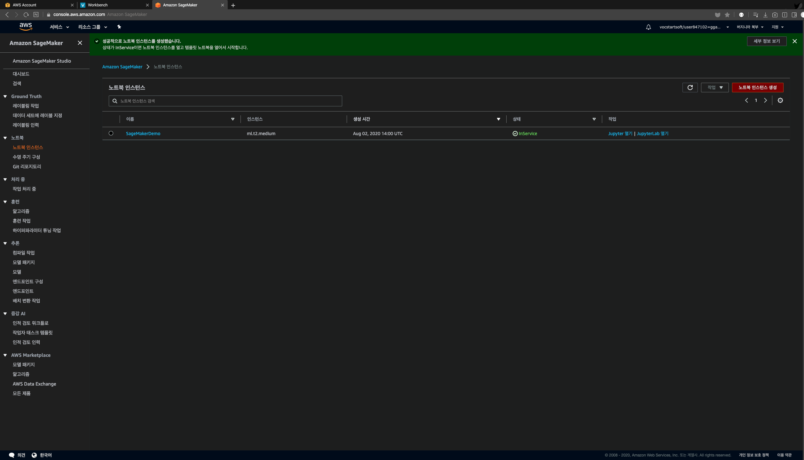

위 처럼 in service가 되면 Jupyter 노트북을 열어줍니다.
그리고 New에서 conda_python3를 만들어줍니다.

10,000개의 MNIST 데이터 세트를 k-mean algorithm을 이용하여 

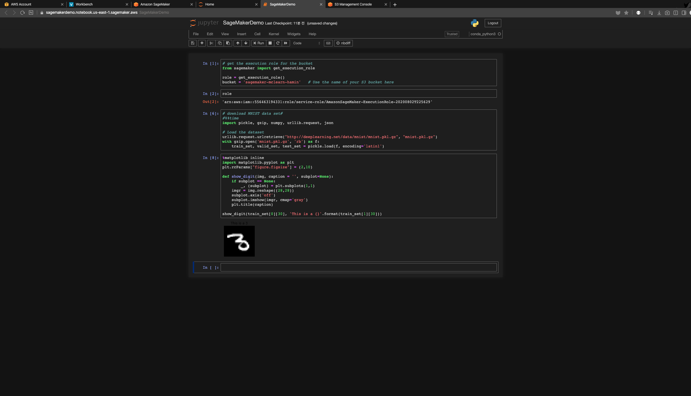

다운로드 받은 이미지들 중 31번째 것이 digit 3입니다

train_set, valid_set, test_set 또한 생성합니다. 이 것들은 numpy array입니다.

aws는 데이터를 record IO protobuf format으로 변환하는 것을 권장합니다.

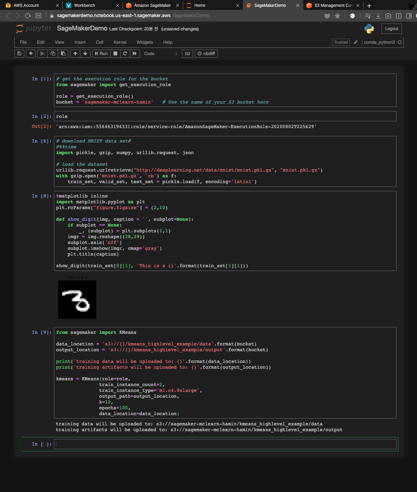

위 코드처럼 하면 sagemaker가 데이터를 record IO protobuf format으로 바꾸는 것을 도와줄 것입니다.

- ml.c4.8xlarge를 이용합니다.

