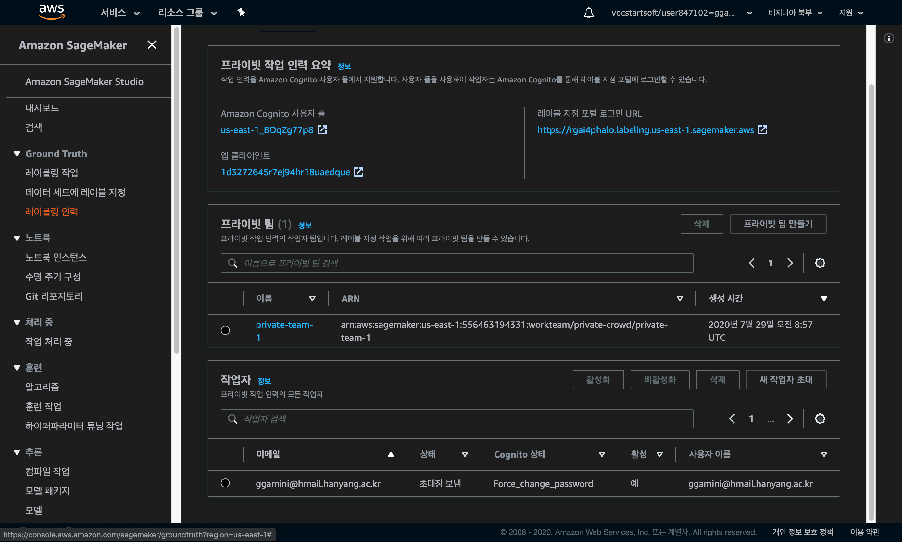
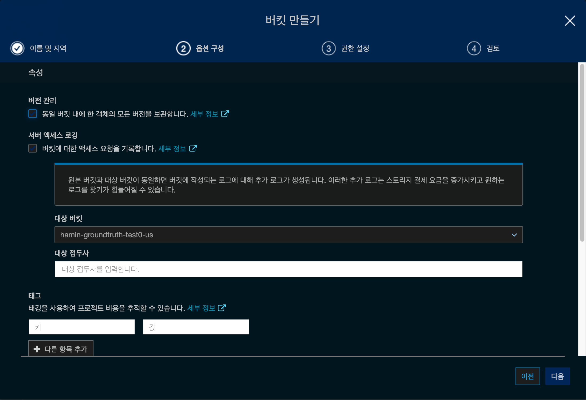

# Amazon SageMaker Ground Truth

## 1. Create workforce

- SageMaker의 Labeling workforce에서 Create private team을 선택해 줍니다.
- 각 항목들을 입력하여 private 팀을 생성해 줍니다.

- private team을 생성하면 다음과 같이 나옵니다.
- 메일로 들어가서 임시 password로 authorize를 해 줍니다.

- 위와 같이 authorized로 바뀝니다.

## 2. Create a labeling job

이제 labeling을 해보겠습니다.

- 레이블 지정 작업 생성으로 들어갑니다.

- s3에 있는 파일로 할 수도, manifest file을 만들 수도 있습니다.

- S3는 다음과 같은 세팅을 하였습니다.

- 해당 버킷에 대한 액세스 요청을 모두 기록합니다.

- 권한 설정도 우선 기본 사항으로 하였습니다.

- 이렇게 S3 버킷을 생성했습니다.
- 그리고 샘플 dataset은 제 마음대로 넣어봤습니다.
- S3 버킷에 파일을 넣고 manifest를 생성해주어야 합니다.

그리고 다시 labeling으로 돌아가