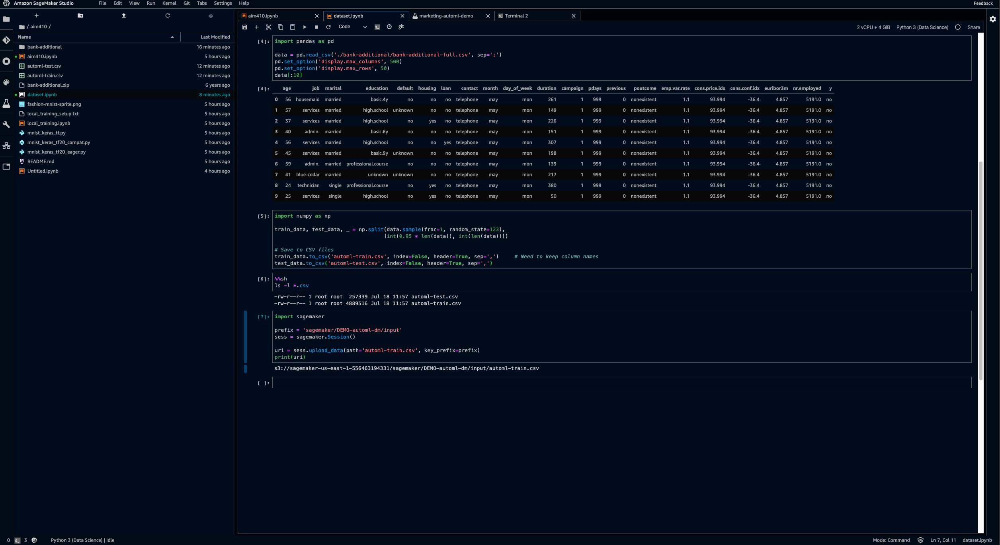
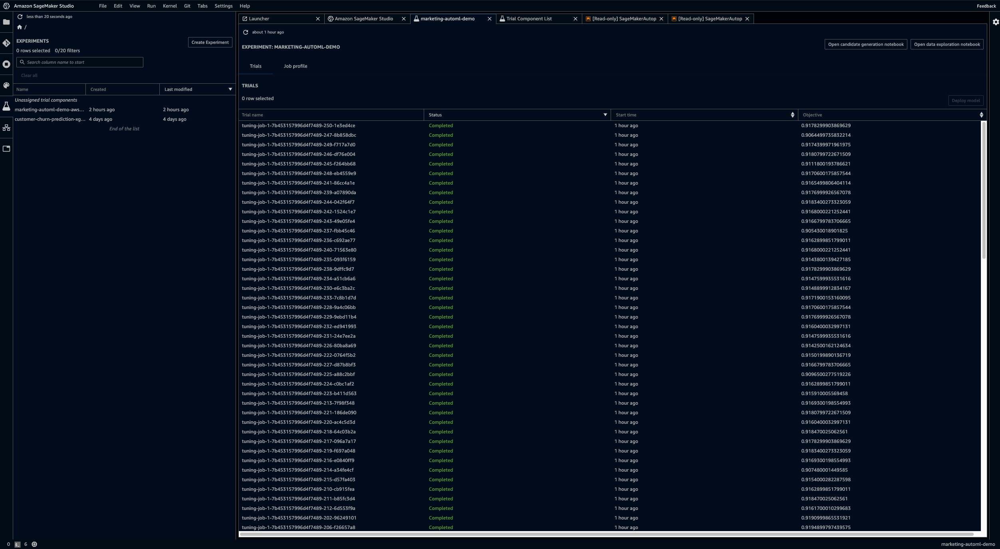
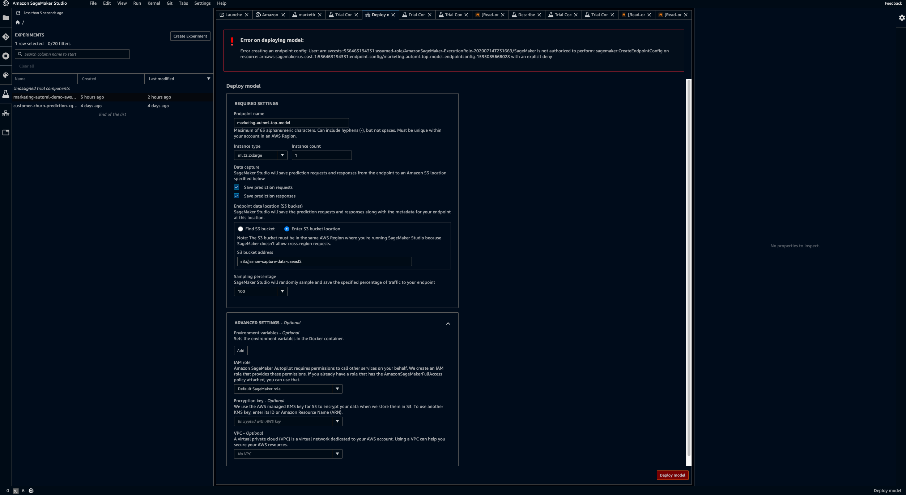
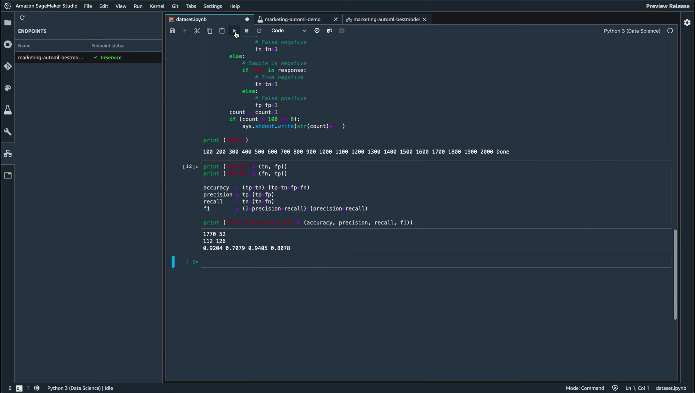

# SageMaker AutoPilot

## 1. 샘플데이터 가져오기
아래 Julien Simon의 GitLab에 있는 Sample 데이터를 사용
SageMaker Studio에 clone하면 됨.

https://gitlab.com/juliensimon/aim410

clone 후 unzip하고 data를 split 하기.

## 2. Experiment create 하기.

## 3. Data가 Analyzing 되길 기다리기.

10분정도 기다려주면 아래와 같이 분석이 끝난다.

## 4. 분석된 자료 보기

### Candidate definition notebook

250가지의 tunning jobs가 가능하다고 합니다.

내려가다 보면 Deploying Best Pipeline도 나옵니다.

weed out bad models를 가능하게 해줍니다.

Full visibility over auto ml process and full control.
cuz we can run and keep teaking.

스냅샷은 아래 경로에 있습니다.

https://d-gjg6mytpl2a2.studio.us-east-1.sagemaker.aws/jupyter/default/lab?sagemaker-share-id=tXzeKtCu8A-_pWCPDu0UiYqXsGR5Dy35WUzWzC-TrTI%3D

### Data exploration

스냅샷은 아래 경로에 있습니다.

https://d-gjg6mytpl2a2.studio.us-east-1.sagemaker.aws/jupyter/default/lab?sagemaker-share-id=qf65Fz7RRR2fhF4UoJ3SI3GDVzIhMsOw2I0i9d5a1C4%3D

## 5. Feature Engineering.

더 기다리면 feature engineering이 마무리됩니다.

candidiates는 combination of a pre-processing and algorithm.

mostly we have XJ boost

based on 10 candidates.

notebook run about 250 jobs in a row, parallelizing that stuff.

We are trying to tune 10 models, it's only 25 attempts for per model.

이런식으로 계속 experiment trial 중 입니다.

Deploy model을 누르면 deploy 가능합니다.

하지만 model들이 completed 될 때까지 기다리는게 좋습니다.

250 jobs들이 completed 될 때 까지 기디립니다.

https://d-gjg6mytpl2a2.studio.us-east-1.sagemaker.aws/jupyter/default/lab/workspaces/auto-E

## 6. Model Tuning.

30분? 정도 기다리면 위와같이 튜닝이 끝납니다.

위의 튜닝은 candidate에 있는 것들을 한 것입니다.

trial component에 들어가면 trial component list가 나오는데 그중 가장 objectiveMetric 값이 높은것을 택합니다. (Table Properties의 Type filter에서 Training job만 선택하여 볼 수 있음)

(Metrics의 objectiveMetric을 체크하여 보아도 됨)

가장 높은 것을 우클릭하여 open in trial details를 누릅니다.

그러면 위와 같은 창이 뜹니다.

여러개를 골라 add chart할 수도 있습니다.

그러면 위와 같은 차트를 그릴 수 있습니다.

각 trial들의 cross validation을 알 수 있습니다.

## 7. Deploy 하기

하나 골라서 deploy model을 눌러줍니다.

deploy 해주면

위와 같은 에러가 뜹니다.

저는 S3가 구축되지 않았기 때문이죠.

제대로 구축하고 기다려 주면

이렇게 inService가 됩니다.

이렇게 setting들도 볼 수 있습니다.

notebook으로 돌아가서 

## 8. 참고자료

AWS re:Invent 2019 - AI/ML recap - Part2: Amazon SageMaker (튜토리얼)

https://medium.com/@julsimon/aws-re-invent-2019-ai-ml-recap-part-2-amazon-sagemaker-fee83f05a1bc

Documentation

https://docs.aws.amazon.com/sagemaker/latest/dg/sagemaker-dg.pdf#whatis

Amazon SageMaker Autopilot – Automatically Create High-Quality Machine Learning Models With Full Control And Visibility

https://aws.amazon.com/ko/blogs/aws/amazon-sagemaker-autopilot-fully-managed-automatic-machine-learning/

Amazon SageMaker Studio: The First Fully Integrated Development Environment For Machine Learning

https://aws.amazon.com/ko/blogs/aws/amazon-sagemaker-studio-the-first-fully-integrated-development-environment-for-machine-learning/

Dataset.ipynb (예시 코드)

https://gitlab.com/juliensimon/amazon-studio-demos/blob/master/dataset.ipynb

Julien Gitlab (예시)

https://gitlab.com/juliensimon/amazon-studio-demos/blob/master/dataset.ipynb

내가 한 분석 링크 (로그인 안하면 접근 불가?)

https://d-gjg6mytpl2a2.studio.us-east-1.sagemaker.aws/jupyter/default/lab/workspaces/auto-E

SageMaker 개발자 리소스

https://aws.amazon.com/ko/sagemaker/developer-resources/

한글 참조 자료

https://docs.aws.amazon.com/sagemaker/index.html

영어 Documentation

https://docs.aws.amazon.com/sagemaker/latest/dg/whatis.html