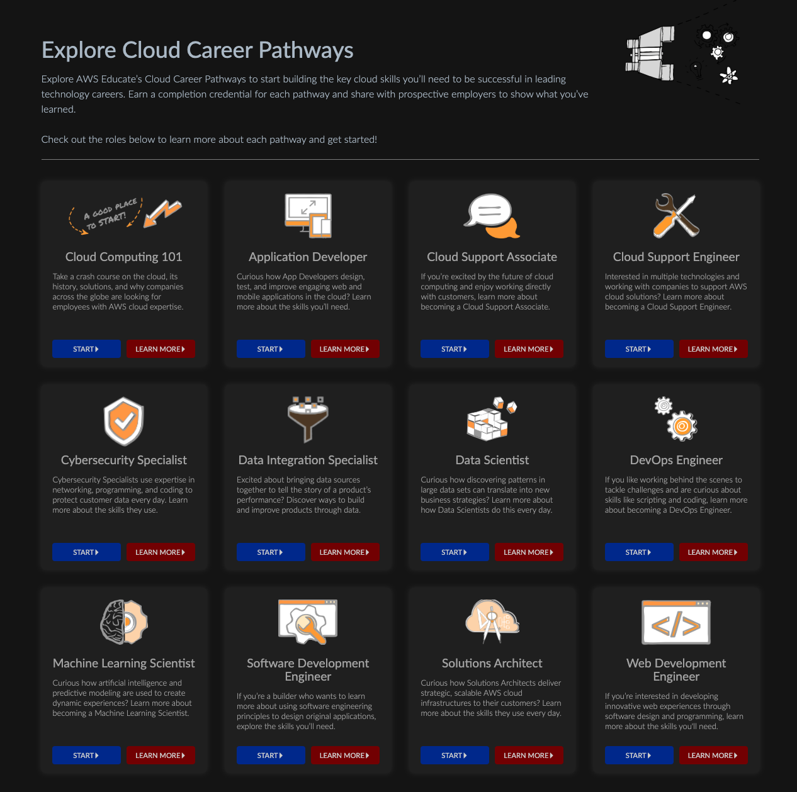
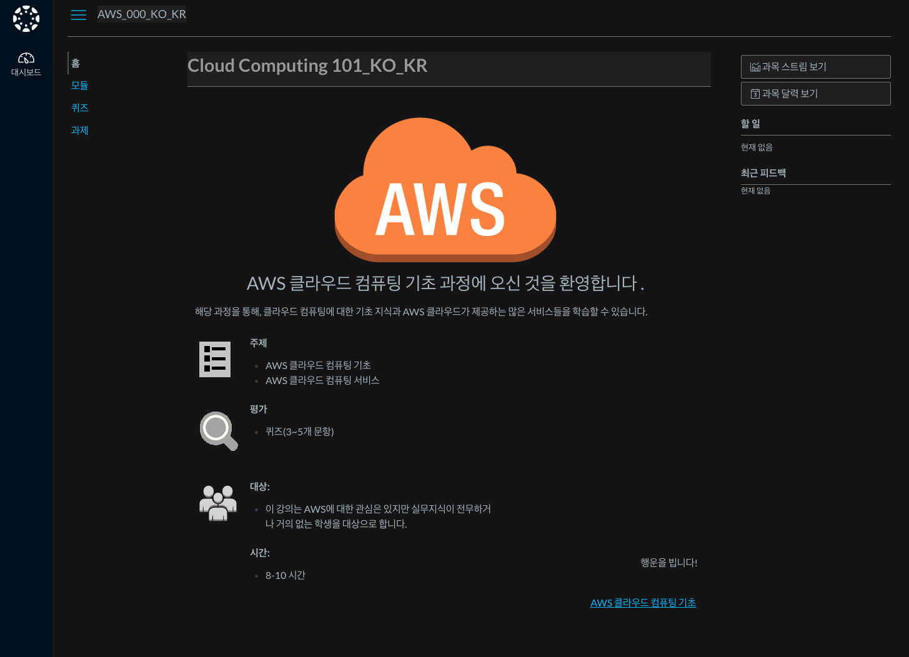
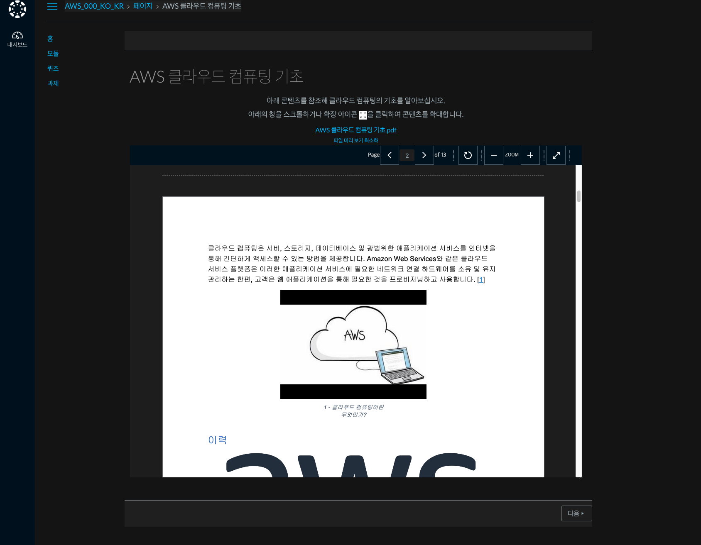
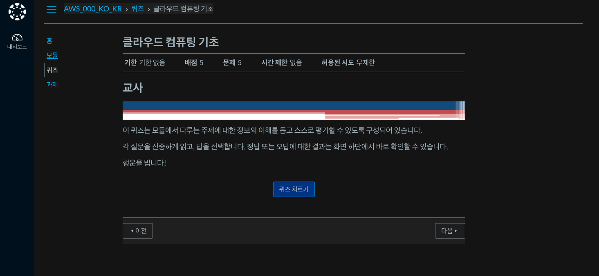
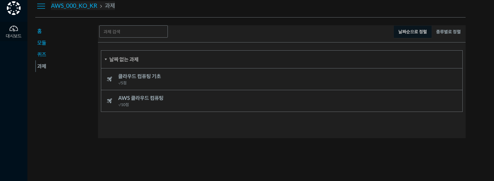
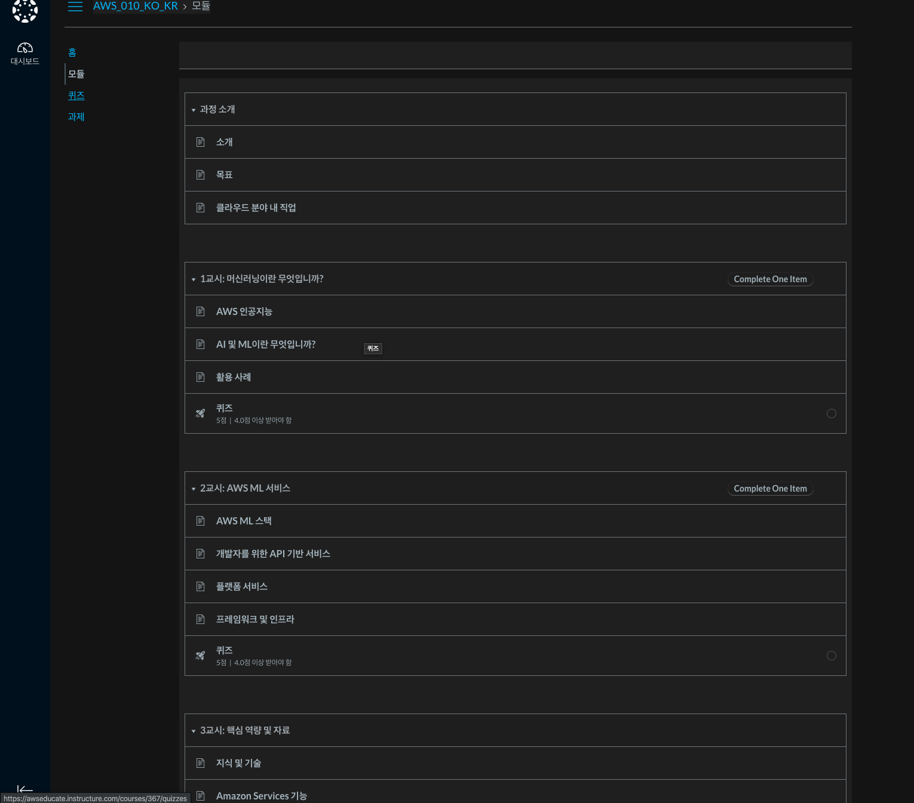
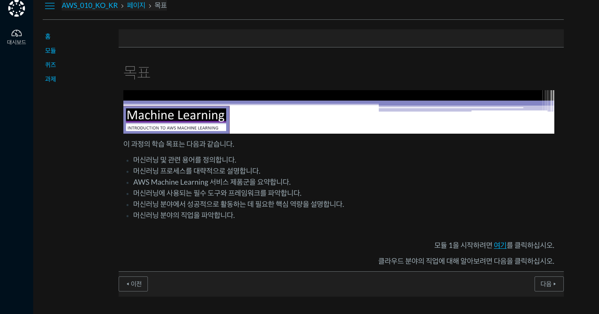
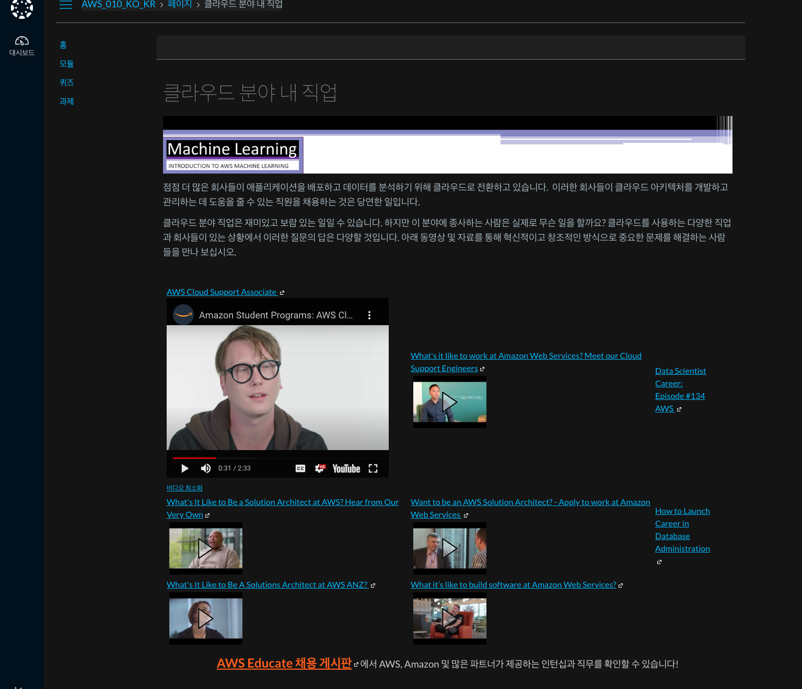
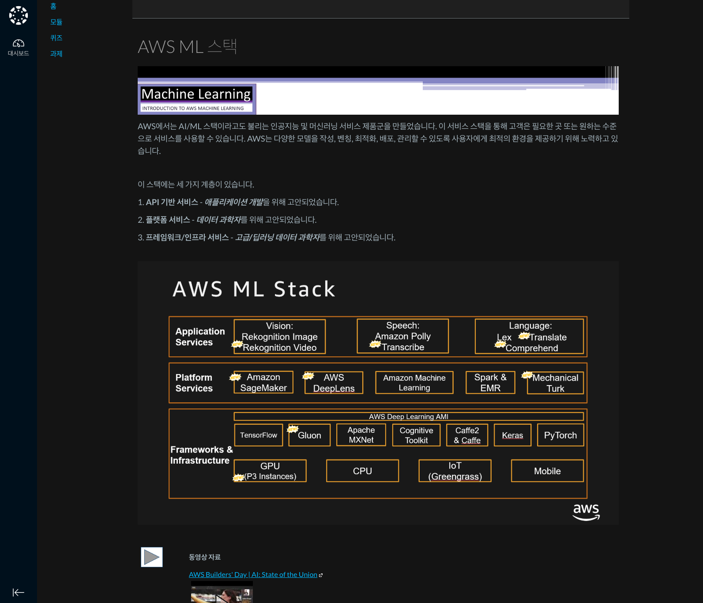

AWS Educate Starter Accounts and_AWS Services.pdf 바탕
해당 문서는 크게 aws educate에서 활용할 수 있는 기능들(1~3p.)와 classroom(4~5p.)로 구성되어 있음.

일단 aws 계정 승인 시간 약 하루정도 걸리는 것 같고, aws educate에 가면 제한된 기능들을 쓸 수 있는 것으로 보임.
각각의 기능들을 서치해서 누르면 해당 기능을 분석? 실행할 수 있는 대쉬보드가 각각 열리는 것 같습니다.

그리고 pathways라는 메뉴항목이 있는데 해당 항목이 문서에서 제시하는 classroom과 같은진 모르겠습니다.
해당 코스들은 아래 보이는 것과 같이 12개 정도의 코스로 이루어져 있는데 해당 항목별로 학습시간이 짧은건 8시간, 긴건 40시간 정도로 이루어져있음

클래스 룸에 들어오면 아래와 같은 화면

기능에선 ec2, classroom에선 AWS Cloud Basics, Machine Learning and AI, Serverless Computing

소웨공 -> API Gateway, EC2, Lambda(Serverless), RDS, Route 53, S3, 
인공지능 -> sageMaker

약간 당황스러운 점은 강의가 아니라 pdf라는거..?

퀴즈도 있다!

과제도 있다!

Machine Learning 강의로 가보자

대략 이런 순서다

목표로 들어가면

당황스럽게도 모듈1을 보기 위해 클릭하면 에러가 난다

여기는 그나마 동영상들이 있다. 현업자들이 어케 이용하는지에 대한 것 같다.

