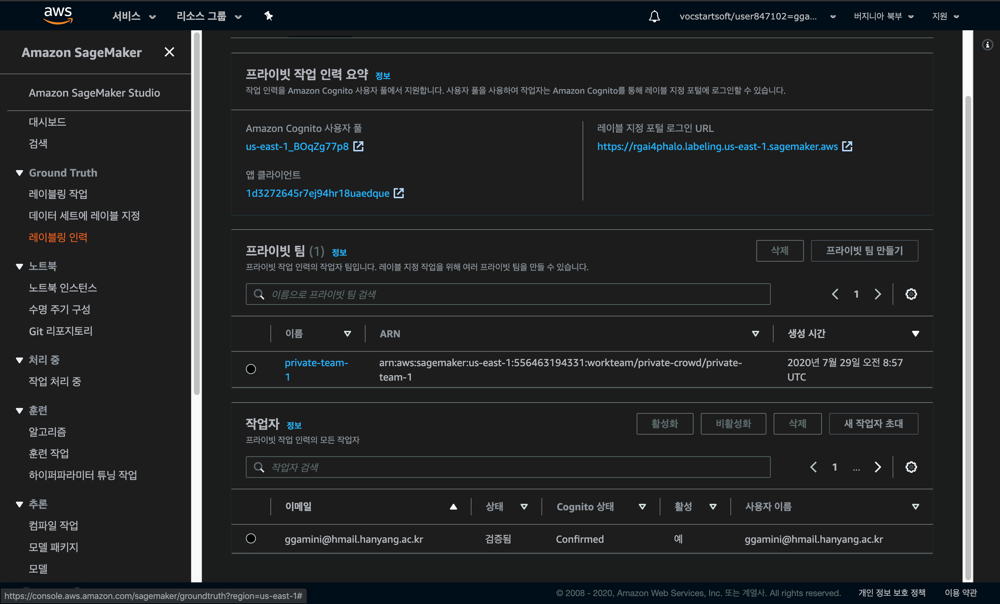

# Amazon SageMaker Ground Truth

## 1. Create workforce

- SageMaker의 Labeling workforce에서 Create private team을 선택해 줍니다.
- 각 항목들을 입력하여 private 팀을 생성해 줍니다.

- private team을 생성하면 다음과 같이 나옵니다.
- 메일로 들어가서 임시 password로 authorize를 해 줍니다.

- 위와 같이 authorized로 바뀝니다.

## 2. Create a labeling job

이제 labeling을 해보겠습니다.

- 레이블 지정 작업 생성으로 들어갑니다.

- s3에 있는 파일로 할 수도, manifest file을 만들 수도 있습니다.

- S3는 다음과 같은 세팅을 하였습니다.

- 해당 버킷에 대한 액세스 요청을 모두 기록합니다.

- 권한 설정도 우선 기본 사항으로 하였습니다.

- 이렇게 S3 버킷을 생성했습니다.
- 그리고 샘플 dataset은 제 마음대로 넣어봤습니다.
- S3 버킷에 파일을 넣고 manifest를 생성해주어야 합니다.
- manifest 만들기는 다음을 참고합니다

https://docs.aws.amazon.com/ko_kr/sagemaker/latest/dg/sms-data-input.html#sms-console-create-manifest-file

https://docs.aws.amazon.com/sagemaker/latest/dg/sms-getting-started-step1.html

- manifest는 샘플들을 리스팅하는 json 파일인데 docs와 다르게 manifest 없이도 할 수 있도록 되어있습니다.
- 하지만 저는 manifest를 직접 만들어 해보았습니다.

그리고 다시 labeling으로 돌아가

- 이런식으로 세팅을 해 줍니다

- dataset이 이미지들 이므로 task category는 image, task selection은 semantic segmentation으로 해보겠습니다.

다음으로 넘어가서

- private으로 세팅해 줍니다.

- 이런식으로 예시가 나옵니다
- 구분해야할 물체를 최대한 구체적으로 명시해줍니다.

- 생성 버튼을 눌러주면 다음과 같이 labeling job이 생성 됩니다.

- 들어가보면 작업 중인 사진들이 보입니다.
- 시간이 좀 걸리니 기다려야 합니다.

- 결과물을 보려면 console로 들어가야 합니다.

- 오른쪽의 레이블 지정 포털 로그인 URL로 들어가면 됩니다.

- 들어가면 다음과 같은 화면이 나옵니다.
- start working을 들어가면

- 다음과 같은 화면이 나옵니다.

- 이런식으로 지정해줍니다
- 그리고 submit을 해줍니다.

- 이번엔 auto segment 기능을 이용해보겠습니다.

- Labels에서 해당되는것을 클릭후 최하단, 최상단, 좌우 끝 네 지점을 지정해주면 auto segmenting이 실행됩니다.

- 이런식으로 잘 지정이 됩니다.

- 다른 차들도 해줍니다.

- 다른 요소들도 해줍니다.

- 다 해줍니다.

- 모두 마무리하면 이런 화면으로 넘어갑니다.

- cloud watch에 들어가면 실행한 log를 볼 수 있습니다.

- S3의 output에 들어가면 결과물이 들어있습니다.

- 결과물들은 이곳에 있습니다.

- 이런식으로 있습니다.

- 이곳에 가면 output의 경로를 볼 수 있습니다.

- 이런식으로 잘 labeling이 되어있습니다.

결과물을 보면

이 사진의 경우

이런식으로 라벨이 붙어있습니다.

# 이미지 분류 (다중 레이블)

- 이번엔 이미지 분류 다중 레이블로 해보겠습니다

위에 했던 방식과 똑같이 해주면

이렇게 워크 포털이 나옵니다
들어가서

지정해 주면 됩니다

계속 지정해 주면 됩니다

작업이 끝났습니다

결과물을 보면

이 사진의 경우

이런식으로 사람, 자동차, 버스, 나무, 신호등의 label이 붙습니다.

이러한 라벨들을 다른곳에 활용할 수 있을 것입니다.