# 딥러닝 개요와 최신 연구 트렌드 그리고 네이버 클로바 AI

## 하정우 팀장님

- 앨런 튜링

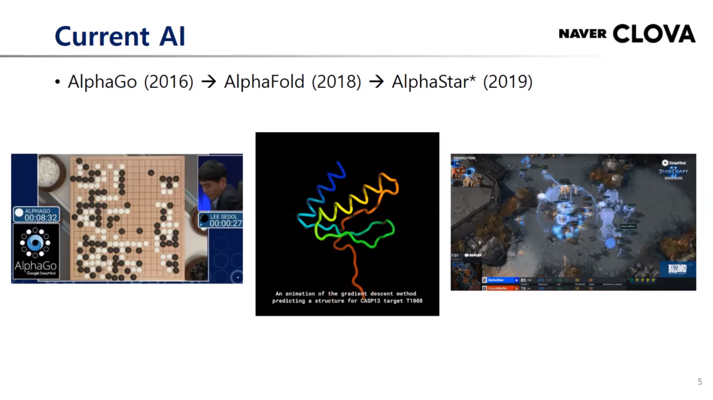
## 현재의 AI
- GauGAN (Nvidia)
- AlphaGo (2016) -> AlphaFold (2018) -> AlphaStar (2019)

## 퍼셉트론
- 여러가지 인풋들이 주어지고 vias라는 텀이 주어짐
- 가중치 주어짐
- 스텝 펑션 통과해서 특정값보다 크면 1 작으면 0 출력

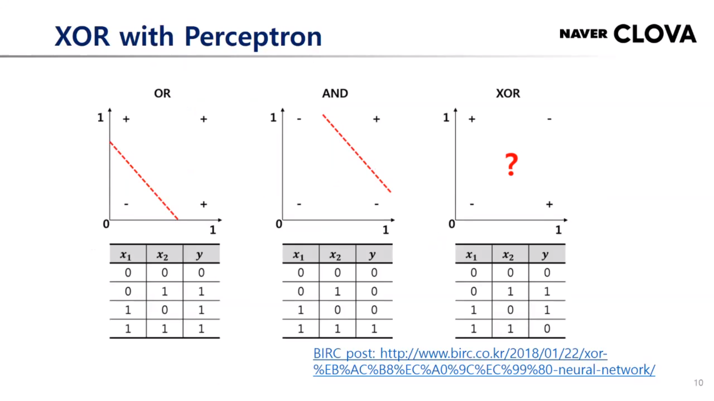
- 퍼셉트론의 문제는 xor 계산 불가
- +와 - 구별 불가 (비선형 분리 불가)

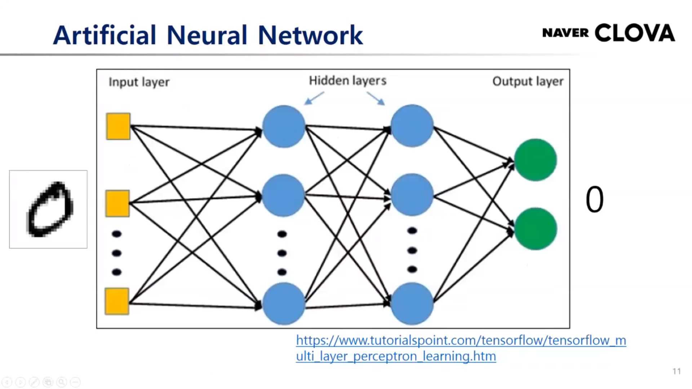
- 그것을 해결하는 방법이 멀티 레이어 뉴럴 네트워크
- 기존의 비선형 분리가 안되었던 문제를 해결

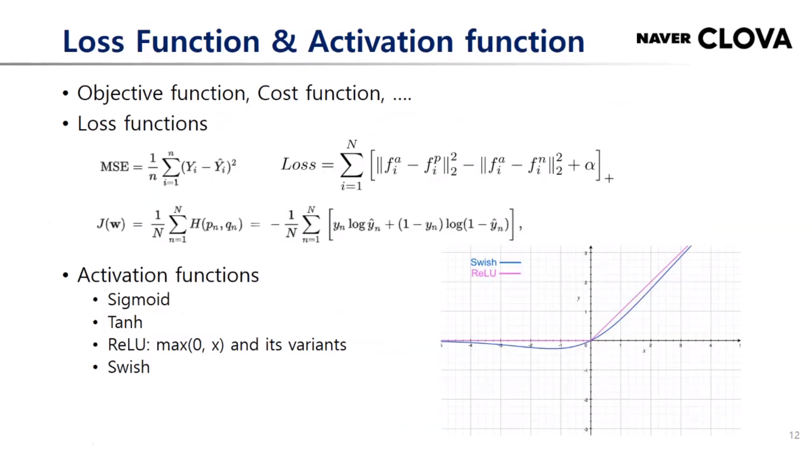
- 오브젝트 펑션과 코스트 펑션

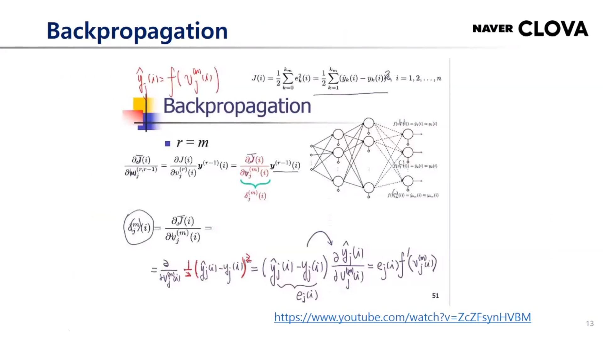
- 수식 유도 외우기..
- Backpropagation : Loss function을 줄이는 방향으로 생각…weight를 조금 바꿨을 때, Loss function이 얼마나 많이 줄게 만들것인가?

- Gradient Descent : weight가 아랫 방향으로 가는것
- optimum 두 개 있음.

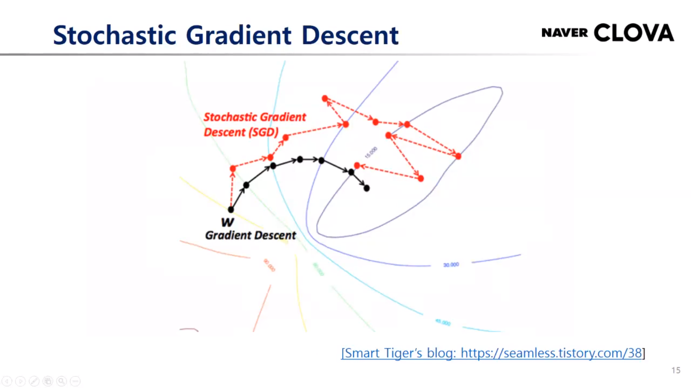
- Gradient Descent가 처음 위치 잘못 잡으면 불리해지는 점 개선하기 위해 만든 것이 Stochastic Gradient Descent

- 보통 이미지 백본을 학습시킬 때에는 SGD 사용
- GAN이나 Segmentation이나 Detection에는 Adam 많이 사용
- SGD가 파라미터 잡는 것이 민감하고 쉽지 않기 때문.

- 의미를 가진 개체가 산술 연산 가능

- CNN은 주로 이미지 인식 시

- RNN : 시퀀스 데이터를 어떻게 잘 학습할 것인가.

- 파랑 - 인코더, 빨강 - 디코더
- 층을 늘림
- 성능 증가

- Self-attention : RNN을 모두 대체중인 이 모델은 position encoding 을 함.
- long dependency 모델링에 용이
- 자연어 처리 "attention is all you need"

- Variational Autoencoder : encoder 와 decoder 사이에 변화를 넣음. 훨씬 더 안정적임.

- GAN : latent vector와 noise를 넣어서 image를 만들어도 원래 이미지와 discriminator가 구별을 못하도록 학습시키자

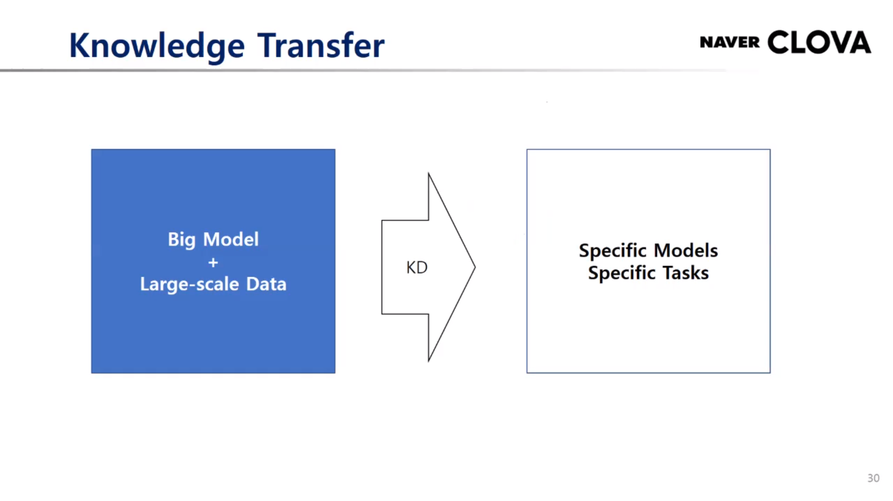
- 최근 트렌드 : 큰 모델을 데이터를 엄청 많이 넣어서 엄청 성능이 좋은 모델을 만든 다음 여기저기 사용

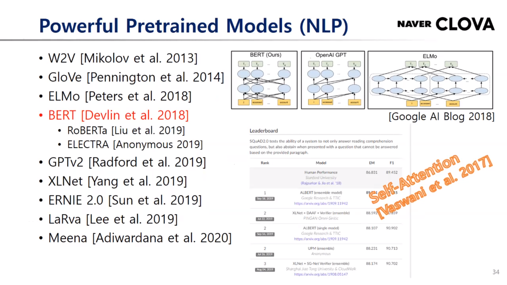
- Self-supervised : label이 없어도 데이터 안에서 학습을 하는 방법
- supervised constrstive : label 정보를 positive pair, nagative pair 만들 때 사용

- 심심이류의 인공지능
- 모델 엄청 크고 데이터 많을수록 좋음!

- 모델링을 해주는 머신러닝 알고리즘

- AutoML 을 시용적 관점에서 가장 실용적으로 쓸 수 있는 부분!

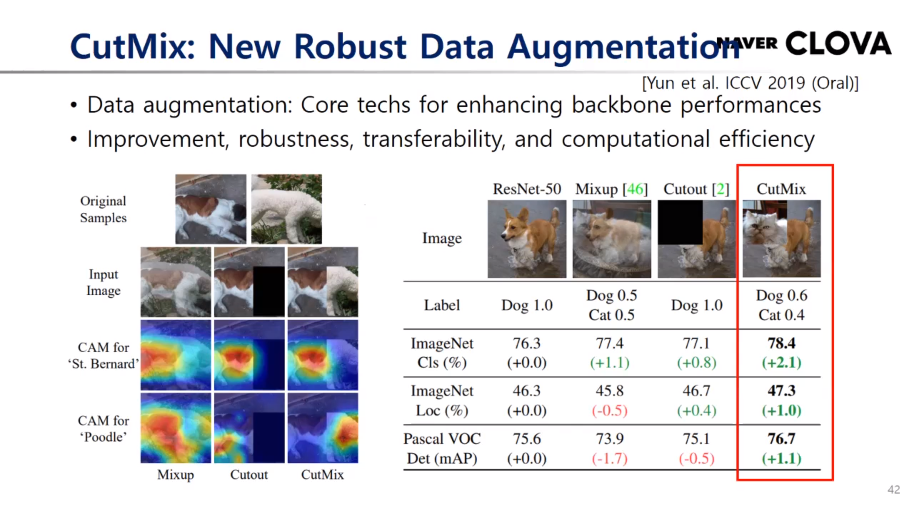
- 이미지 백본 트레이닝에서 regularizer를 잘 활용하는것이 중요

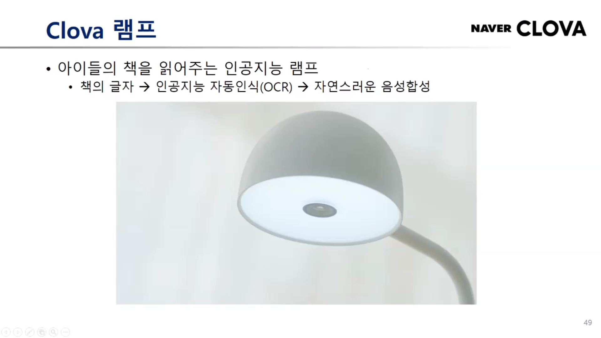
- OCR 이용한 Clova 램프 -> 앵간하네

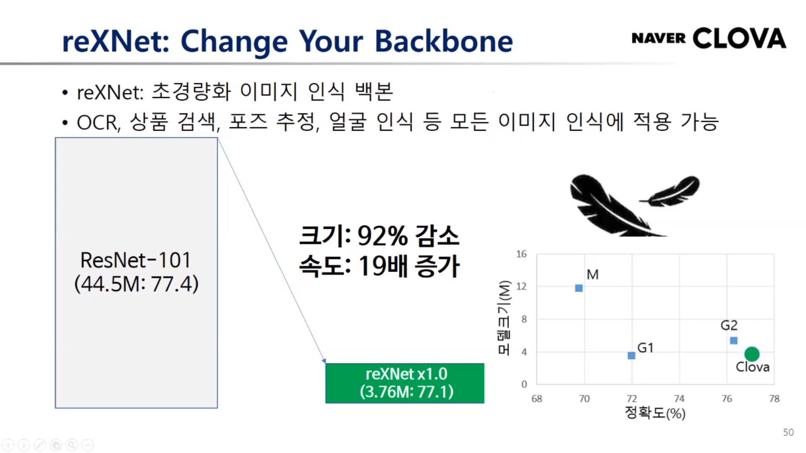
- reXNet : 이미지 인식 백본

- starGAN : 이미지 소스 하나 추가해주면 그것과 비슷하게 스타일링 해주는 것

- 데이터 증강 기법
- 기존에는 classification류 밖에 없었음

- clova 더빙
- clova speech
- LaRva
- AI_Call
- ClovaCall