# Problem Solving Revisited

## 장의선 교수님

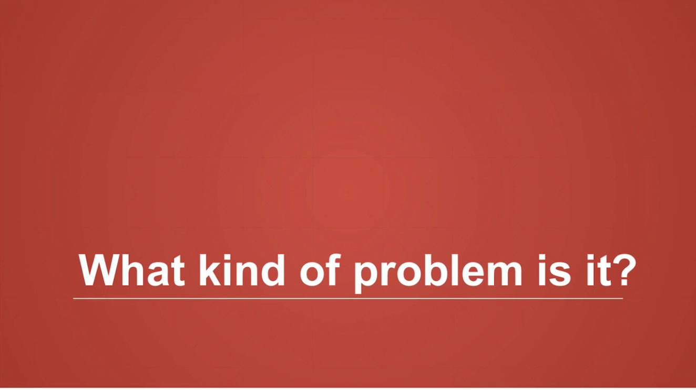

- 문제 해결 전략에 대해

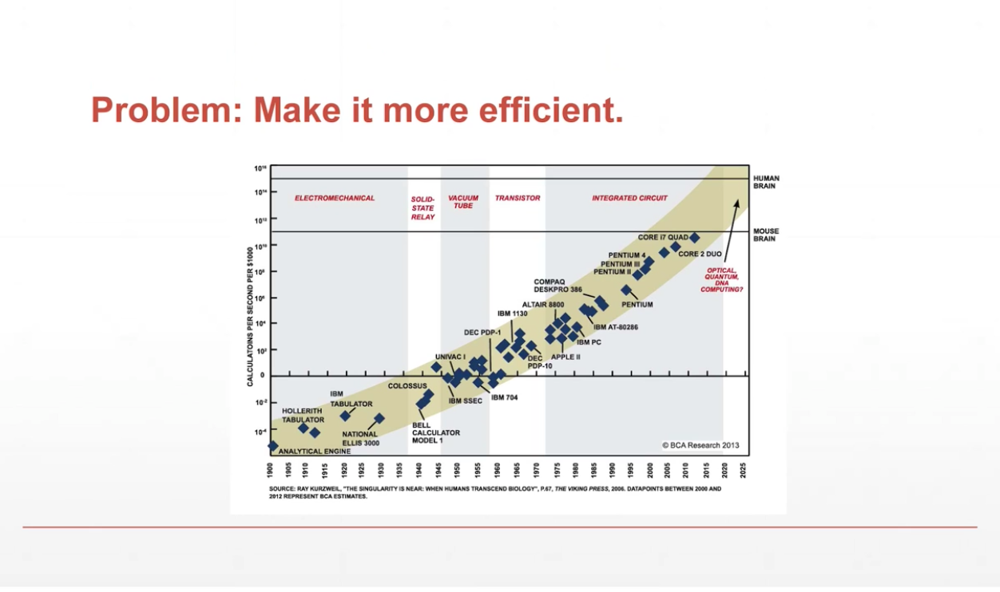

- x축 연도, y축 1000불을 내고 1초동안의 계산 횟수.
- Colossus, DEC, 등등 메인프레임들
- 최근의 컴퓨터들과 PC들은 혁신이 적은 것이 문제.
- 성능을 향상시키거나 같은 성능을 더 싸게 만들거나
- 또는 기존의 기기와 더 잘 호환이 되느냐
- 공학은 efficiency를 따지는 학문

- 번호표는 시스템을 바꾸는 개선
- 개선보다 성능 올리는 것이 더 쉬움

- 문제는 알아 내야 한다는 것
- 문제의 예 : 단면의 간격이 detection을 어렵게 할 수 있다.

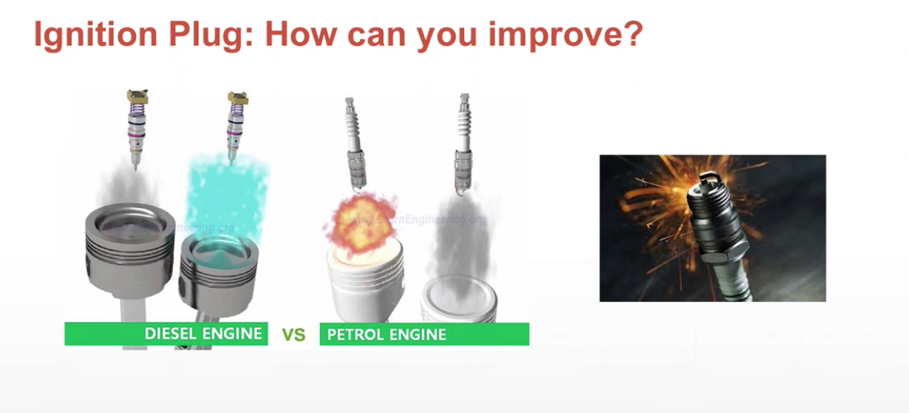
- 디젤엔진에는 점화 플러그가 필요 없지만 가솔린 엔진은 필요하다
- 점화 플러그 사이 공간이 메워져 버리면 전기가 흘러버려 고장남
- 계속 쓰면 그을음 (숯)이 쌓여서 공간을 메워버림. -> 쇼트남

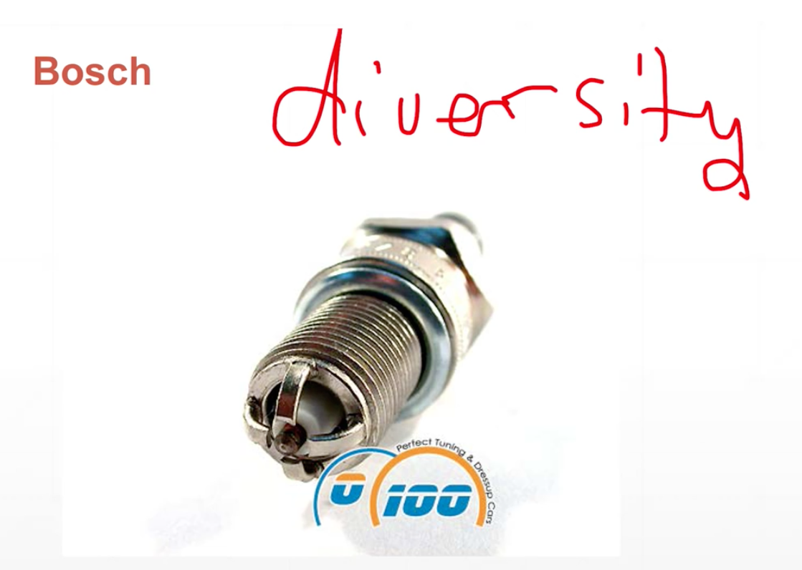
- 보쉬가 플러그 네개를 만들어서 보완함

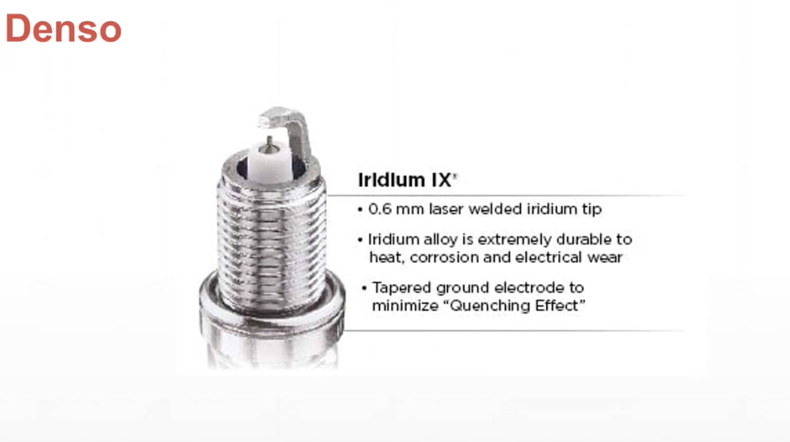
- Denso는 전극을 이리듐을 사용하여 보다 더 얇게 만듬
- 얇게 만들면 그을음이 잘 안쌓임

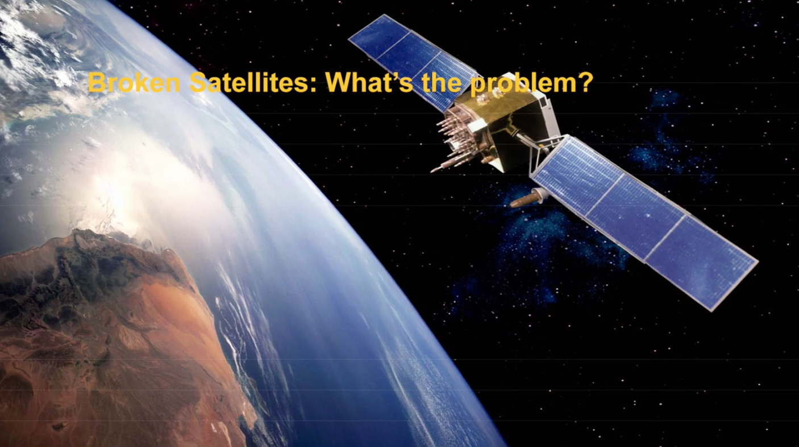
- 인공위성에 구멍들이 생김
- 상공에는 진공이라고 가정함
- 하지만 아주 작은 입자들 존재, 그리고 위험함
- 입자들 시간당 수백 키로미터 이동
- 정지위성이 지구와 동일한 속도로 회전 즉, 시속 수천키로미터로 가고 있음

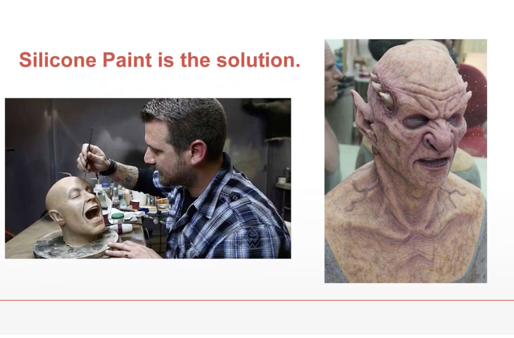
- 미국 나사의 해결책 - 실리콘 페인트 사용

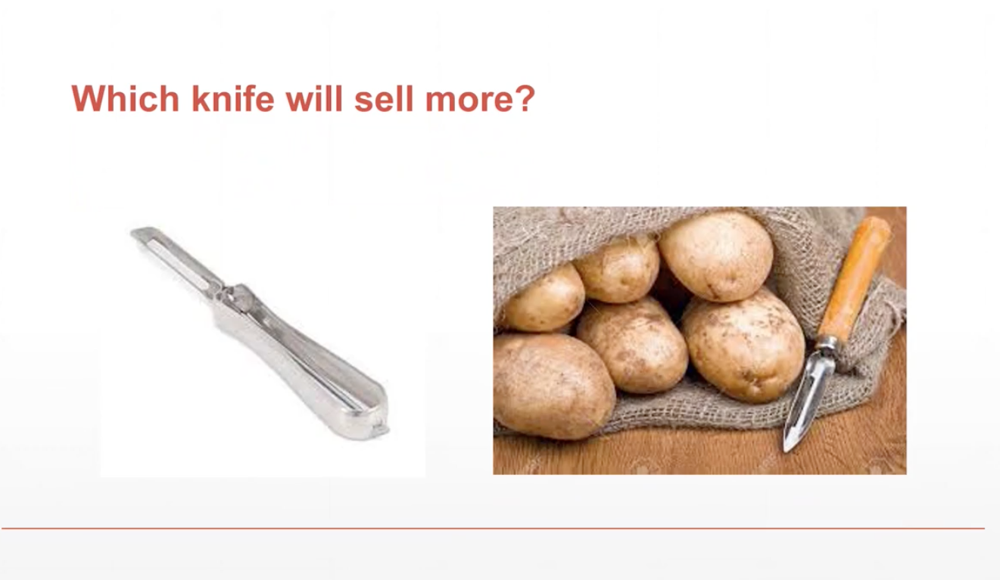
- 어느 칼이 더 잘 팔릴까?
- 감자 껍질과 비슷한 색의 칼은 감자 껍질로 착각하여 버려짐
- 더 잘팔림

- 문제의 6가지 공통점

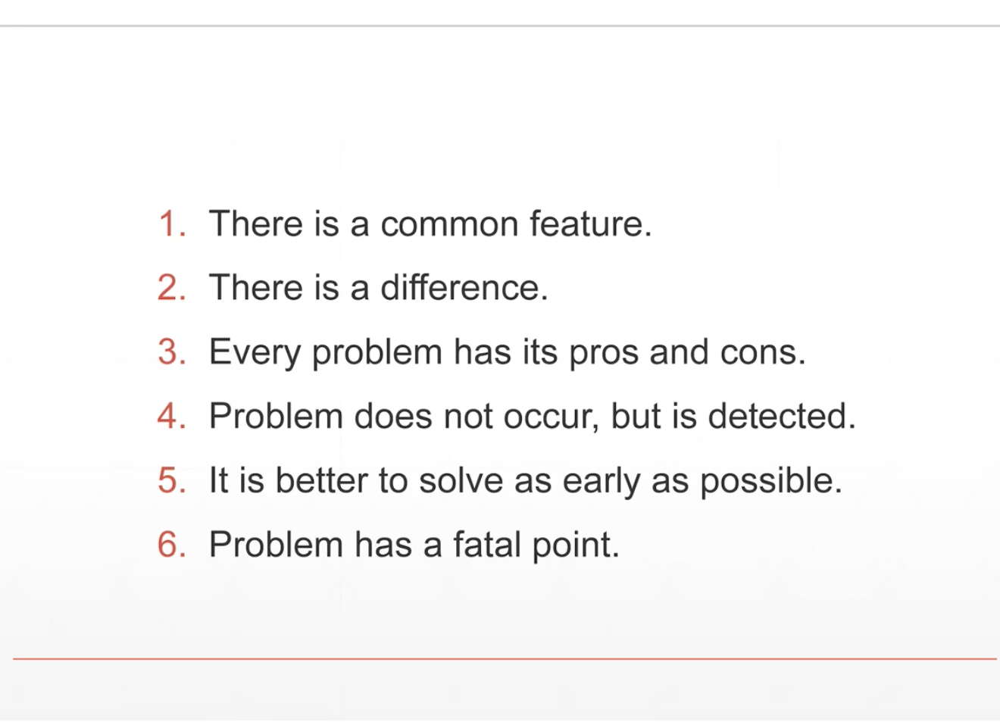
- 공통점 6가지!

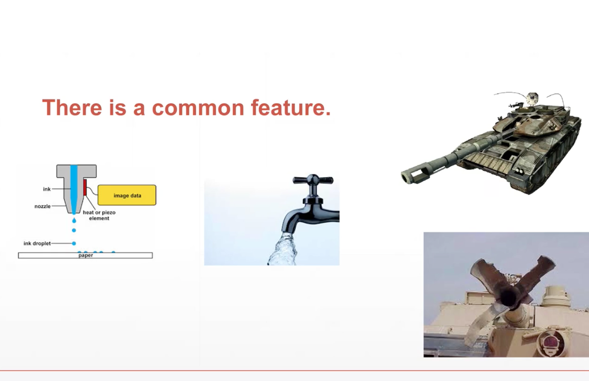
- 탱크 - 수돗꼭지와 비슷
- 대포 끝에 공기가 통할 수 있는 구멍이 있음 - 열이 빠져나감
- 탱크에 적용 되었던 기술을 수돗꼭지에 적용
- (잉크 젯) 프린터에도 적용
- 잉크가 퍼지지 않도록

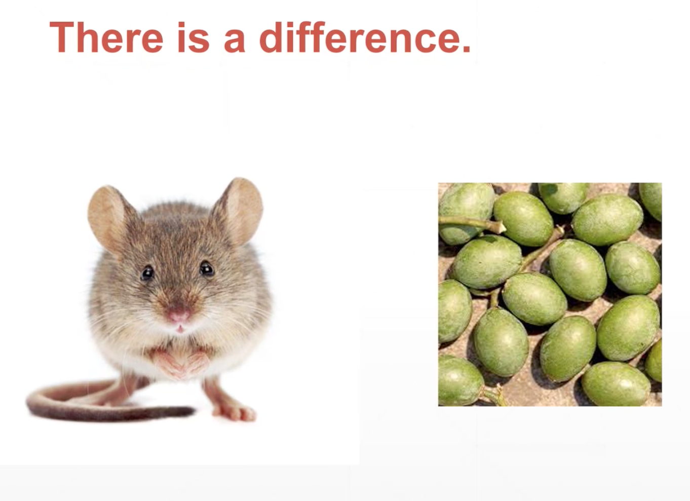
- 쥐로 임상 실험
- 같은 콩이라도 차이점 있을 수 있다 (쥐에게는 독, 사람에겐 살찜)

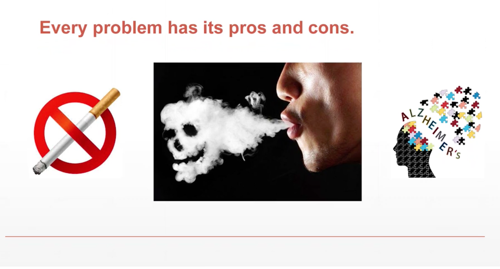
- 담배 필 수록 알츠하이머 병 확률 적음
- 다르게 해석 -> 담배 피는 사람은 알츠하이머 걸리기 전에 죽음
- 인과관계와 상관관계는 다르다

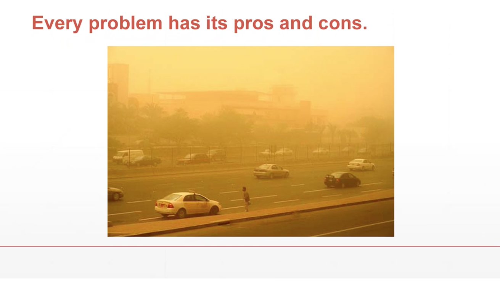
- 황사 덕분에 우리나라의 토양을 알칼리성으로 만들어줌

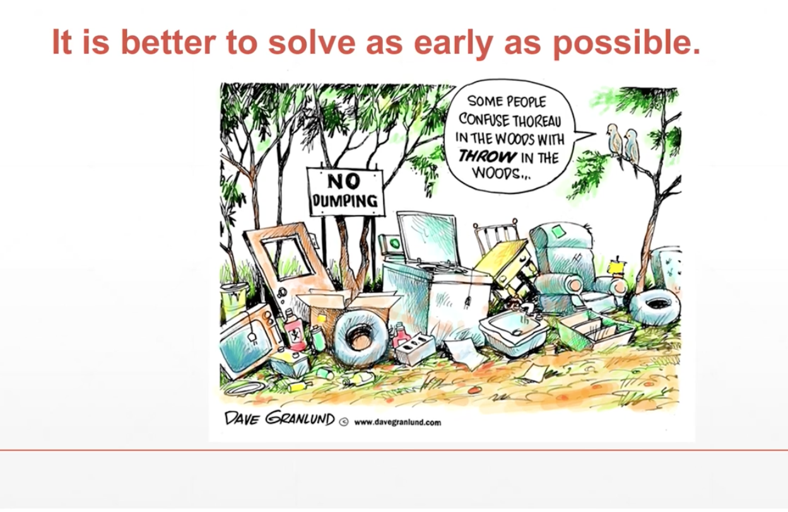
- 문제는 빨리 해결할수록 좋다.

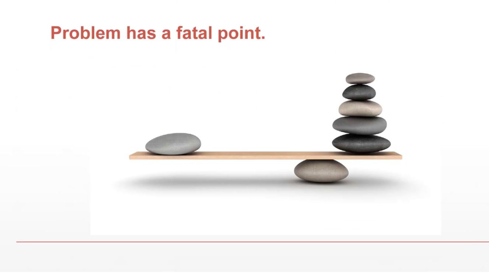
- 문제의 핵심적 요소를 찾는것이 문제 해결의 가장 중요한 요소

- 핵심이 상황이나 경우에 따라 달라진다
- 핵심이 무엇인지 파악하는것이 중요하다