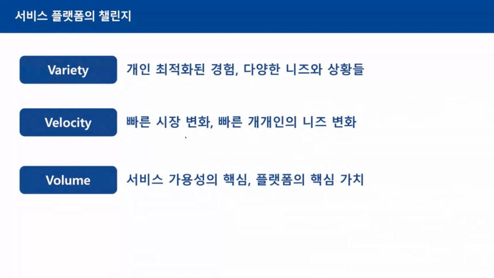
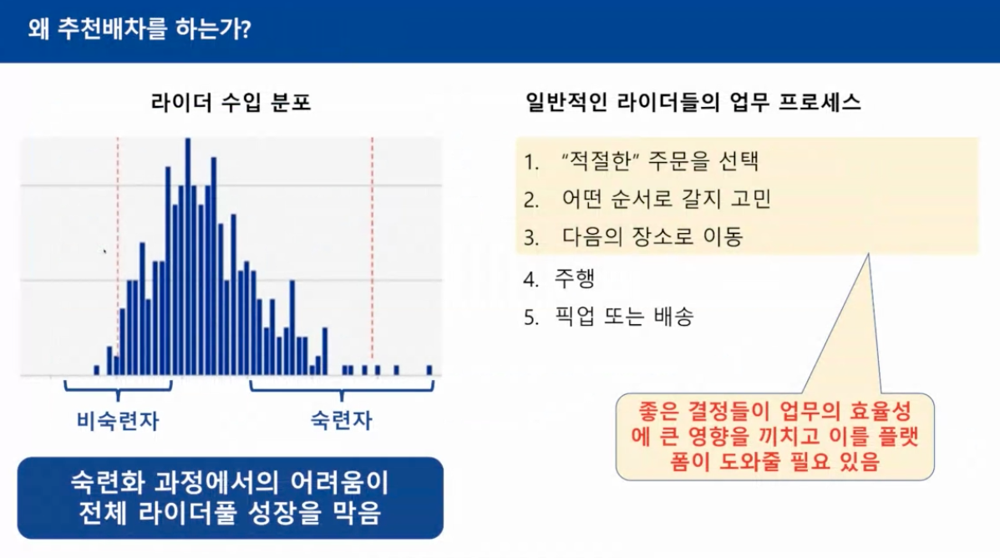
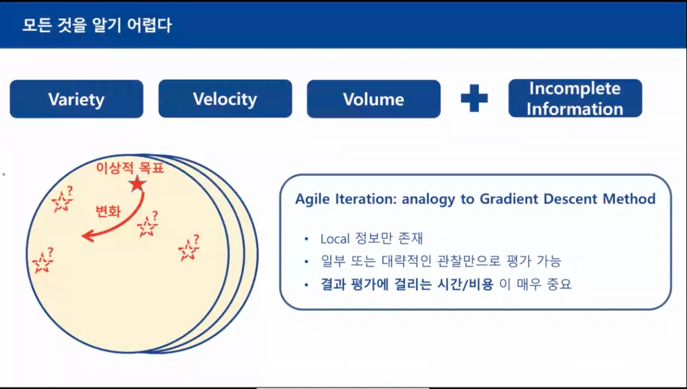
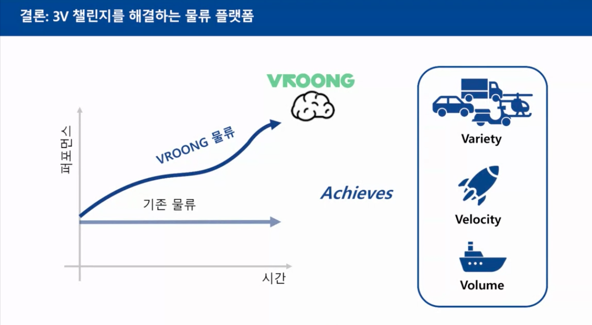

# Data Science and AI in Mobility service industry

- 다양한 채널을 온디맨드로~
- 소비자가 변화하니 생산자도 변화함

- 롱테일 경제학의 추세

- 플랫폼으로 발전할 수 밖에

- 코어소비자와 롱 테일 소비자
- 사용자를 플랫폼에 유지하는것이 중요

- 니즈 변화를 빠르게 대응해 줘야함
- 세가지를 모두 서포트 하는 것이 중요
- 사람 많이 써서 하는게 아니라 경제적으로! 해결해야

- 다양성이 4차 산업혁명 시대의 핵심

- 플랫폼의 참여자 유지가 중요!

- 주문도 이제 빠른 배송으로~

- 운송 수단도 다양해짐

- 근무 형태도 다양해짐
- 본인들이 원하는 스펙트럼에서 근무
- 어떻게 다양한 노동력을 잘 담아, 앤드 유저에게 좋은 경험을 드릴까

- AI랑 데이터 사이언스로 세가지 미션을 어떻게 경제적으로 풀 것인가가 중요한 포인트

- 기사님이 고르는게 아니라 ai가 배정해 줌 (추천 배차)

- 거부여지를 남겨둠으로써 개발자의 개선 고민 여지를 둠

- 왜???
- 데이터 사이언스가 동기부여, 중요성, 객관화의 요소가 됨

- 라이더들의 수입 분포가 다양함
- 업무 효율성을 높여주기 위하여
- 라이더 풀이 빠져나감 (어려워서ㅠ)
- 플랫폼이 라이더를 도와주어 플래폼에 남아있게 하자!

- 여러가지 방향성이 존재
- 일단 기사님들이 쓸만하다고 느끼는것이 중요
- 과거에 기사님들은 어떻게 선택했을까?

- 안전 중요

- 모든것을 알기 어려움
- 목표가 빠르게 변함
- 설정하기 더 어려움
- 애자일하게 해야함!
- 전체를 보고 하는게 아니라 일부 정보만을 보고 해야하기 때문에 
- 생산성!!이 가장 중요

- 애자일한 이터레이션의 예시
- 완벽함보다 "빠름"이 중요

- 해상도를 낮춰서 일단 보고 재밌어 보이면 해상도를 높여서 기다려서 보는 것
- 전체적인 그림 먼저 찾고 필요한것 고고

- 사람은 더 창의적인 리서치에 집중
- 더 나은 서비스에 집중

