# 기계학습을 위한 확률 통계

## 노영균 교수님

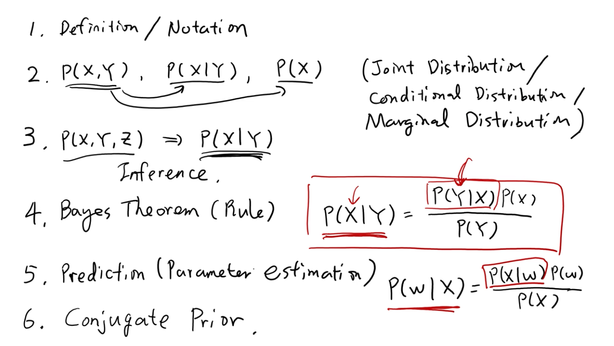

## 1. Definition / Notation

## 2. P(X, Y), P(X | Y), P(X)
- Joint Distribution
- Conditional Distribution
- Marginal Distribution

## 3. P(X, Y, X) => P(X | Y)
- Inference 

## 4. Bayes Theorem (Rule)

P(X | Y) = P(Y|X) * P(X) / P(Y)

## 5. P(X | w) 데이터를 주어졌을때 파라미터를 알아낸다 -> 학습
Parameter prediction -> Parameter estimation 필요 
어떤 w가 많이 나올까가 궁금한 것

P(w | X) = P(X | w) * P(W) / P(X)

## 6. Conjugate Prior

# 1. Notation
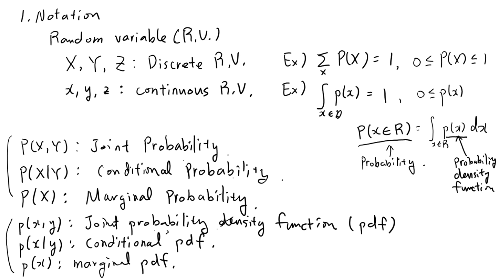
## Random variable : 이벤트마다 숫자가 주어지게 하는 것.
- X, Y, Z : Discrete Random Variable
- 0 <= P(X) <= 1
- x y, z : continuous R.V.
- P(x) 전체 적분 == 1
- P(R) 
- 확률과 확률 밀도함수 잘 구별할 것
- 확률 밀도함수를 적분한 것이 확률

- p(X, Y) : joint probability
- P(X | Y) : conditional probability
- P(X) : Marginal Prob
- p(x, y) : Joint probability density func (pdf)
- p(x | y) : conditional pdf
- p(x) : marginal pdf 

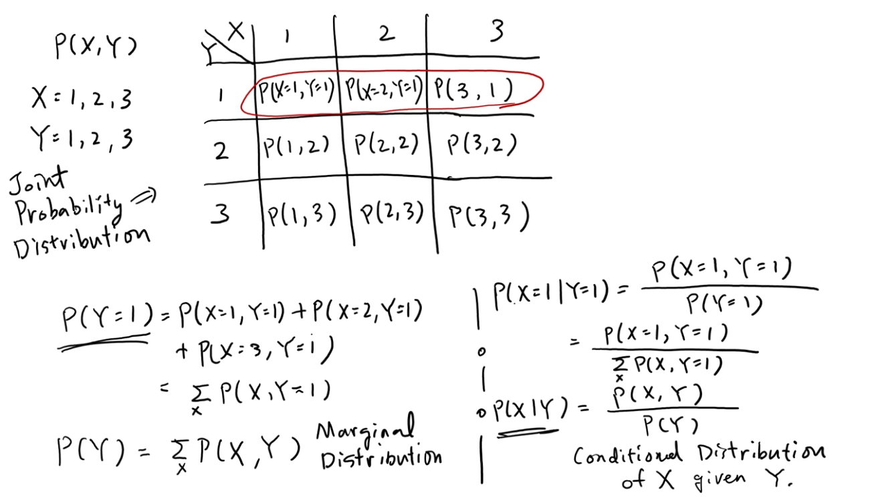
- 그렇다고한다.. 그냥 고등학교 확통..

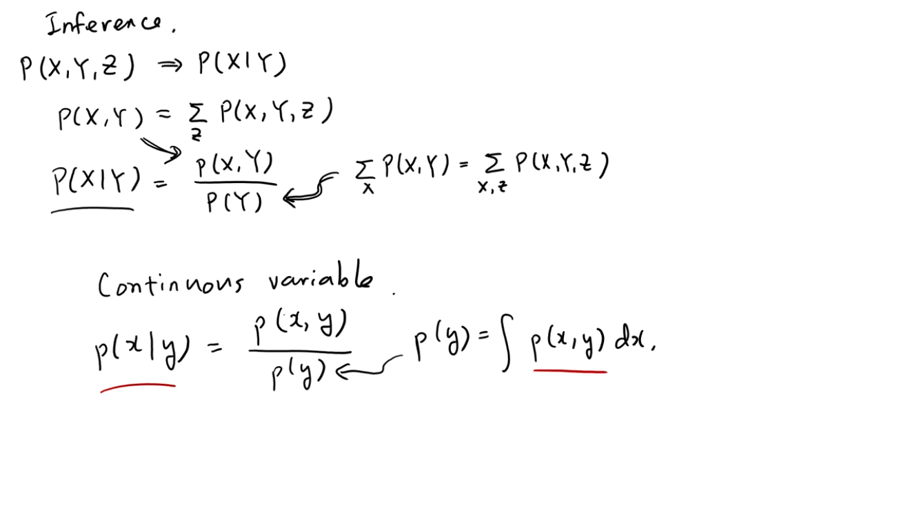
- 그렇다고 한다..

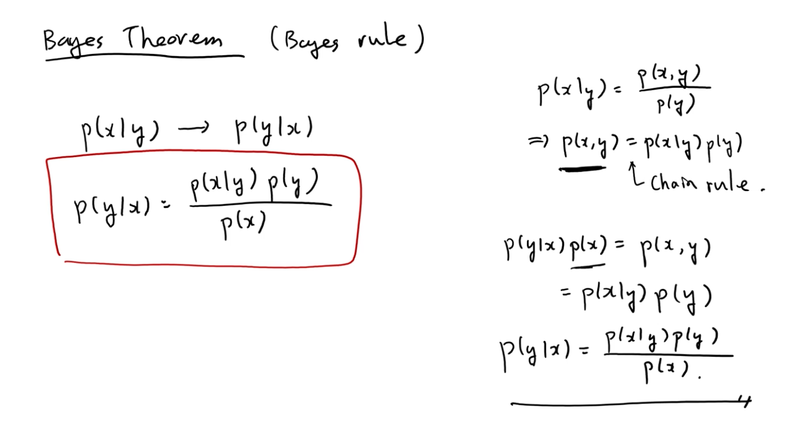
## Bayes Theorem (Bayes rule)
- Joint distribution을 Conditional distribution과 Marginal distribution으로 나타내는 것을 chain rule이라고 함.

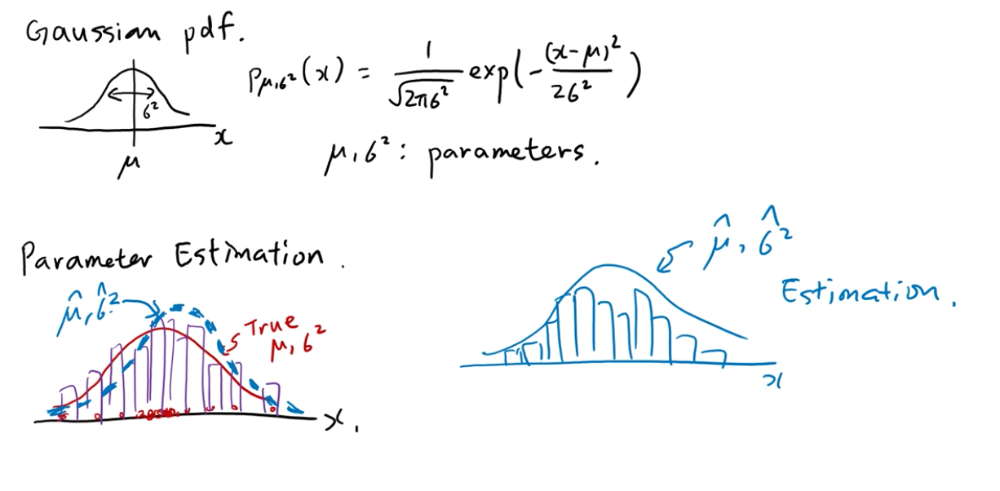
## Gaussian pdf
- x라는 random variable이 있으면 베일 shape?을 가지는 pdf
- 중앙값이 ℳ 라는 variable이고 분산은 시그마의 제곱
- ℳ와 시그마 제곱을 파라미터로 가지고 shape가 그려지는 pdf

## Parameter Estimation
- 빨간색은 진짜 데이터를 생성한 distribution
- 가우시안에서 나왔다고 하더라도 데이터는 항상 노이즈가 있음.
- 완전히 가우시안 shape을 가지지는 않고 약간 노이지한 shape를 만듬
- 실제 뮤와 시그마 제곱을 추정을 하는것.
- 데이터로 추정한 것이 뮤 햇과 시그마 제곱 헷
- 데이터 값으로 가우시안을 추정하여 뮤 헷과 시그마제곱 헷을 트루 distribution의 값인 양 추정을 할 것.

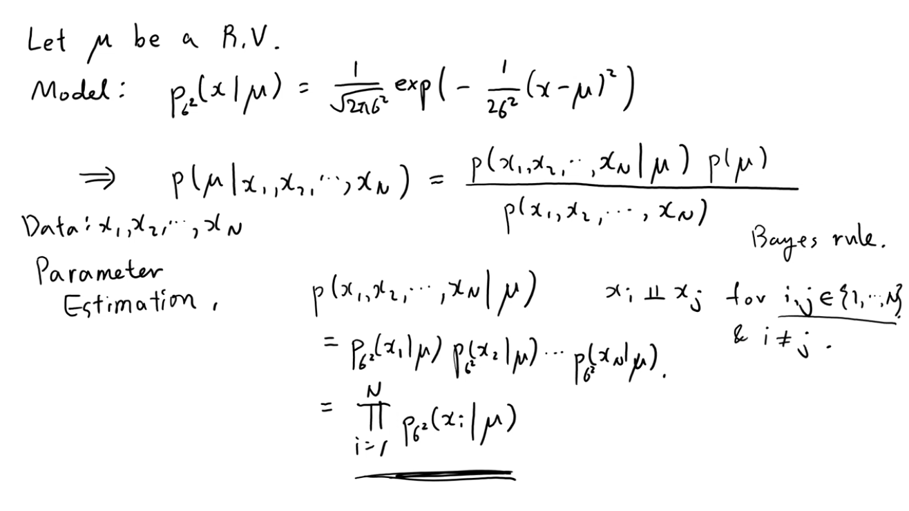
## 뮤가 우리가 estimation 해야 할 파라미터
- 뮤는 Random variable
- 뮤가 given일 때 x가 생성되는 식을 가우시안이라고 하겠다. 라는 식으로 모델이 만들어짐
- 시그마는 정해진 수라고 하자.
- n개의 데이터가 주어짐
- 이 데이터를 생성한 true DF의 뮤가 뭐냐 라는 질문을 가지고 parameter estimation을 해야함.
- i j가 인덱스에 있는데 i != j 일 때
- 뮤를 구하는데 만드는 모델이 사진에서 마지막에 있는 식.

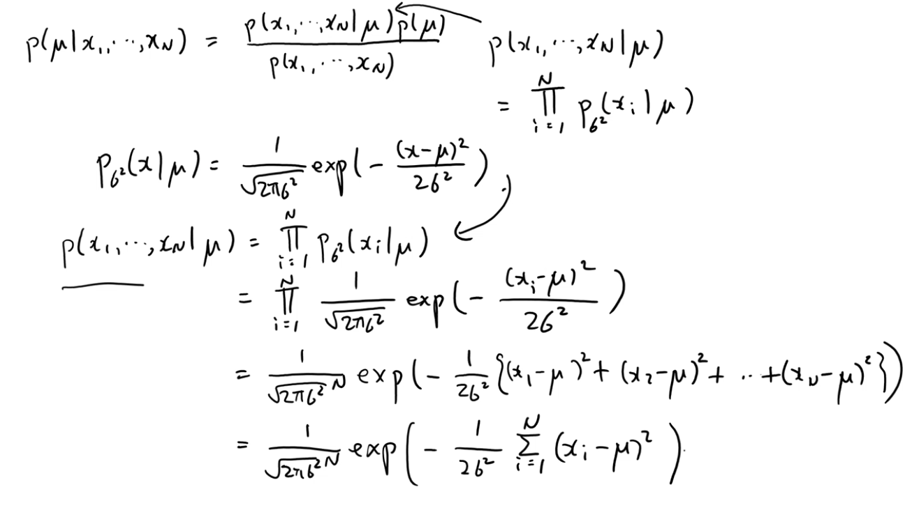
## 다시한번 정리하자면..
- 우리는 파라미터 estimation을 위해 inference를 하는 것
- 뮤를 구하는 것은 앞 페이지에서의 뮤를 구하는 모델 이용.
- 식을 정리해주면 위와 같다..

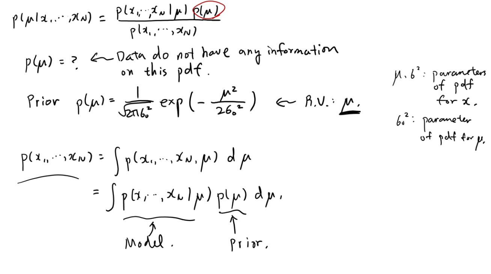
- P(x1, ... , xn | ℳ) 를 어떻게 구하는지는 앞에서 하였다.
- 이제 P(ℳ)를 어떻게 정할지 해보겠다
- P(ℳ)는 파라미터에 대한 estimation func
- 그런데 데이터가 없음 (Data do not have any information on this pdf)
- ℳ에 대한 distribution은 임으로 정해주면 됨.
- 우리의 기존 지식에서 정한다고 해서 Prior라고 해줌
- 이전까지의 ℳ와 시그마 제곱은 x에 대한 pdf의 파라미터
- 시그마 제곱은 ℳ에 대한 pdf 파라미터

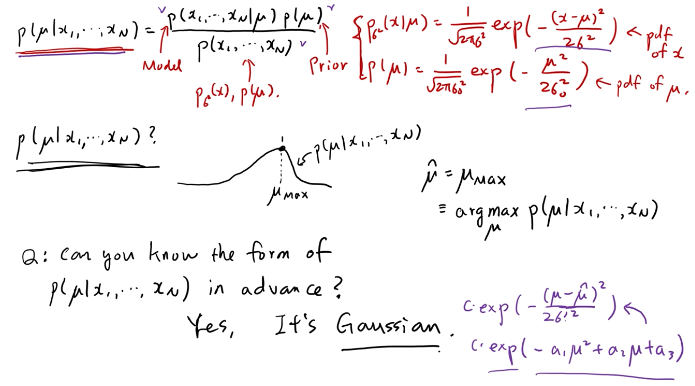
- p(ℳ | x1, ... , xn) 이거 왜 구하느냐?
- 데이터가 n개가 있으면 내 모델의 파라미터가 무엇인지 알아보려구.
- 가우시안을 세웠는데 내 모델에 어떤 가우시안이 가장 잘 맞는지 알아보려고.
- 여기서 질문! : p(ℳ | x1, ... , xn) 계산할 수 있다고 해도 굉장히 복잡할 텐데 무턱대고 계산해야 하는가?
- 이걸 계산하는 더 쉬운 방법이 있는가?
- P(ℳ | x1, ..., xn)이 어떤 form을 갖는지 미리 알 수 있음.
- 그 형태는 가우시안이다
- 가우시안의 특징은 ℳ앞에 -가 붙은 이차함수꼴이 exp안에 있음.
- 저런 꼴이 있으면 가우시안 이라고 볼 수 있음
- ℳ가 이차식 초과되는 항이 없으므로 가우시안이라고 볼 수 있음.

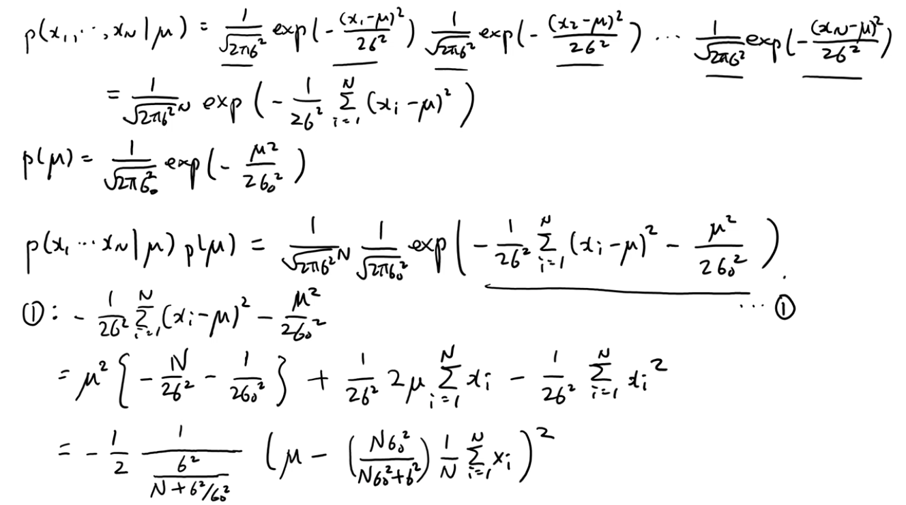
- 앞에서 계산한 식을 완전 제곱식으로 바꾸기!

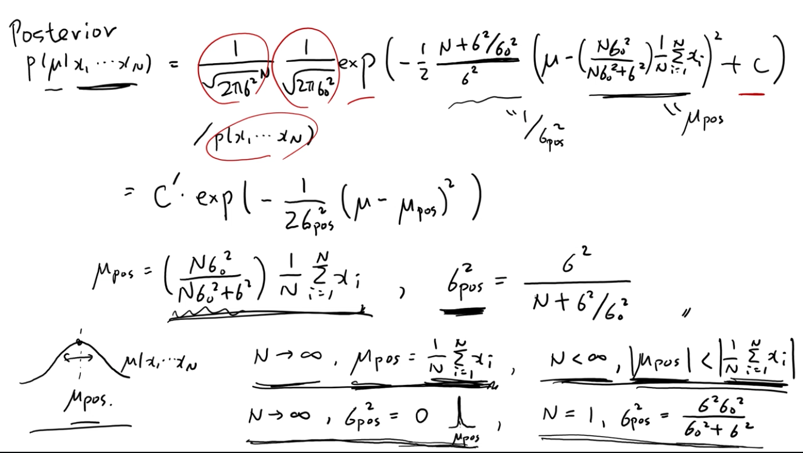
- Posterior는 굉장히 샤프한 형태의 가우시안이 됨
- 추장한 ℳ에 대한 값에 엄청난 확신도가 있는 것

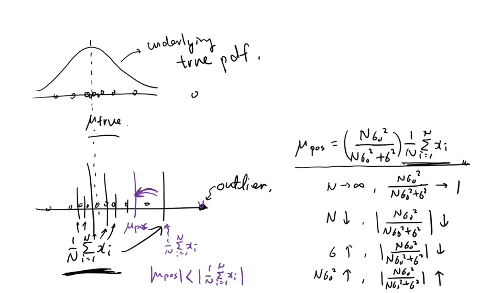
- outlier 하나가 평균에 미치는 영향이 매우 큼
- 그래서 데이터만 가지고 estimation 하는 것은 매우 위험한 방법
- ℳ Posterior는 outlier가 안 나오도록 해줌.

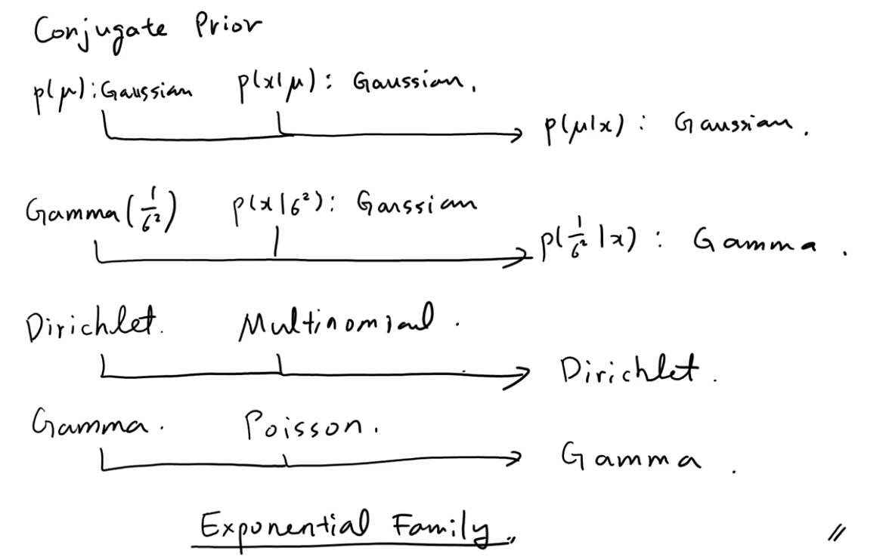
## Conjugate Prior
- Exponential Family

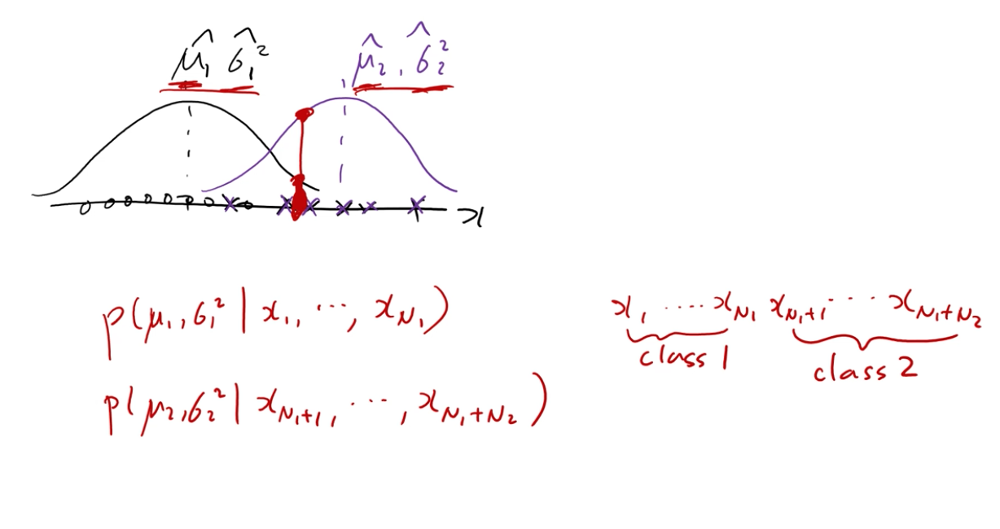
- class1 에 대한 destination estimation과 class2에 대한 것을 하여
- 이걸 ML에서는 학습을 했다고 함
- 파라미터 estimation 하는 것이
 오늘의 핵심
- func들을 구한 후 데이터가 들어왔을 때 class1 class2냐 구분하는 알고리즘을 만들 수 있다.