# 4차 산업혁명의 원동력 = 소프트파워

## 윤종록 교수님

백색전화 = 내가 수신하는 전화 청색전화 = 서버

ict 발달 : 
아폴로11호 nasa에서 일하는 조경철박사 컴퓨터조종함! 왔다갔다함!-> 1500배의 대단한 스마트폰!
## Ai를 통해서 데이터의 바다를 항해하는 자가 패권을가짐! 소프트파워가 필요함!(ex.이스라엘)

기억의 반대는? = 망각? 아니다! 상상이다! 
3가지의 상상 : x축 : 바다 y축: 우주 z축: 생명
## Shimon peres : 65년간 국가를 위한 봉사, 이스라엘 건국의 국부

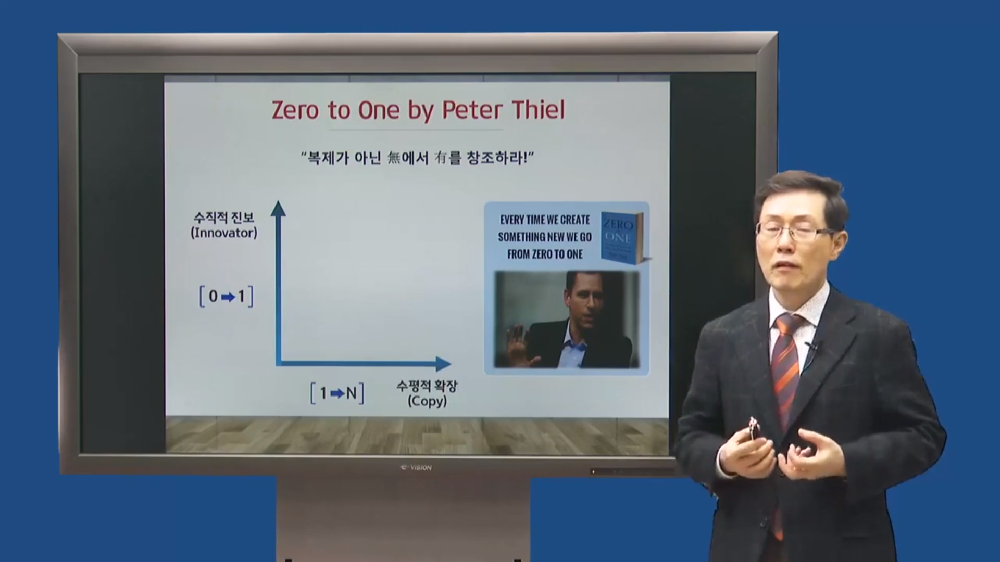
Zero to one by peter thiel : “복제가 아닌 무에서 유를 창조하라” 
수직적 진보 : 0->1 (에어비엔비) 
수평적 확장: 1->N (우리나라회사들) 
수직적 진보인 혁신이 필요함! = 소프트파워

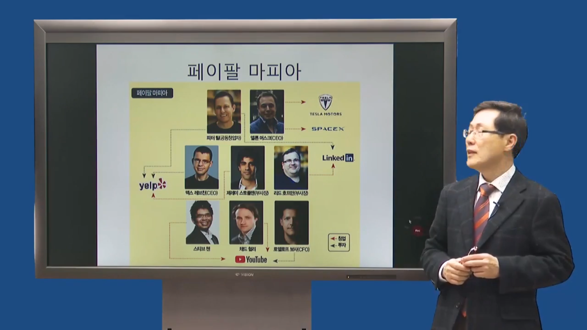
페이팔 마피아 -> 여러 회사
하드파워 -> 소프트파워

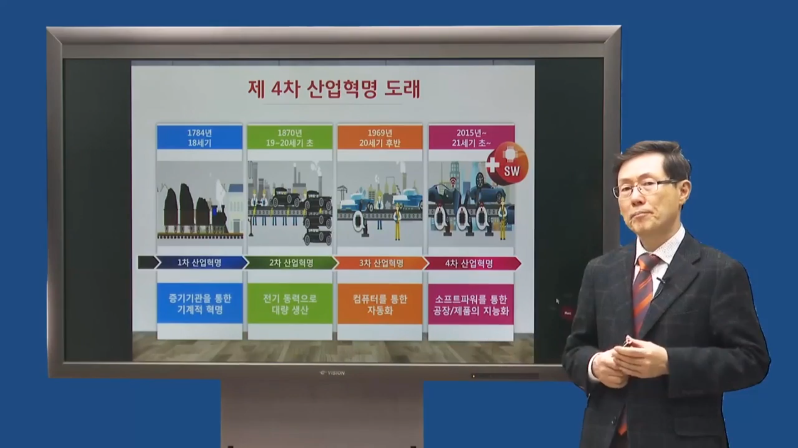
4차산업혁명 : 소프트파워를 통한 공장/제품의 지능화. 

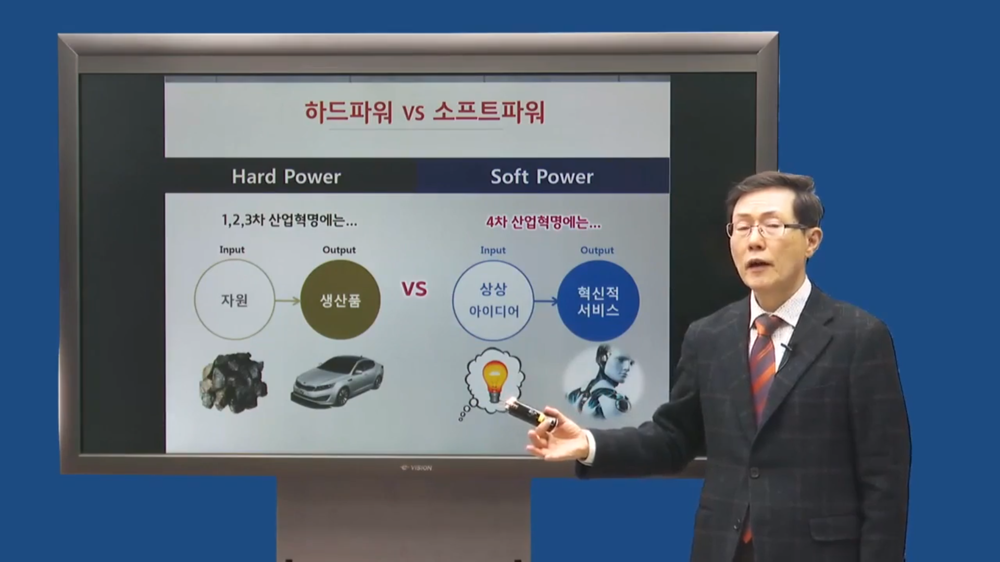
상상 아이디어 -> 혁신적 서비스

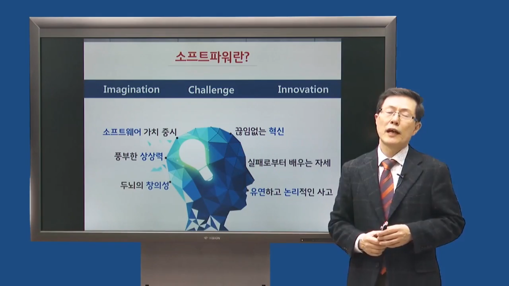
소프트파워란? : 소프트웨어 가치 중시, 풍부한 상상력, 

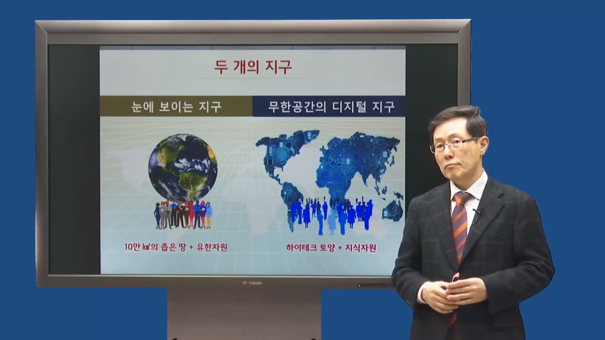
두뇌의 창의성, 끊임없는 혁신, 실패로부터 배우는 자세, 유연하고 논리적인 사고. Imagination challenge innovation

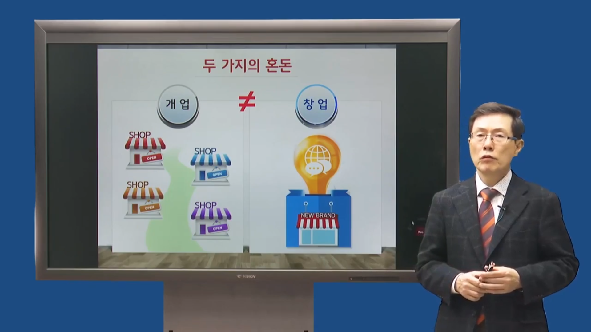
창업 != 개업

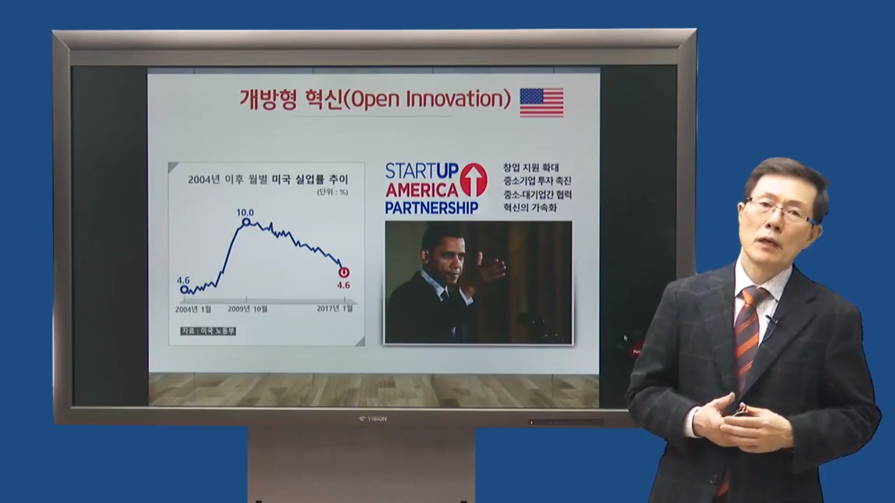
개방형 혁신(미국): 창업 지원 확대, 중소기업 투자 촉진, 중소대기업간 협력, 혁신의 가속화

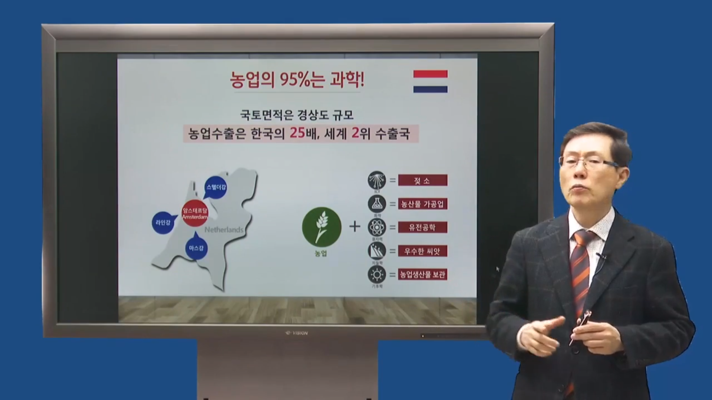
네덜란드 : 농업은 과학!

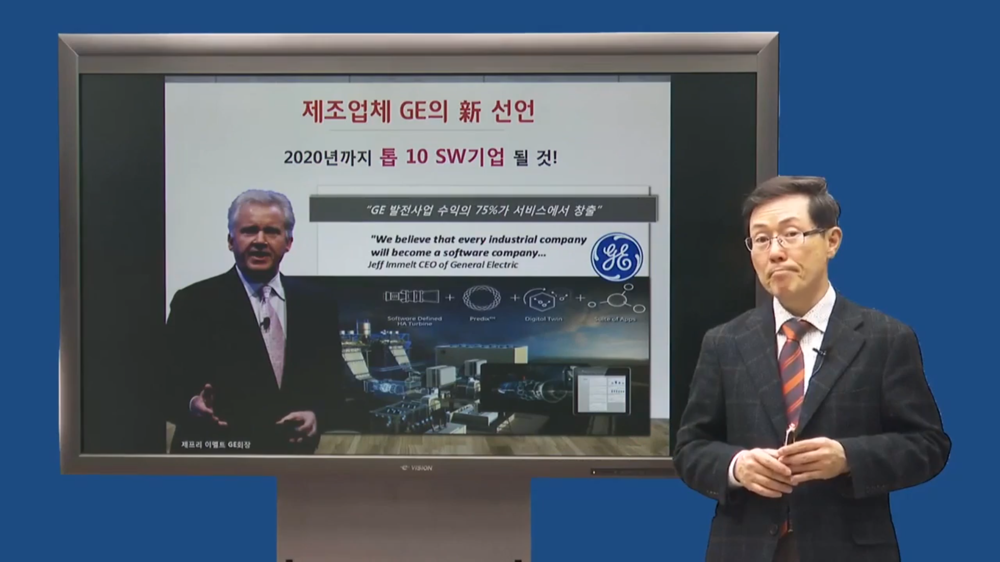
GE의 항공기 엔진 센서 - 엔진 상태 체크
서비스 charge 받음
Zara - 디자인 판매

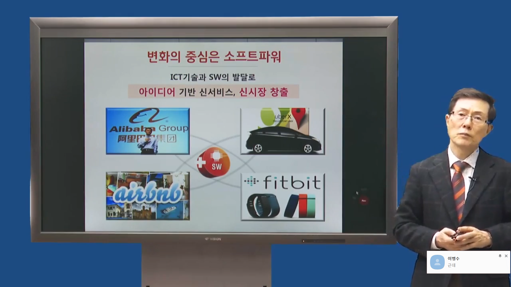
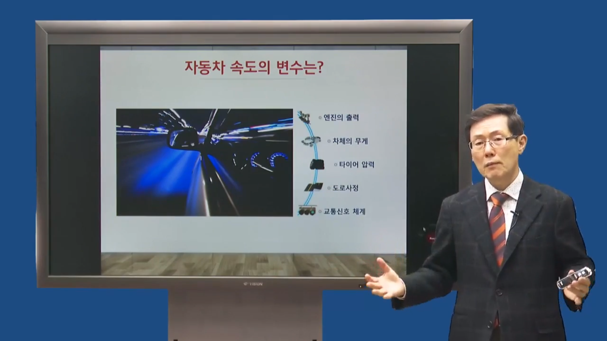
자동차 속도의 변수는? 엔진의 출력, 차체의 무게, 타이어 압력, 도로사정, 교통신호 체계 하모니를 이루어야한다.
4차 산업혁명의 속도를 높이는 소프트파워 : 창의적 교육, 개방형 혁신, 융합적 사고와 문화, 위험 감수 금융, 규제 완화, 기업가 정신

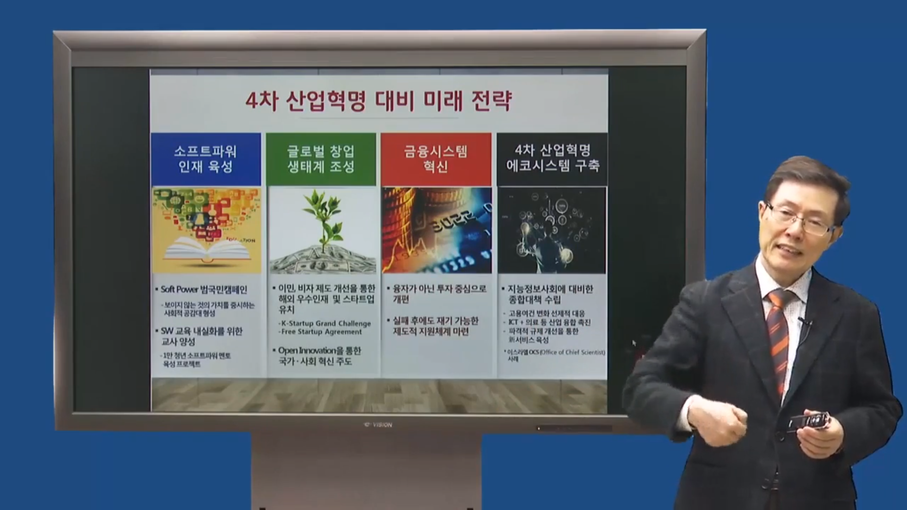
4차 산업혁명 대비 미래 전략: free startup agreement

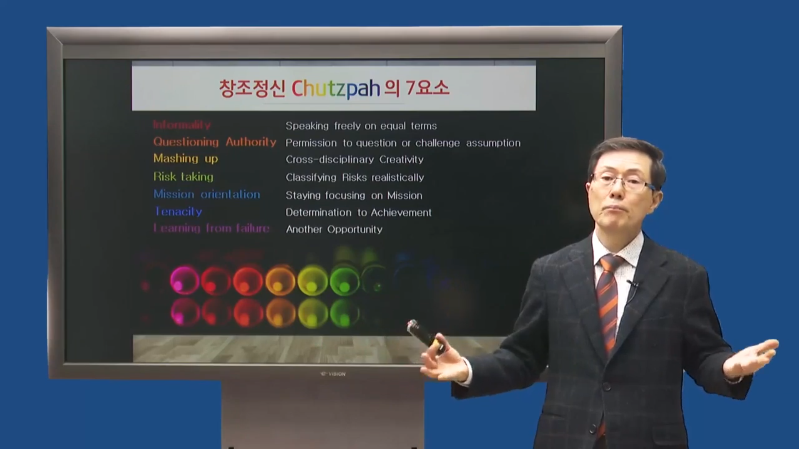
## 이스라엘의 창조정신 : chutzpah(유대인의 국민성) -> 형식타파, 질문의 권리, mashing up(), risk taking, mission orientation(목표 지향), Tenacity, learning from failure

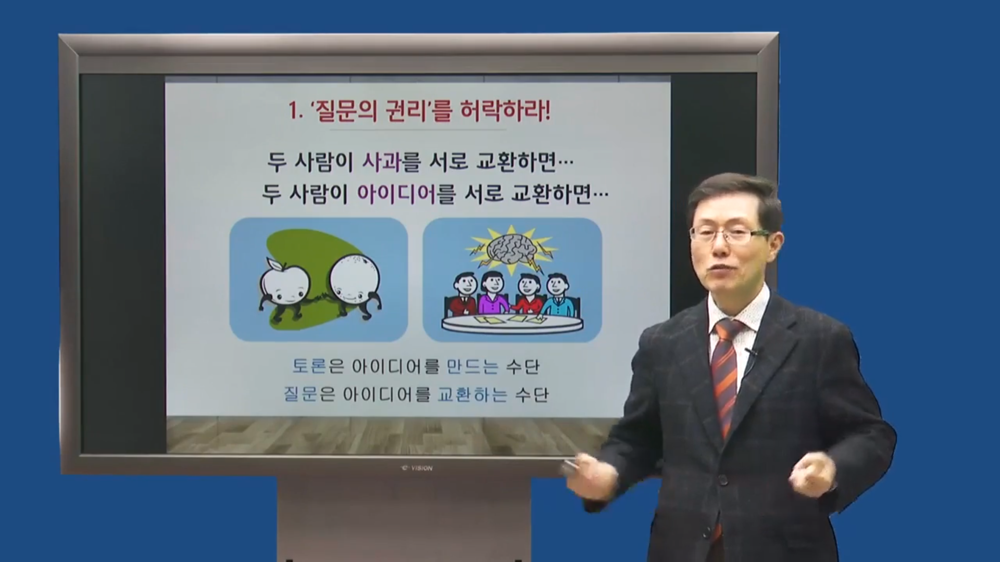
1.	질문의 권리를 허락하라! (토론 -> 아이디어 만듦, 질문 -> 아이디어 나눔)

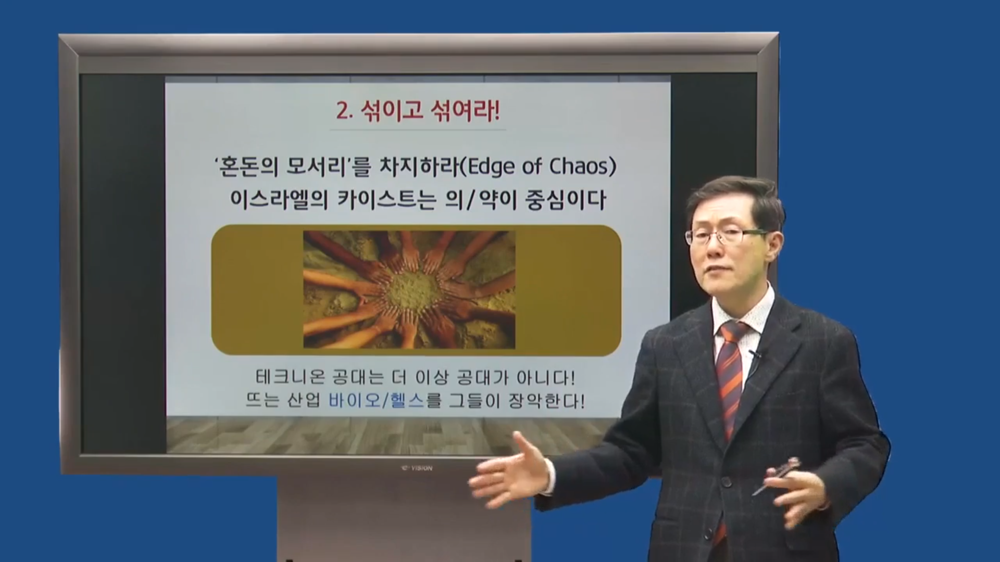
2.	섞이고 섞여라! 
3.	실패를 ‘훈장’으로 바꾸자! 
challenge & response 
