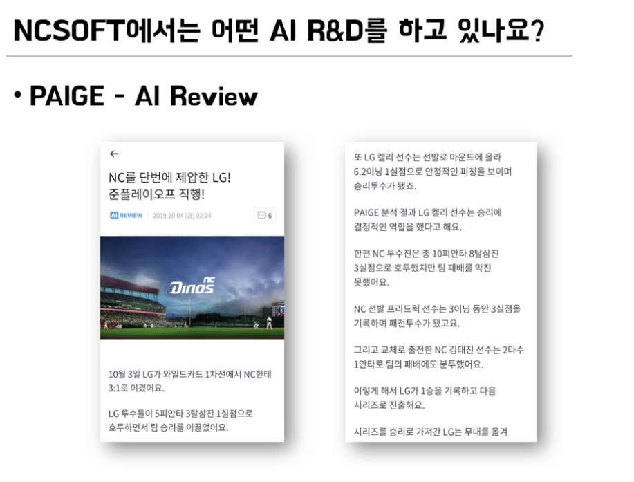

# 게임 회사에서 AI 개발자로 살아남기

## 오주민 강사님

- 강화학습을 통해 ai들이 학습을 함 (PvP NPC AI 개발)
- 아이콘 이미지 만들기 - 많은양 데이터 구축하면 비용 시간 듬
- constraint를 넣어서 이미지를 더 자연스럽게 생성
- 시간 단축 효과
- NPC 얼굴 커스터마이징 - AI가 다수의 샘플 생성

- 태그정보 바탕으로 동향 분석 가능

- 부조화된 데이터들을 인공지능이 어떤것을 이해하고 어떤것을 기억할 것인지에 대해 효과적인 인코딩 방법 연구

- 정보 전달 아닌 친근하게 대화할 수 있는 AI 기술 연구 
- 요약 기능 - 문서화 기능
- 재미있게 이야기 - 공성전 네러티브

- ai 알림
- 채팅, 이모티콘 ui
- 앵간하네

- 리뷰도 ai가 함
- 내 팀 뉴스 편파 리뷰도..
- 야구 뉴스 요약도 있음
- 요즘 어때 : 최근 추세 -> 아이콘 다양화
- 경기 요약 & 모아보기
- 타석 투구 모아보기
- 야구 하이라이트 클립 생성
- 이미지로 정보를 추출하여 색인 정보로 사용하여 하이라이트 클립 생성

- RNN 기반 모델 : 입력이 주어졌을 때 출력을 만들어내는 모델
- 단순히 현재 입력만 받는것이 아니라 이전 state의 정보도 추가적으로 입력
- 어디까지 무엇을 했구나 하는 context 정보를 받아옴
- context정보와 현재 입력에 근거하여 출력 정보를 만듬


- 롱 텀 디펜던시 문제 있음 : 문장의 길이가 길어져서 순차적 계속적으로 연산 하다 보면 멘 앞에 처리했던 정보에 대해 잊는다는 말
- 그것을 개선한 것이 LSTM (Long short term 메모리)
- 현재 입력을 얼마나 받아들일지에 대한 gate와 이전 state를 얼마나 받아들일지에 대한 gate 존재
- 출력에 대해서도 얼마나 출력할지에 대한 gate 존재
- 문장과 단어의 토큰이 있을때 중요한 단어는 더 많이 채택하고 그것에 대한 정보도 더 많이 내보낸다는 
- 나는 소년이다 -> 이다 안중요함 소년 중요함
- GRU cell : lstm과 유사한 성능을 가지나 gate의 수가 적어서 연산량이 적고 빠름

- 1-1 : free conacted layer 입력이 출력으로 함수같음 - 시퀀셜
- 1-many : 요즘 사용 별로
- many-1 : 댓글 긍정 부정 판별하는 것
- many-many : 왼쪽 : 인코더 디코더 모델 : 입력 끝까지 다듣고 처리
- 오른쪽 : 입력과 동시 출력 : 동시 통역 같은

- 단어와 단어 간의 관계를 유사도를 벡터 공간안에 표시
- 의미하는 바 : 주변 단어의 문맥에 따라 단어의 의미가 정해진다는 것을 유념하여 학습
- 문제점 : 어떤 단어는 벡터 공간안에 특정 위치에 일대일로 대응이 된다는, 배라는 단어가 타는 배일수도 먹는 배 일수도 있는데 상관 없이 일대일로 매핑 된다

- 앞의 그런 문제점을 고려하여 효과적으로 학습해 보자는 것이 ELMo
- 단어가 특정 뜻을 갖는것이 아니라 주변 문맥에 따라서 달라 질 수 있다는 것을 전제로 함

- 단어를 행 형태의 벡터로 나열을 하여 이것을 두단어 세단어 만큼 윈도우 사이즈 만큼 나누어 한꺼번에 covolution을 하는 것
- 한 단어에 의해 feature가 추출이 되는 게 아니라 주변에 있는 단어들과 함께 봐야지만 한다는 의미
- 명사 하나만 보는게 아니라 명사절 전체로 봐야 어떤 의미였구나 하는걸 알 수 있다라는걸 모델에 인지적으로 표현해 준 것
- 이렇게 해서 얻어진 정보들을 max-pooling을 통해 중요한 정보만 남기는 과정을 진행 - 문장에서 중요한 내용과 중요하지 않은 내용이 있는데 max-pooling을 통해 그 값이 가장 큰 것만 가져와서 사용을 하겠다 라는 것
- 장점 : RNN의 경우 병렬성이 떨어짐 (기초 state의 정보를 사용하기 때문), cnn은 병렬적 처리 가능 - 학습 속도 빠름
- RNN과 비교하여 비슷하거나 더 좋음

- 텍스트를 전부다 입력을 받은 후 그 정보들을 기반으로 시퀀셜한 아웃을 출력
- 번역 테스크에 많이 사용

- seq2seq 단점 : 입력 문장을 벡터로 입력하여서 어떤것이 중요하고 어떤것이 안 중요한지 뭉뚱그려서 전달 됨
- 그러한 단점 보완하기 위한게 attention Mechanism
- 디코더의 어떤 스텝에서 히든 스테이트를 기반으로 하여 입력의 모든 히든 state에 대하여 얼마나 유사한지에 대해 측정
- 측정된 값들을 기반으로 인코더 정보를 weighted sum하여 문장 정보를 다시 구축
- 구글 번역기 성능 향상에 지대한 영항

- self-attetion 사용
- 입력 문장 스스로 본인이 본인의 attetion을 가하고 정보를 가져오는 것
- 즉 어떤 정보를 추출하면 이 문장을 표현하는데에 좋을까 대해모델이 스스로 학습

- 입력문장들이 서로와 서로를 matrix multiplication 을 통해 얼마나 유사한지 계산
- 중요한 정보는 더 많이 덜중요한건 더 적게
- 입력을 multi head로

 
- Bert라는 모델이 transformer 기반
- 실제 human performance 보다 높은 성능!

- 문장을 cls 토큰이란것을 이용하여 표현
- 문장을 표현하는 벡터를 통해 문장과 문장이 연속되는 것인지 아닌지를 학습 - 문장의 관계성 학습

- BERT 이후 다양한 모델들 생겨남
- 인간을 뛰어 넘음

- 정시템은 선형대수 미적분 어디로..

- 라인 바이 라인~
- 구글 코랩 좋지
- 나만의 코드 패키징

- 아카이브 좋음

- api 뜯기

- 산학장학 개꿀

- 흥미가 중요
- 인턴쉽

- 다른분야에서 영감 얻기

- 깃
- 도커 아나콘다 virtualenv 환경설정 극혐
- 파이프라이닝..

