# 학자와 학술 활동

## 노영균 교수님

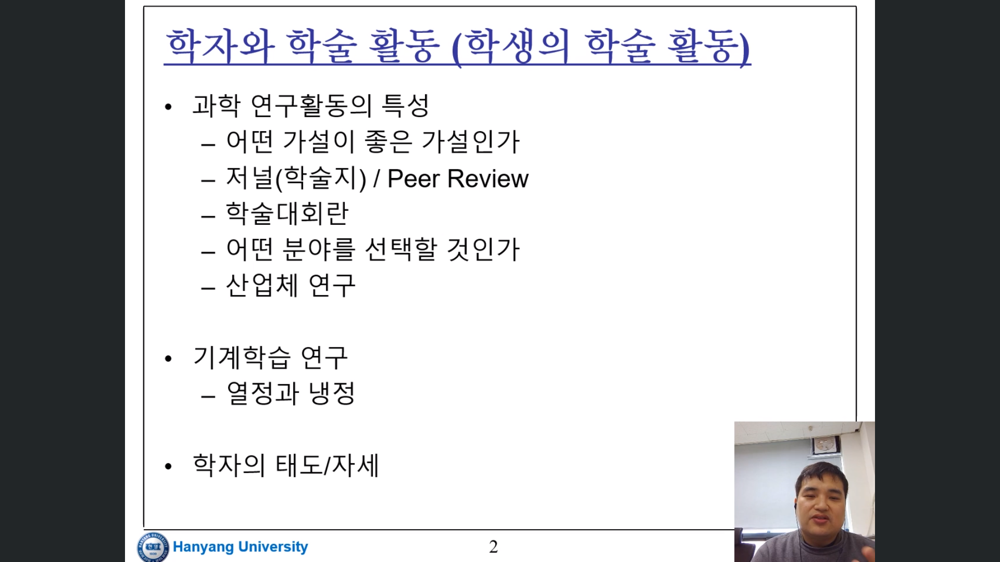
- 일단 가설을 세우고 검증
- 좋은 가설을 세우는 것이 중요
- 저널은 어떤식으로 평가 하는가? peer review
- peer review 시스템의 약점?
- 학술 대회 - inner circle이 독점?
- 좋은 학술 대회 일수록 진입하기 힘듬 - 내부에서 어떻게 돌아가는지 알아야 함
- 어떤 분야를 택할 것인가? 
- 중요한 것은 분야를 잘 선택해야 한다는 것
- 산업체 연구 - 학계에서 못하는걸 할 수 있음
- 산업체의 약점 - 연구의 자율성 떨어짐

##  기계학습 연구
- 기준은 열심히 찾아보고 재밌는 것이어야 함

## 학자의 태도
- 정직해야 함
- 성실해야 함

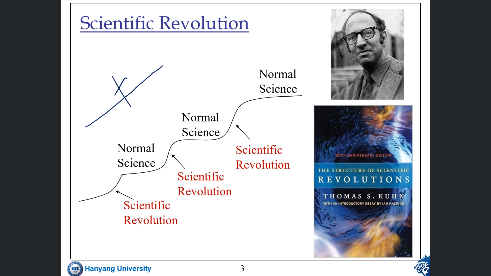
- 토마스 쿤 과학 혁명
- 혁명 - 서서히 - 혁명 이런식으로
- 머신러닝이 과학혁명 기간임

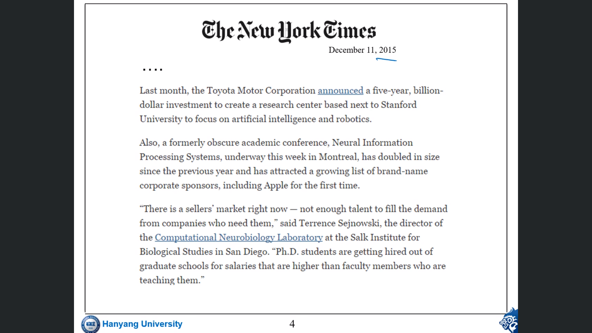
- 지도 교수보다 박사 졸업생이 수입 더 많움

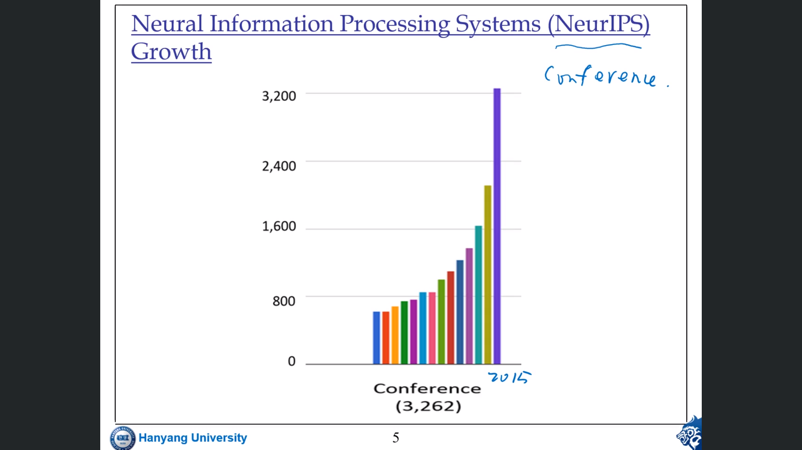
- NeurIPS학회

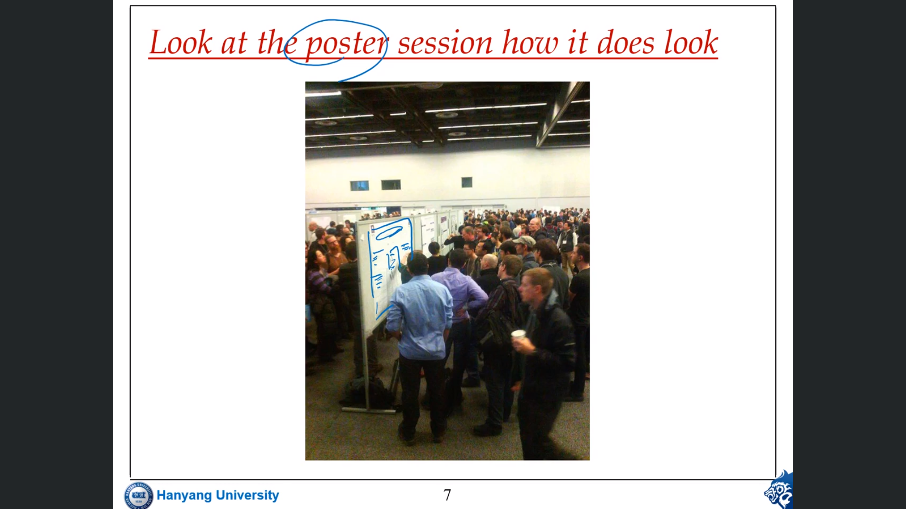
- 포스터 발표 핫함

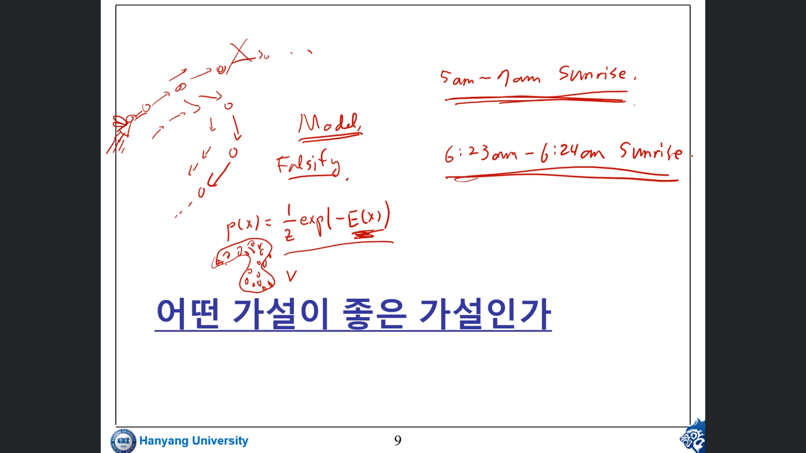
- 좋은 연구 == 좋은 가설
- 알고리즘 만들면 어떤 데이터 셋에 대해서 다른 알고리즘 보다 성능이 좋다 이런게 좋은 연구
- Falsifiability : 가설이 기각 될 수 있는 방법이 있어야 함
- 어떤 가설이 좋은 가설인가? 가능한 구체적으로 강력하게 해서 falsify가 가능해야 함

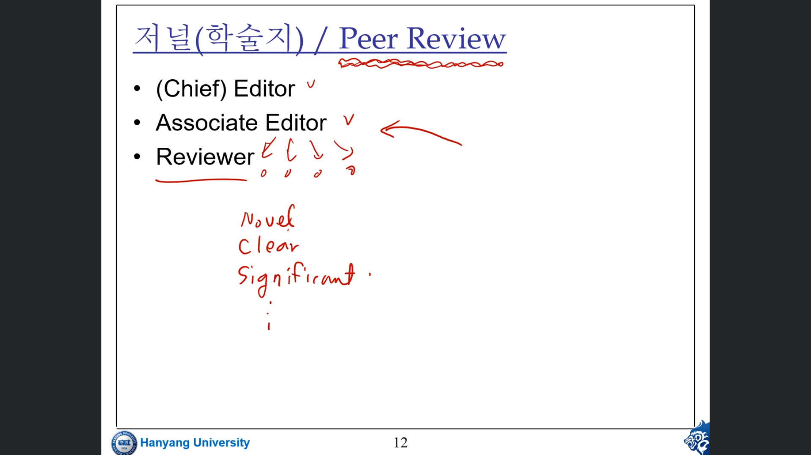
## Peer Review
- associate editor가 리뷰 할만한 리뷰에게 맡김
- 리뷰어가 논문이 clear 하냐 significant 하냐 novel 하냐 평가
- chief가 feedback 줌

## 잘못될 수 있는가 
- 리뷰어나 에디터가 되어야 참여 가능함
- impact factor를 높이기 위해 꼼수들을 씀 저널들이

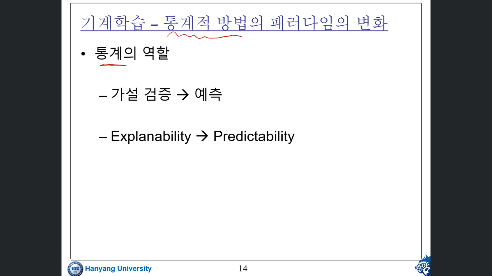
- 가설검증이 되든 안되늗ㄴ 예측이 중요
- explanable이든 아니든 prediction 되어야

## 기계학습과 인공지능
- 기계학습 : 룰베이스 쓰는 사람들과 다르다 그래서 기계학습으로 이름 바꿈
- 인공지능 : rule based를 사용
- 기계학습 인공지능 이제는 비슷
- 그저 역사적 차이일 뿐~
- 방법론이 다른단걸 말하고 싶었던거

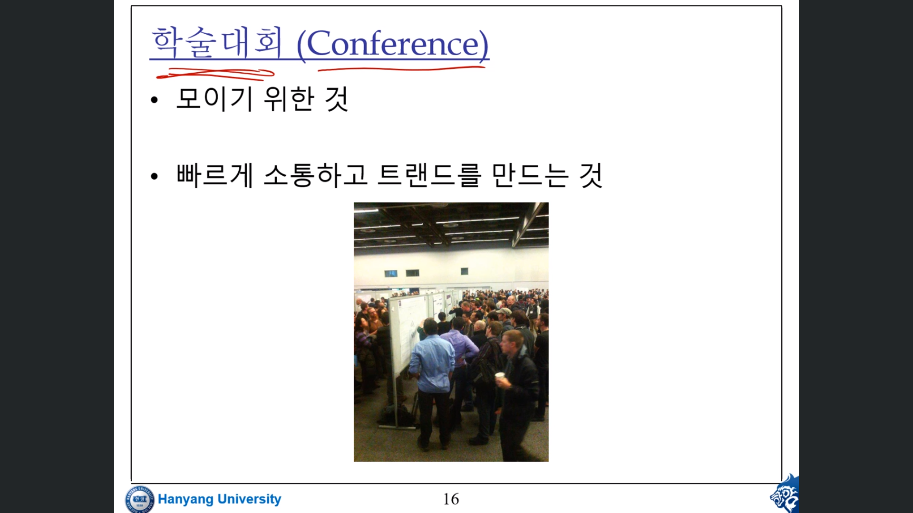

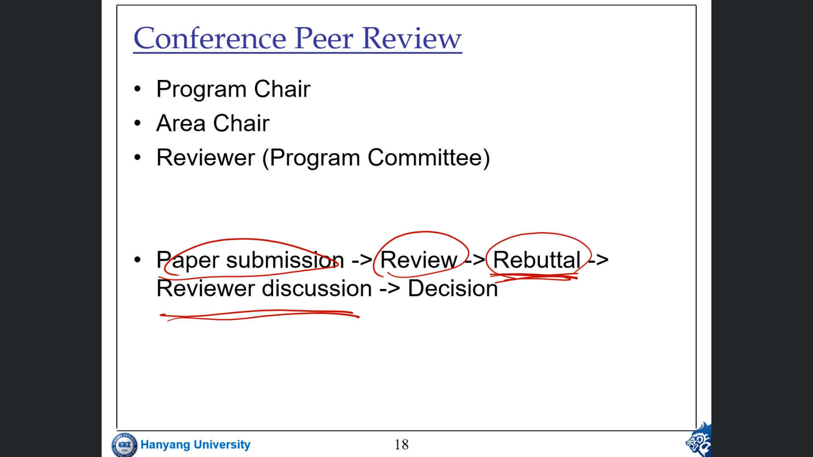
- rebuttal : 리뷰에 대한 답변
- reviewer discussion : 답변 보고 토론

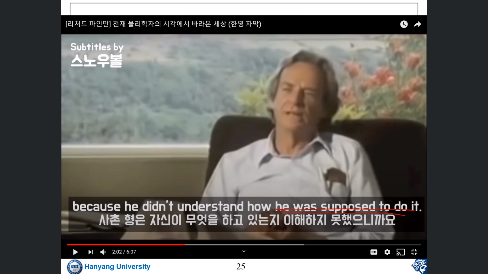
- 내가 진짜 무엇을 하려는건지 알아야 한다는 뜻
- tensorflow 같은 툴은 algebra인 것

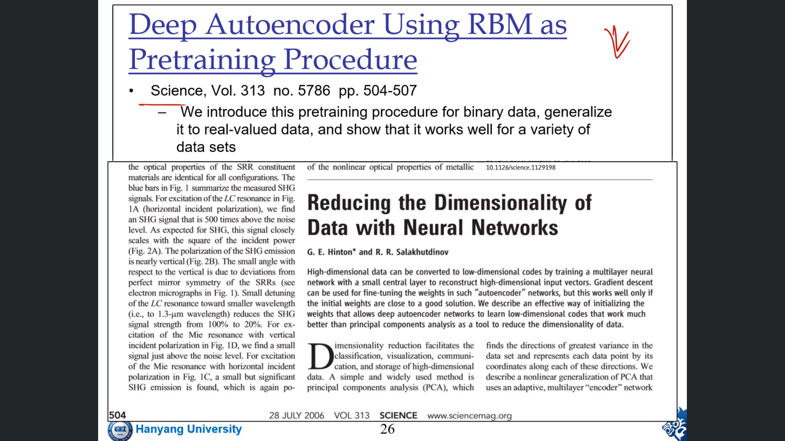
- 정직함과 재미
- 뭐든지 재미있게 얘기할 수 있어야