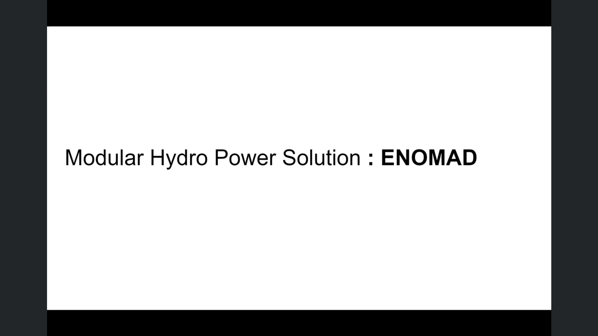

# Enomad

## 박혜린

- 친환경 스타트업
- 지속가능한 신재생 에너지 물을 개발중.

- 전력사용
- 지속가능, 안전하게 하는 방법 연구 중
- 신재생 에너지

## Energy + Accessibility
Energy + Accesibility : 케냐 인프라 부족해서 스마트폰 보급률 90프로로 늘림
But 새로운 문제가 생김. 

- 초 연결 사회
- 전기 필요
- 전력 인프라 안정되지 않은 곳 많음
- 초연결사회 : 전세계의 3분의 2 이상의 인구가 모바일기기로 연결. 
- 전력에너지가 필요함. 케냐는 전력 인프라가 부족함… 대부분의돈을 충전하는데에 소비.

## Energy Paradigm Shifting
- 에너지 패러다임 바뀌어야
- 1. 지속 가능해야
- 2. 사용자의 수요에 따라서
- 3. 분산형 시스템으로

- 모바일, 큰 전기 사용하지 않음
1.	새로운 에너지 수요 
-	Personal/Mobile Energy Demand
-	Energy Accessibility
2.	Energy system
-	Awareness- participant ex) 메일확인, 잔고확인 하지만 전력에너지사용에 관심을 안가짐 so, 개인이 참여하게 만드는 것이 중요

- Skinny Grids : 아주 작은 전력 소비 시장
-	Inefficient – Environmental Impacts 지금 사용하고 있는 시스템은 비효율적 -> 환경문제발생 ex) 전력에너지 수급은 석탄에너지가 많이 필요함.
에너지 패러다임이 바뀌어야한다! 
-	화석연료 중심 -> 신재생 에너지 중심으로 바꾸자
-	공급자 중심 -> 사용자 수요에 따른 공급
-	소형분산형
-	USB 전원
Skinny grids – Goalzero, Biolite, Power Practical

- 휴대용 태양광
- 휴대용 바이오매스
- 열을 전기로 변환

- 다른 접근법
- 영역 분계

회사의 세가지 목표
-	Visible invisible
-	Access the inaccessible
-	Personalized sustainability

- 청계천 흐르는 물로 스마트폰 충전

- 발전에 포커스 말고 
- 라이프 스타일로 소개에 포커스

