# Towards Smart Avatar for AR Telepresence

## 이성희 교수님

- 증강인식 Telepresence를 위한 아바타 연구
- 사람과 사물간의 상호관계를 아바타가 비슷하지만 다른 사물과의 상호작용 모션으로 어떻게 바꿀 수 있는지?
- 대응점 찾기, 적절히 모션 변형

- 현 공간의 상황에 맞게 원격체의 사람을 조정해야함

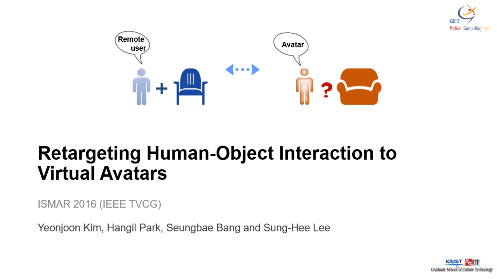

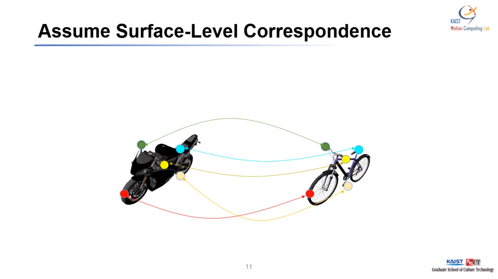
- 두 물체가 다르지만 기능과 종류가 비슷하다고 간주
- 대응점을 찾아냄

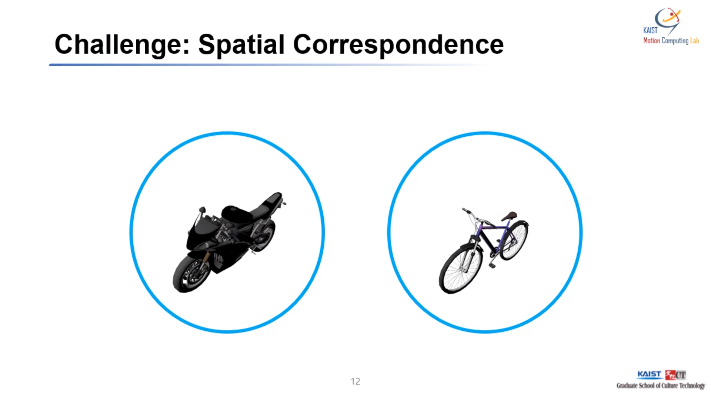
- 초록색 점에 대응하는 빨간 점을 잘 찾는것이 연구의 목적

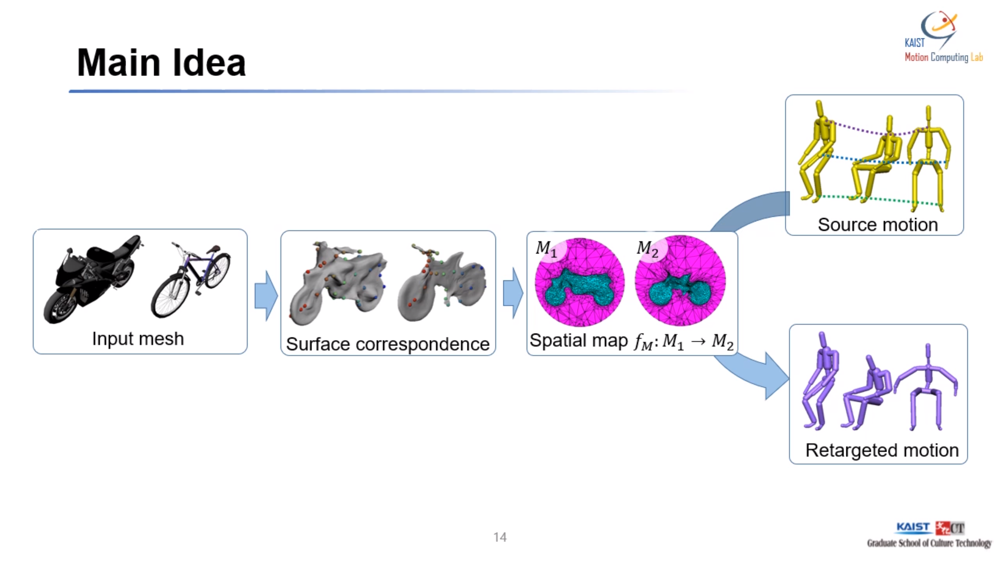
- 메인 아이디어
- Surface correspondence 찾음 (대응점 찾음)
- Spatial map : 오브젝트 주변 공간에 대한 대응점 찾아냄
- 원 모션을 타겟 모션으로 바꿔줌
- 이런 것을 retargeting이라고 함

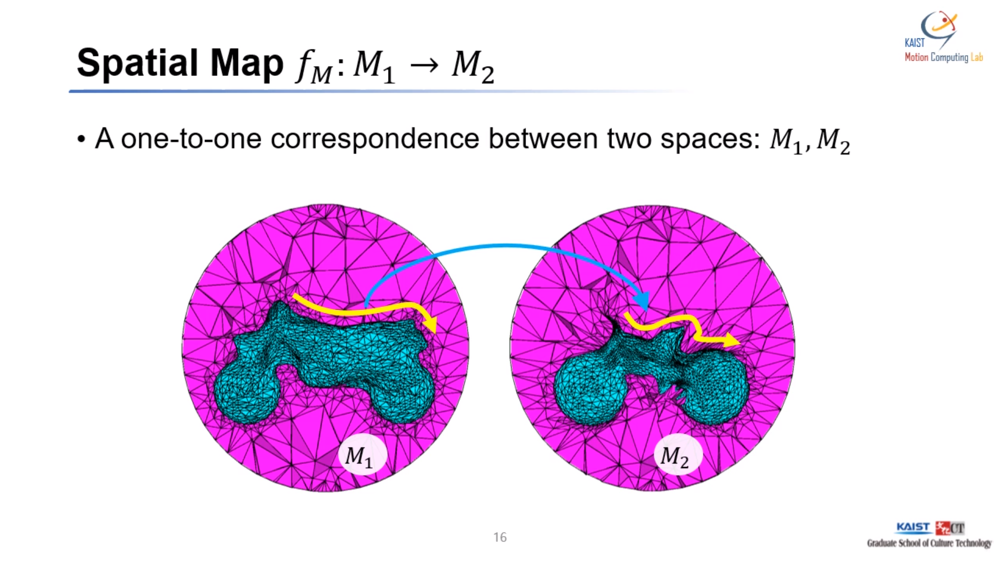
- 여기서 가장 중요한 것은 Spatial Map
- 두 공간 간의 일대일 correspondence를 찾아냄

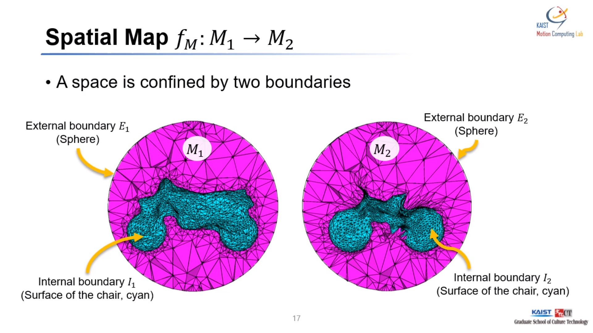
- external Boundary를 만들어야 한다 
- 구형이라고 가정함
- 두 internal boundary 간 매핑을 찾아줌
- 그 다음 external boundary 간 매핑을 찾아줌

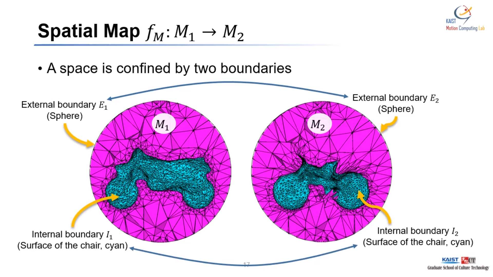
- Internal Boundary 찾는 법

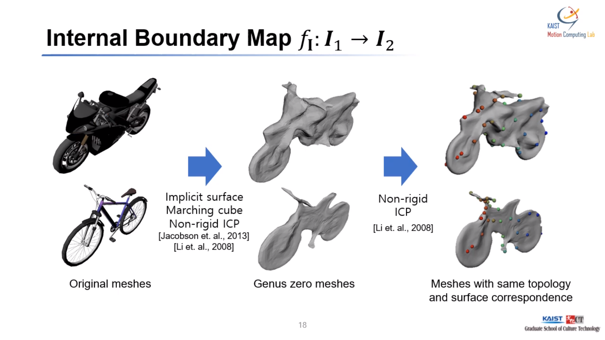
- External Boundary 찾는 법
- 두 개의 동일한 구 사용

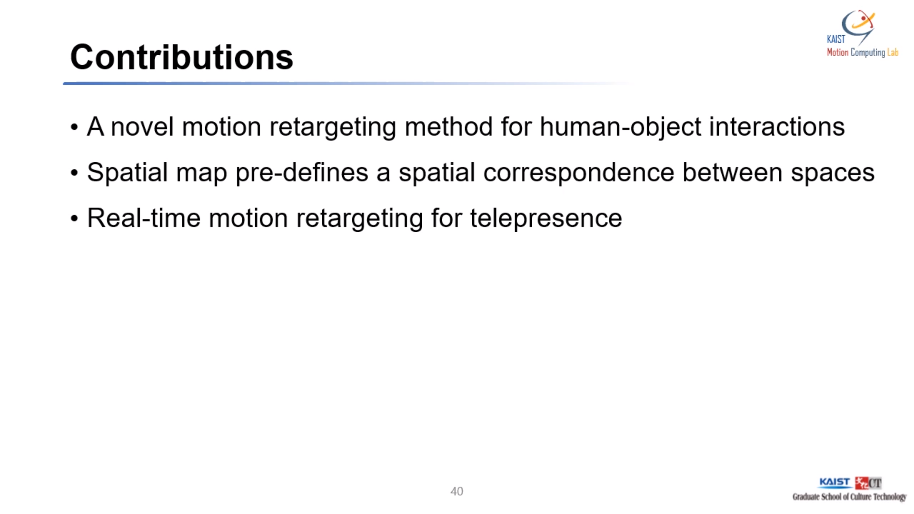
- 기여한 부분
- 새로운 모션 리타게팅 방법
- 공간간의 대응점을 pre-define
- real-time 모션 리타게팅을 수행

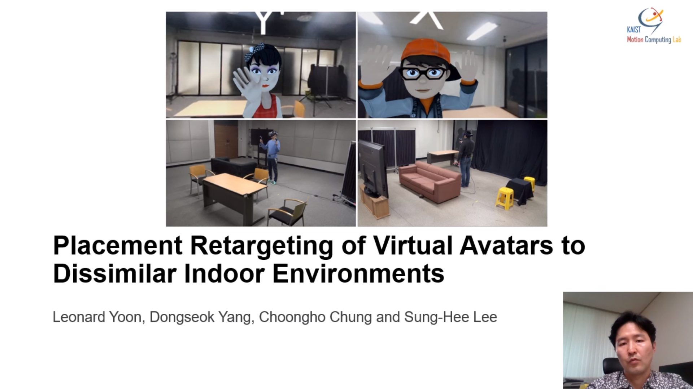
- 여기부터는 사람이 한 공간에서 취한 모션을 다른 곳에서의 아바타의 모션으로 변형될 수 있는지에 대한 연구

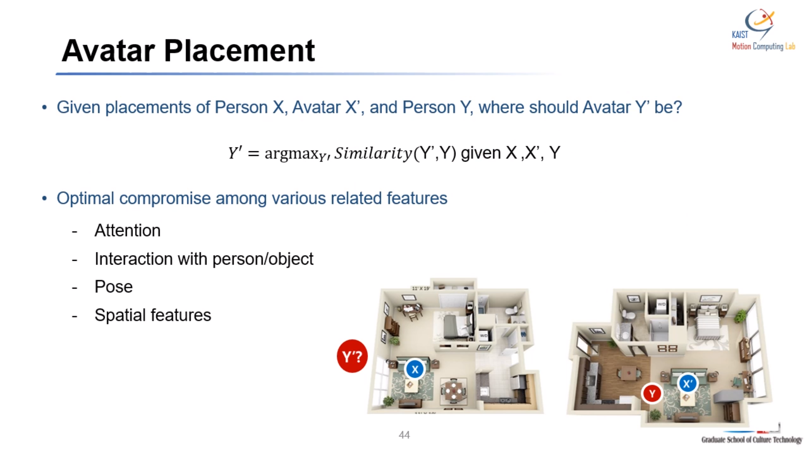
- 두 위치의 유사도 파악

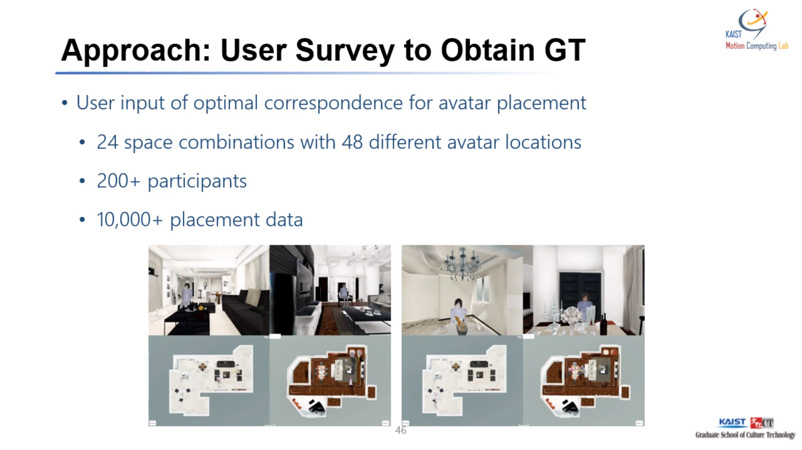
- 두 위치의 유사도를 특징짓는 4가지 특징 모델링
- 네가지 특징은 공간의 상황에 따라서 달라질 수 있음

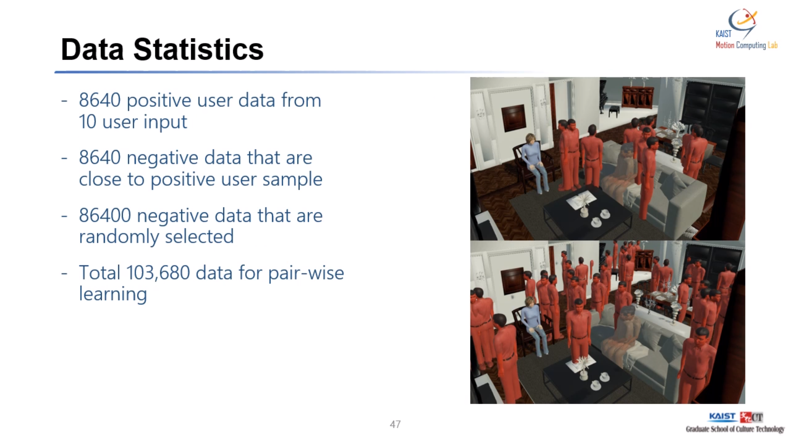
- 갈색의 위치들은 유저들이 선택한 적절한 위치
- 붉은색은 컴퓨터가 설정한 적절하지 않은 아바타의 위치

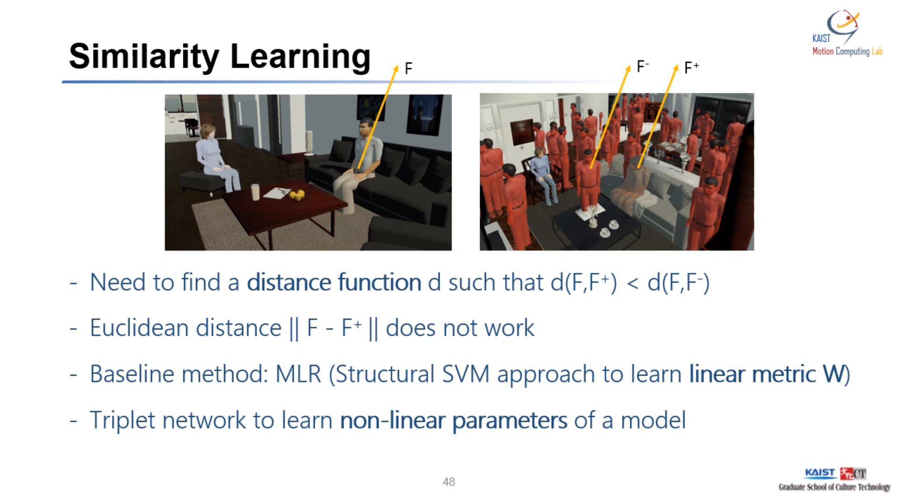
- distance function
- 심층 학습 기법 이용 -> triplet loss 이용

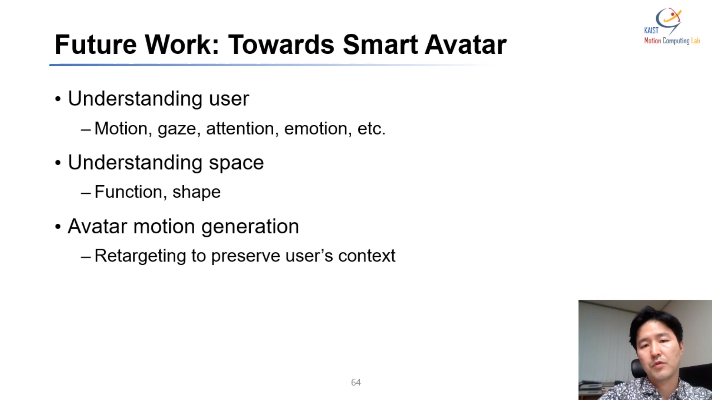
- 아바타가 원격지의 사용자 모션을 잘 전달하려면
- 공간인식 자동으로 해야하고, 사용자를 잘 이해해야 함

