# Understanding iOS-based Crowdturfing Through Hidden UI Analysis
# 이연준 교수님

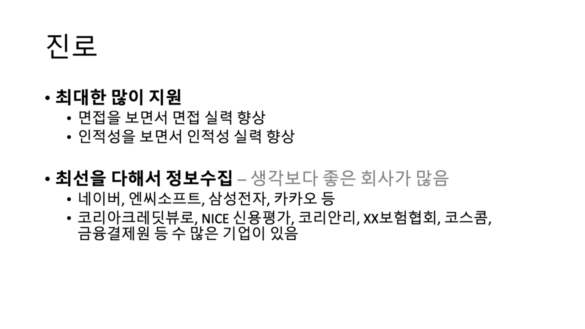
조사 많이 할 것

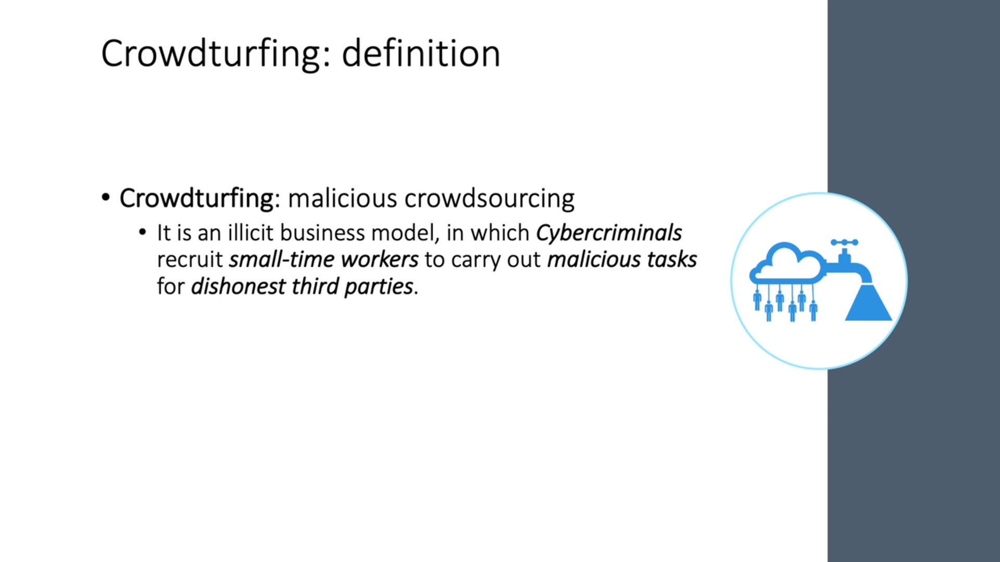
- Crowdturfing : 악성 crowdsourcing(내부 x, 외부에게 outsourcing하는 것 ex. 아마존) 대중(small-time workers)에게 참여를 유도해서 불법적인 일을 행동
- Crowdsourcing : 대중 + 아웃소싱 합친말, 외부에게 문제 해결을 아웃소싱 하는 것

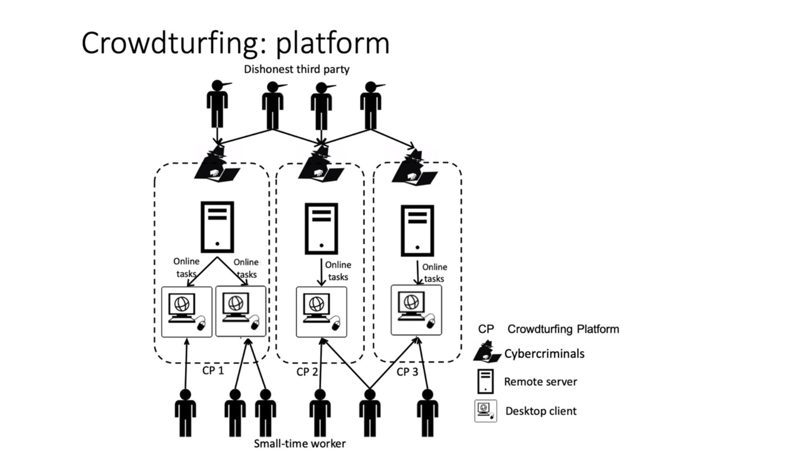
- Crowdturfing platform
- Dishonest third party 가 불법적인 의뢰 -> task단위로 쪼개서 small-time worker에게 push. -> push 된 task들에 기여.

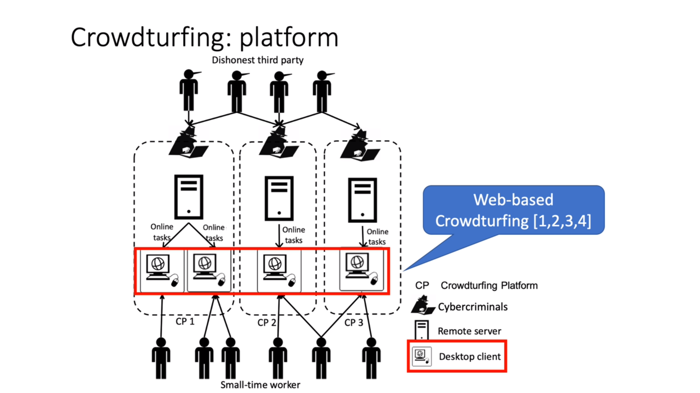
- 모바일 crodturfing이 왜 중요한 문제인가
- 모바일 트래픽 증가
- 웹은 테스크를 웹사이트를 통하지만 모바일은 앱을 통해서 함
- 즉 앱이 설치가 되어있어야 한다는 것

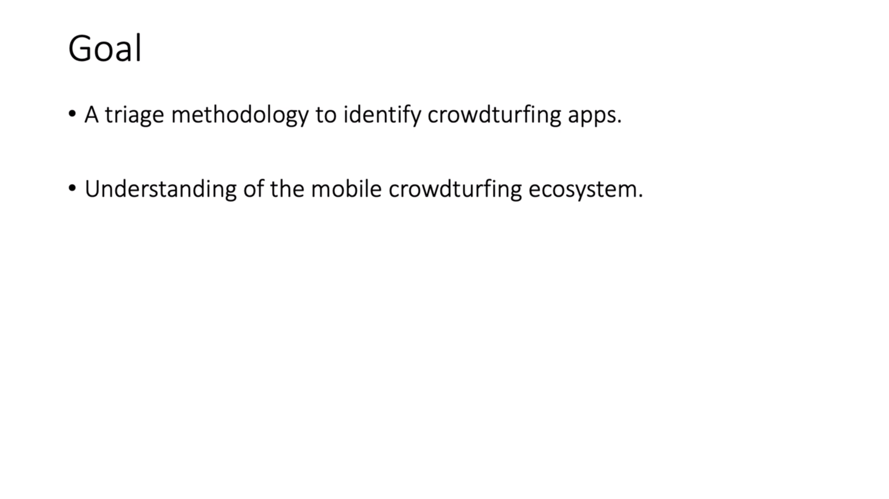
- 연구의 목적 : crowdturfing 앱을 identify 하기
- mobile ecosystem을 이해하는 것

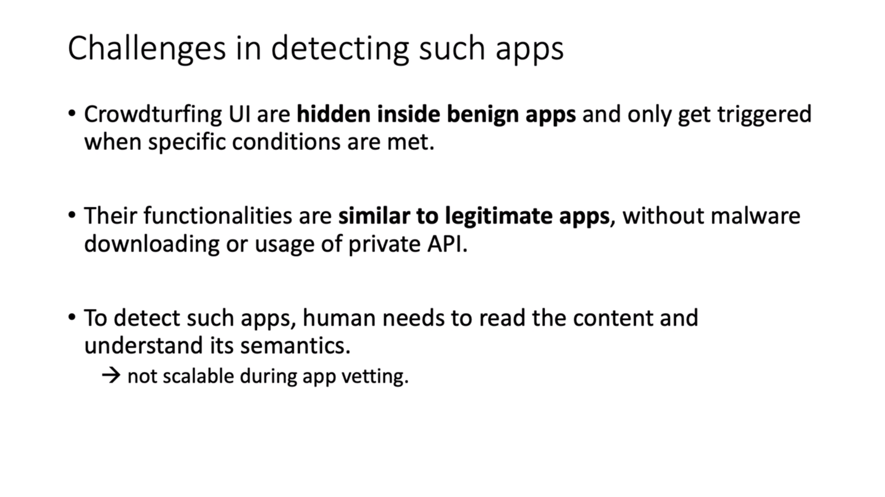
- 악성 코드 탐지하는 방법론으로는 잘 탐지 안됌 : crowdturfing UI가 다른 앱들과 비슷하기 때문
- 코드를 봤을때는 비슷해서 직접 코드 보고 판단하는 수 밖에..
- 그런 방법은 scalable 하지 않음

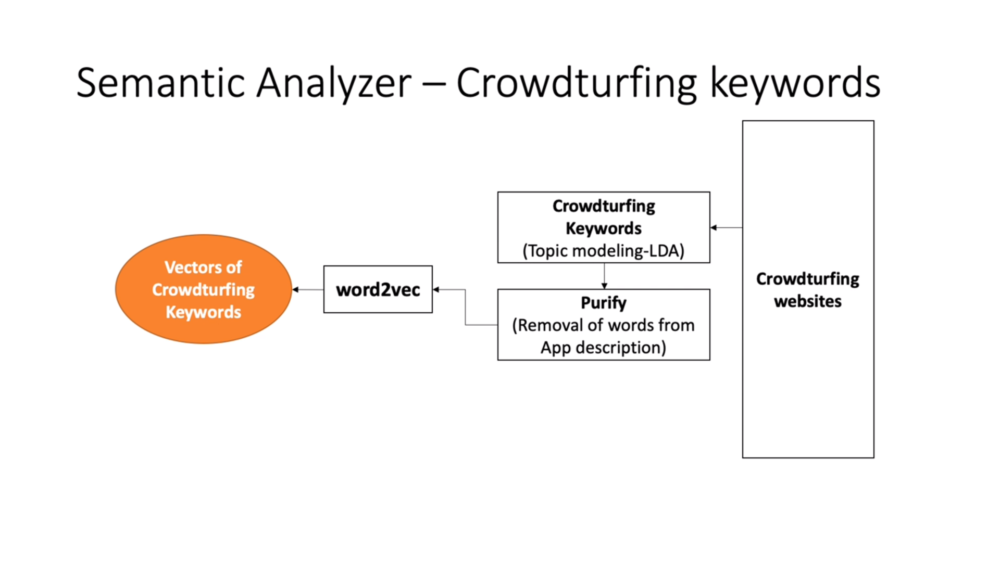
- Crowdturfing keyword 크롤링 해둠
- keyword 추출 후 purify함

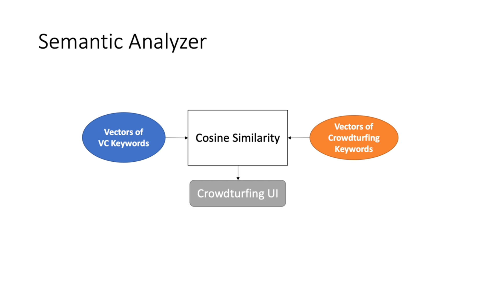
- 의미적으로 유사한지 비교

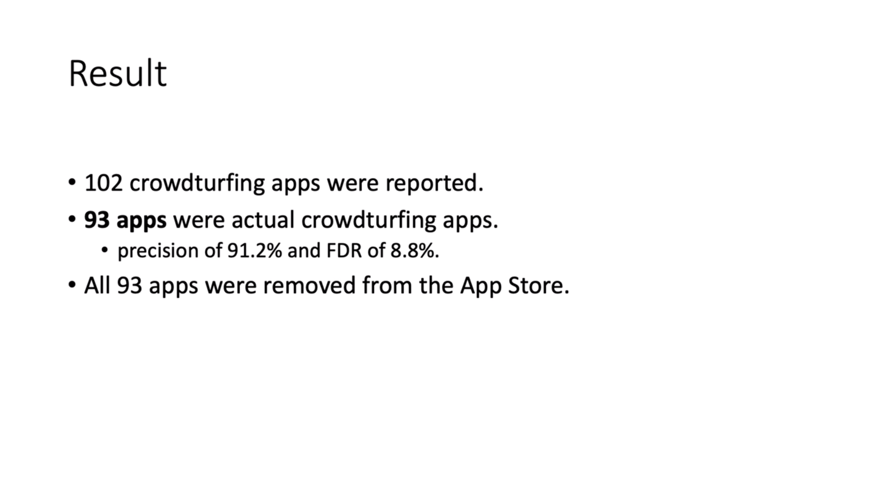
- 정확도는 91.2%
- 93개의 malware 찾음

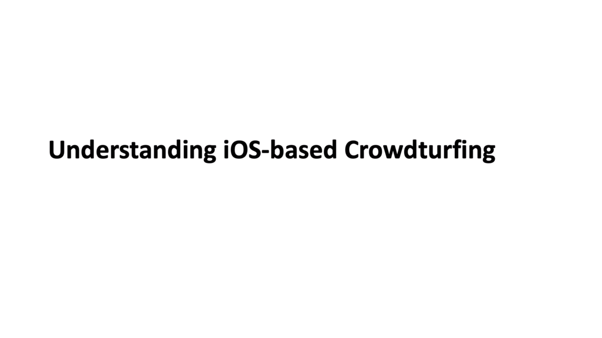
- cyberCriminal이 앱 개발자에게 요청함
- 개발자가 개발해서 줌
- 앱을 올림
- 프로모션해서 많이 깔도록 함
- 사람들이 다운 받음
- 플랫폼이 형성 되면 cyber criminal이 이제 돈을 받고 task를 받음
- 해당 task 를 푸쉬

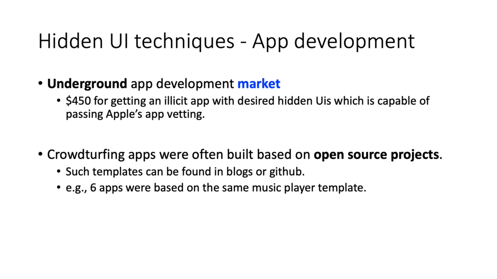
- 오픈 소스 프로젝트를 많이 사용

