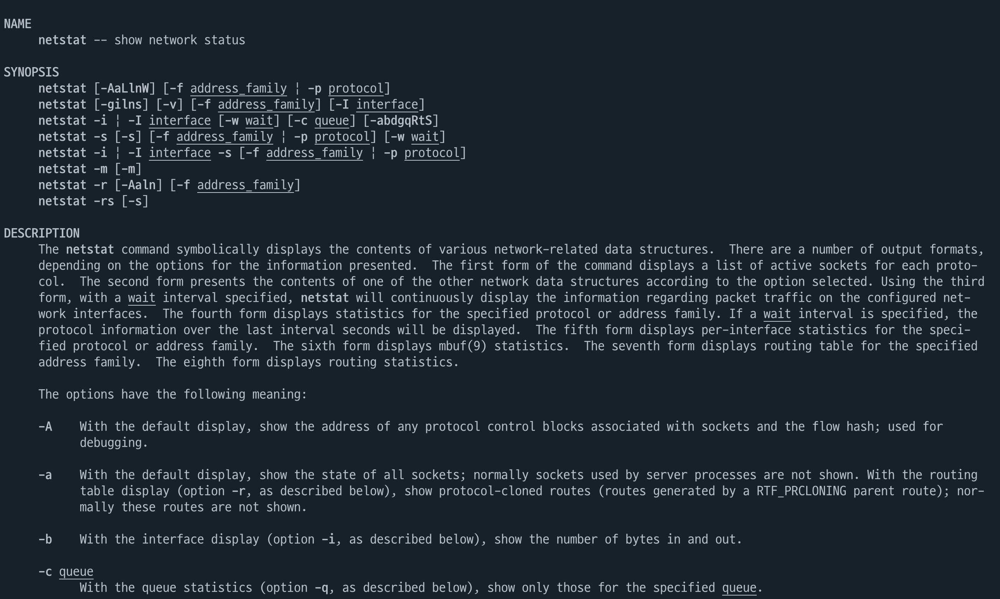
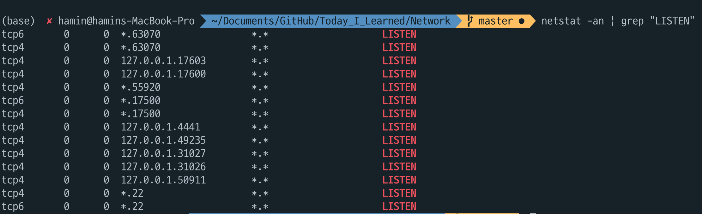
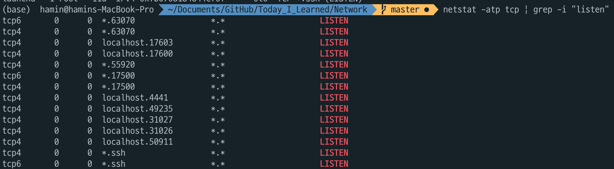
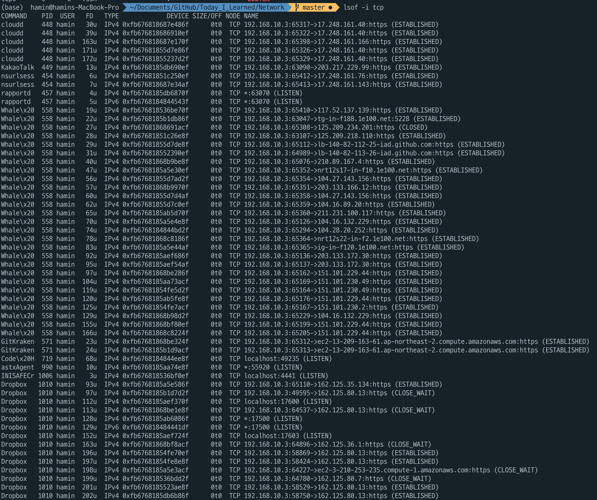
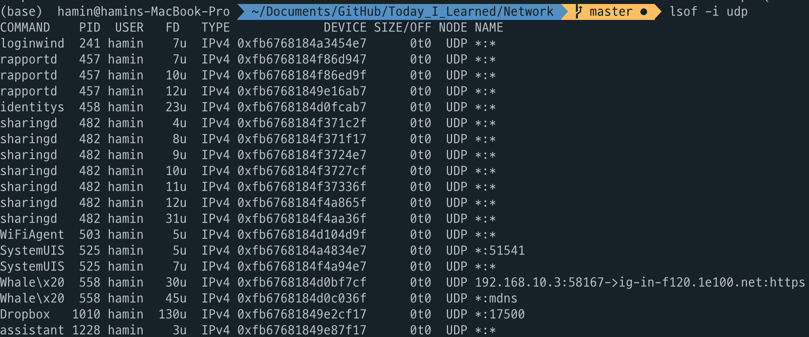
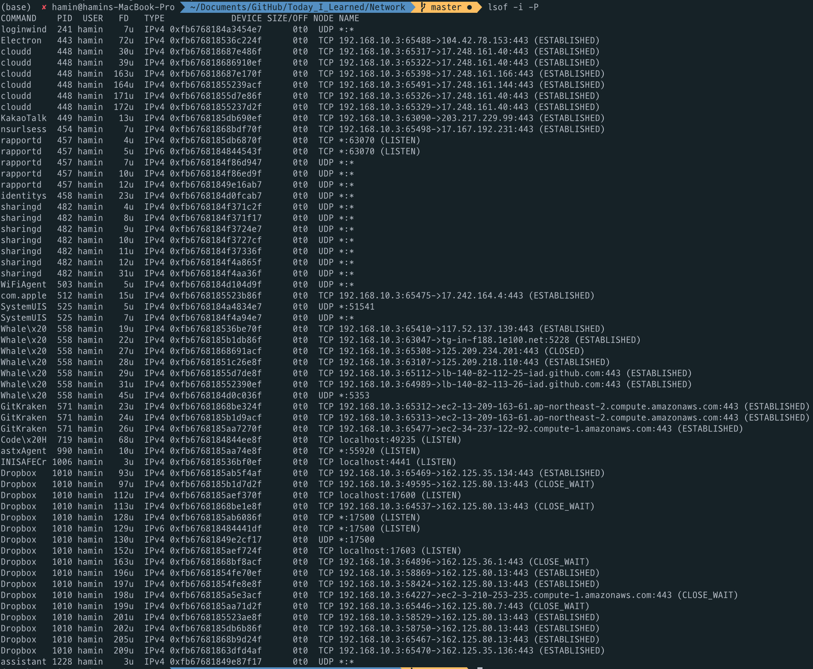
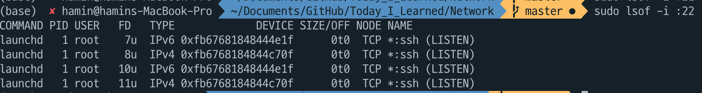

# Check open port in System

## Department of Information System 2017029134 Hamin Lee.

### 1. Use netstat

Command|Explain
-|-
netstat|Display current connections
netstat -a| Display all connections
netstat -b| Also show corresponding executable
netstat -f| Show FQDNs for foreign addresses
netstat -n| Show numbers, not names
netstat -o| Show corresponding process-id

~~~json
netstat -tnl
~~~

option 't' means "TCP", "n" means "Numberic", "I" means "Listening".

The network information factors that displayed in system console is like above.

Proto(Protocol)|Type of protocol, TCP or UDP
-|-
Local Address|Own Ip address and port number. 0.0.0.0 means it is not connected to certain IP.
Foreign Address|Other party's Ip address and port number. 0.0.0.0 means that commuication is not started.
State|Current state of service

State factor that means current network service connection state is like below.
Listening|State that waiting current service
-|-
Established|State that connected other computer
Closed|State that connection is terminated compltely
Time Wait|Connection is terminated but socket is opened

netstat is abbreviation of Network Statistics. It use because "Find the problem of network and determine the quantity of network's traffic by performance measurment.

netstat's command options are like below

If you want to see the information of process that using port, use command like below.

![netstat-tnlp]

If you want to see all information of LISTEN state, command like below.

If you want to see state of process that using TCP protocol, command like below.

### 2. Use lsof (MAC)

And also, you can use lsof.

If you want to see UDP protocol, command like below.

If you want to see all open port, comman like below.

If you want to see process that use specific port, you can use lsof

