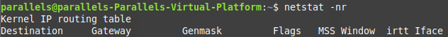

# NTP란?

- ntpd는 ntp 서버를 참조해 시스템 클록을 보정하면서 클라이언트에 시간을 제공하는 데몬

- 라디오나 원자시계에 맞추어 시간을 조정하며 밀리초 1/1000초 단위까지 시간을 조정 가능

- ntp 방식은 straum이라는 계층 구조를 가진다.
  - straum 0 : GPS나 세슘원자 시계 등 시간을 구하는 장비
  - straum 1 : GPS나 세슘원자 시계등에서 직접 시간을 동기화하는 서버를 의미
  - straum 2, 3 : 트리구조를 형성하는데 보통 straum 2에서 동기화하고 straum 3 서버에서 나머지 서버들을 peer로 해서 동기화 시키므로 straum 1 서버들의 부하를 줄인다.
  - 값이 너무 작으면 (Server dropped : strata too high) 이런 에러가 발생하니 적당히 낮은 수치로 설정
  - 1 혹은 2는 외부 ntp 서버값이므로 사용을 안하는 것이 좋음

- ntp는 UDP 123을 기본 포트로 사용하므로 포트 개방이 필요하다
- 우리나라에서 운영되고 있는 ntp 서버는 아래와 같다
  - kr.pool.ntp.org
  - time.bora.net
  - time.nuri.net

# ntp 사용법

## 설치 및 확인

- apt-get update && apt-get install ntp

# ntp 설정

1) ntp 설정 파일 수정
   - vim /etc/ntp.conf
   
   - 다음과 같이 추가해 준다.
   
   - 설정 변경 반영을 위해 재시작을 해 준다.
   
   

2) ntp 관련 패키지 설치

## apt -y install ntp ntpdate

# ntpdate 사용하기

- ntpdate는 서버 시작시 실행되도록 하는것이 좋다. (DB 서버 및 시간에 민감한 서버는 제외)

- 시스템이 부팅될 때 메인보드 CMOS Clock(하드위어 시계)에 의해 OS 시간이 결정되는데
이때 CMOS Clock이 맞지 않을 경우 ntpd에 의해 ntp 서버와 동기화 될때까지 시간이 틀어져 있게 된다.

- ntpdate는 시스템 부팅 때 ntpd 보다 먼저 실행이 되어 ntp 서버와 즉시 동기화를 하므로 어플리케이션 서비스가 구동되기전에 정확한 시간을 보장

## 설치 및 확인

### yum install ntpdate

### rpm -qa | grep ntpdate

## 명령어 사용법

### ntpdate time.bora.net
### ntpdate -s 192.168.10.10

## 옵션

-s : 결과를 화면이 아닌 syslog로 보냄

-u : ntp 프로토콜은 UDP 123 포트를 사용하는데 이 포트가 방화벽등으로 막혀있는 경우 다른 포트를 이용

-b : settimeofday() 시스템 콜로 즉시 시간을 동기화

-B : adjtime() 시스템 콜로 천천히 시간 동기화 (점근적 시간 보정 방식으로 커널 클럭을 조정)

ntpdate의 경우 settimeofday(), adjtime()의 2가지 시스템 콜로 시간을 설정하는데  -b,-B 옵션을 지정하지 않으면
현재 시스템 시간과 128MS 이상으로 차이가 나면 settimeofday()를 이내면 adjtime()을 사용한
부팅할 때는 ntpdate -b로 설정하고 정기적으로 시간을 조정할 때는 옵션없이 ntpdate를 사용하는 것을 권장

# rdate 사용하기

rdate : 원격 타임서버로부터 날짜시간 정보를 받아와 보여주거나 설정하는 명령어

clock : 시스템 CMOS 시간을 현재시간으로 재설정하는 명령어 (리눅스에만 존재)

## 설치 및 확인

### yum install rdate

### rpm -qa | grep rdate

# 명령어 사용법

### rdate 192.168.10.10

### rdate -p 192.168.10.10

# 옵션

-4 : IPv4만 사용

-6 : IPv6만 사용

-o NUM : 지정한 포트(NUM)으로 연결

-p : 호스트의 정보만 출력하고 설정은 안함

-s : 설정만 하고 내용은 출력 안함

-u : TCP 대신 UDP 사용

-v : 상세한 정보 출력

-w : 시스템 시간을 CMOS시간으로 변경

# ntpq 사용하기

- ntpd가 정상적으로 작동하지는 확인할 수 있다.

## 명령어 사용법

### ntpq -p

## 출력 의미

reach 값이 377에 도달하면 동기화가 완료 (보통 6~10분 사이에 동기화)

# clock 사용하기 

- CMOS의 시간을 변경할 수 있는 명령어 (리눅스만 사용가능)

- CMOS의 시간을 OS 시간으로 설정할 수 있고 반대로 OS 시간을 CMOS 시간으로 설정할 수 있다

## 명령어 사용법

### clock -w

## 옵션

-u : CMOS 시간을 국제시간으로 조정

-r : CMOS 시간을 출력

-w : OS 시간으로 CMOS 시간을 설정

-s : CMOS의 시간으로 OS 시간을 조정

-a : CMOS의 시간으로 OS 시간을 조정하고 다시 CMOS에 조정

# 윤초 (ntp slew)

## 1) 윤초란?

- 평균 태양시에 맞추기 위해 가끔식 UTC(세계 협정시)의 1초를 수정하는 것 (시스템고장의 원인이 될 수 있다)

## 2) 예상되는 영향

•    어플리케이션 속도 저하
•    어플리케이션 충돌 및 시동실패
•    Kernel Deadlock
•    윤초 loop 현상
•    CPU 사용 증가

## 3) 윤초 대응방법

•    커널 버전 확인 -> 각 RHEL 버전별 다음의 커널 버전 이상으로 업데이트를 권고 (이전 커널에 시스템 행 버그가 있음)
- RHEL4 : kernel-2.6.9-89.EL 또는 이후
- RHEL5 : kernel-2.6.18-164.el5 또는 이후
- RHEL6 : kernel-2.6.32-358.el6 또는 이후
- RHEL7 : 기본 커널 대응

•    NTP 또는 PTP를 사용해 시간 동기화하는 환경 -> tzdata 업데이트 (optional)
주의) 단 패키지 업데이트만, /etc/localtime 링크는 절대로 변경하지 않음

1-1) Leap Second 시간 즉시 적용 가능한 경우
- 위에 설명된 커널 버전이 최신인지 확인
- 특별한 작업 불필요
- 개별 3rd-party 솔루션이 Leap Second 예외에 대응할 수 있는지 확인

1-2) Leap Second 적용하지 않고 천천히 1초를 동기화 해야 하는 경우
- 이전 버전의 커널을 사용하고 업데이트가 불가능 한 경우 또는 Leap Second을 즉시 적용하지 않고 천천히 동기화 하고자 하는 경우
- ntptime 초기화 후 slew mode로 재시작 (다음과 같이 -x 옵션 추가)
주의) Slew mode의 경우 시간 Jump가 없는 대신 시간 GAP이 발생한 경우 동기화에 더 오랜 시간이 소요

### service ntpd stop

### ntptime -s 0 -f 0

### cat /etc/sysconfig/ntpd
OPTIONS="-u ntp:ntp -p /var/run/ntpd.pid -g -x"

### service ntpd start

주의) RHEL6의 경우 ntp 패키지를 반드시 ntp-4.2.6p5-3.el6_6 또는 이후 버전으로 업데이트

•    별도의 자체 NTP 서버를 운영해 동기화 하고 있는 환경
- NTP 서버가 공식 상위 Stratum NTP 서버와의 동기화(권장) 되었는지 점검
- 만약 외부와 동기화 되지 않은 자체 RHEL기반 NTP 서버의 경우 Leap Second 인지 불가능,

2015년 7월 1일 09시 00분(KST 기준) 이후 외부와의 시차 1초 발생
- 자체 NTP 서버측 : 필요시 수동으로 NTP 서버 시간 조정으로 동기화
- NTP 클라이언트측 : 1) 대응 방안 적용

•    NTP 또는 PTP를 사용하지 않는 경우

1-1) Leap Second 인지가 꼭 필요한 경우
- 가능하면 6월 이전에 일정을 잡고 tzdata 패키지 업데이트
- https://rhn.redhat.com/errata/RHEA-2015-0141.html
- Timezone 파일 변경

### cp /usr/share/zoneinfo/right/Aisa/Seoul /etc/localtime

- 재부팅으로 시스템에 POSIX Time 적용
주의) 향후 NTP 동기화시 Timezone 원복 필요

1-2) Leap Second 인지 없이 향후 수동 조정 가능한 경우
- tzdata 업데이트는 선택
- 향후 수동 시간 조정
주의) 단 패키지 업데이트시 /etc/localtime 링크는 절대로 변경하지 않음

# [Summary]

1. 커널 버전 확인 후 업데이트 (공통사항)

2. NTP서버 구축 환경에 맞게 조치
1) NTP 또는 PTP를 사용해 시간 동기화하는 환경
- tzdata 패키지 업데이트 or slew mode에 -x 옵션 추가 (선택)

2) 별도의 자체 NTP 서버를 운영해 동기화 하고 있는 환경
- 자체 NTP 서버가 윤초 이슈를 해결한 서버일 경우 클라이언트도 동일하게 적용됨
(NTP 서버가 리눅스 서버일경우 '1)' 안을 적용)

3) NTP 또는 PTP를 사용하지 않는 경우
- tzdata 업데이트 