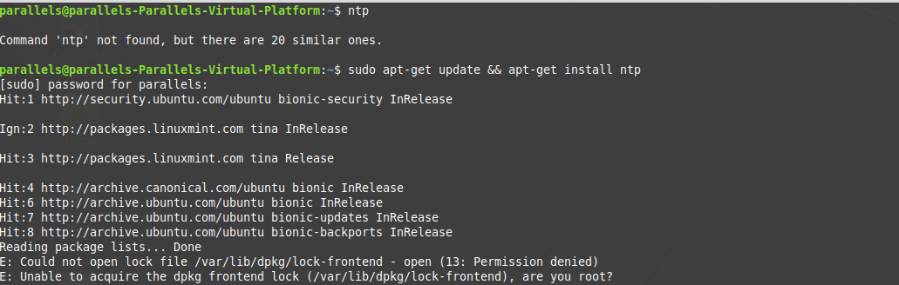
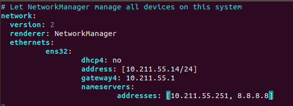
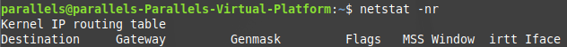
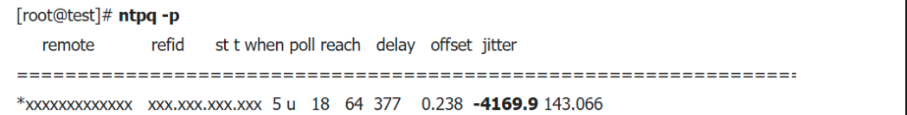

# Assignment 0.6

### Department of Information System 2017029134 이하민

## What is NTP?

- ntpd refers to the ntp server and provides a time to the client while calibrating the system clock.

- Adjust the time according to the radio or atomic clock, and the time can be adjusted in milliseconds to 1/1000 second.

-The ntp method has a hierarchical structure called straum.
   -straum 0: GPS or cesium atomic clock equipment
   -straum 1: means a server that synchronizes time directly from a GPS or cesium atom clock
   -straum 2, 3: Forms a tree structure, which usually synchronizes on straum 2 and synchronizes the rest of the servers on straum 3 as peers, reducing the load on straum 1 servers.
   -If the value is too small (Server dropped: strata too high), this error occurs and set it to a moderately low value.
   -1 or 2 is an external ntp server value, so it is not recommended to use it.

-Since ntp uses UDP 123 as the default port, it is necessary to open the port.
-The ntp servers running in Korea are as follows.
  - kr.pool.ntp.org
  - time.bora.net
  - time.nuri.net

# ntp usage

## Installation and verification

- apt-get update && apt-get install ntp

# ntp settings

1) Modify ntp configuration file
   - vim /etc/ntp.conf
   
   
   
   - Add it as follows.
   
   
   
   - Restart to reflect the setting change.
   
   
   
   

2) Install ntp-related packages

## apt -y install ntp ntpdate

# Using ntpdate

-It is recommended that ntpdate is executed when the server starts. (Excluding DB servers and time-sensitive servers)

-When the system is booted, the OS time is determined by the motherboard CMOS clock.
At this time, if the CMOS clock does not match, the time will be wrong until it is synchronized with the ntp server by ntpd.

-ntpdate is executed prior to ntpd when the system is booted, and it synchronizes immediately with the ntp server, guaranteeing the correct time before the application service starts.

## Installation and verification

### yum install ntpdate

### rpm -qa | grep ntpdate

## Command usage

### ntpdate time.bora.net
### ntpdate -s 192.168.10.10

## option

-s : Send results to syslog, not screen

-u : The ntp protocol uses the UDP 123 port. If this port is blocked by a firewall, use another port.

-b : Synchronize time instantly with settimeofday () system call

-B : Slow time synchronization with adjtime () system call (adjust the kernel clock with asymptotic time correction)

In the case of ntpdate, the time is set by two system calls: settimeofday () and adjtime (). If the -b, -B option is not specified, adjtime () is used if the difference is more than 128MS from the current system time. It is recommended to set ntpdate -b at boot time and use ntpdate without options when adjusting the time on a regular basis.

# Using rdate

rdate : Command to receive date time information from remote time server and display or set

clock : Command to reset the system CMOS time to the current time (only in Linux)

## Installation and verification

### yum install rdate

### rpm -qa | grep rdate

# Command usage

### rdate 192.168.10.10

### rdate -p 192.168.10.10

# option

-4 : IPv4 only

-6 : IPv6 only

-o NUM : Connect to the specified port (NUM)

-p : Print only host information and do not set

-s : Set but not output

-u : Use UDP instead of TCP

-v : Print detailed information

-w : Change system time to CMOS time

# Using ntpq

-You can confirm that ntpd is not operating normally.

## Command Usage

### ntpq -p

## Meaning of output

Label|Description
-|-
remote | Host name of Remote Server
refid | Reference ID (displayed as 0.0.0.0 when not clear)
st | stratum number. It indicates which layer the server is.
t | Layer type (l: local, u: unicast, m: multicast, b: broadcast)
when | Time elapsed since the last packet was received (unit: second)
poll | Polling interval (unit: second)
reach | Reachable register in octal
delay | Estimated time to delay Polling insterval (unit: millisecond)
offset | Offset of layer (unit: millisecond)
jitter | Dispersion of layer (unit: millisecond)

 
 

Mark | Description
-|-
' '(reject) | Servers not used due to long distances
'x'(falsetick) | Server not used as a result of falseticker check
'.'(excess) | Server not used due to many reference servers
'-'(outlyer) | Server not used as a result of clustering test
'+'(candidat) | Server that can be referenced at any time by passing the connection test
'#'(selected) | Servers that are far synchronous but can be referenced
'*'(sys.peer) | Synchronous server
'o'(pps.peer) | Synchronous server (synchronization is done indirectly from the PPS signal)

Synchronization is complete when the reach value reaches 377 (usually synchronization between 6 and 10 minutes)

# Using clock

-Command to change CMOS time (Only for Linux)

-CMOS time can be set as OS time and vice versa.

## Command Usage

### clock -w

## option

-u: Adjust CMOS time to international time

-r: Output CMOS time

-w: Set CMOS time as OS time

-s: Adjust OS time with CMOS time

-a: Adjust OS time to CMOS time and back to CMOS

# Leap second (ntp slew)

## 1) What is a leap second?

-Correcting the 1 second of UTC (Coordinated Universal Time) from time to time to match the average solar time (may cause system failure)

## 2) Expected impact

• Slow application speed
• Application crash and startup failure
• Kernel Deadlock
• Leap second loop phenomenon
• Increased CPU usage

## 3) How to respond to leap seconds

• Checking the kernel version-> It is recommended to update to the following kernel version for each RHEL version (the previous kernel has a system line bug)
-RHEL4: kernel-2.6.9-89.EL or later
-RHEL5: kernel-2.6.18-164.el5 or later
-RHEL6: kernel-2.6.32-358.el6 or later
-RHEL7: Basic kernel support

• Time synchronization using NTP or PTP-> tzdata update (optional)
Note) Only package updates, but never change the / etc / localtime link

1-1) Leap Second time can be applied immediately
-Make sure the kernel version described above is up to date
-No special work required
-Check whether individual 3rd-party solutions can respond to Leap Second exceptions

1-2) When it is necessary to synchronize 1 second slowly without applying Leap Second
-When using an older version of the kernel and updating is not possible, or if you want to synchronize slowly without applying Leap Second immediately
-Restart ntptime and slew mode (add -x option as follows)
Caution) In the case of Slew mode, there is no time jump, but if the time gap occurs, synchronization takes longer

### service ntpd stop

### ntptime -s 0 -f 0

### cat /etc/sysconfig/ntpd
OPTIONS="-u ntp:ntp -p /var/run/ntpd.pid -g -x"

### service ntpd start

Note) For RHEL6, the ntp package must be updated to ntp-4.2.6p5-3.el6_6 or later

• Separate NTP server operating and synchronizing environment
-Check whether the NTP server is synchronized (recommended) with the official upper Stratum NTP server
-If it is own RHEL based NTP server that is not synchronized with the outside, Leap Second cannot be recognized.

Time difference from the outside occurs 1 second after 09:00 (KST) on July 1, 2015
-NTP server itself: Synchronize with NTP server time adjustment manually if necessary
-NTP client side: 1) Apply countermeasures

• When not using NTP or PTP

1-1) When it is necessary to recognize Leap Second
-Schedule tzdata packages before June if possible
- https://rhn.redhat.com/errata/RHEA-2015-0141.html
- Change Timezone file

### cp /usr/share/zoneinfo/right/Aisa/Seoul /etc/localtime

-POSIX Time applied to the system by rebooting
Note) Timezone restoration is required for future NTP synchronization

1-2) In case of manual adjustment in the future without Leap Second recognition
-tzdata update is optional
-Manual manual time adjustment in the future
Note) However, the / etc / localtime link is never changed when updating the package.

# [Summary]

1. Update after checking the kernel version (common)

2. Measures according to the NTP server deployment environment
1) Time synchronization environment using NTP or PTP
-Update tzdata package or add -x option to slew mode (optional)

2) Environment in which a separate NTP server is operated and synchronized
-If its own NTP server is the one that solved the leap second issue, the client is also applied
(If the NTP server is a Linux server, apply '1)')

3) When not using NTP or PTP
-tzdata update