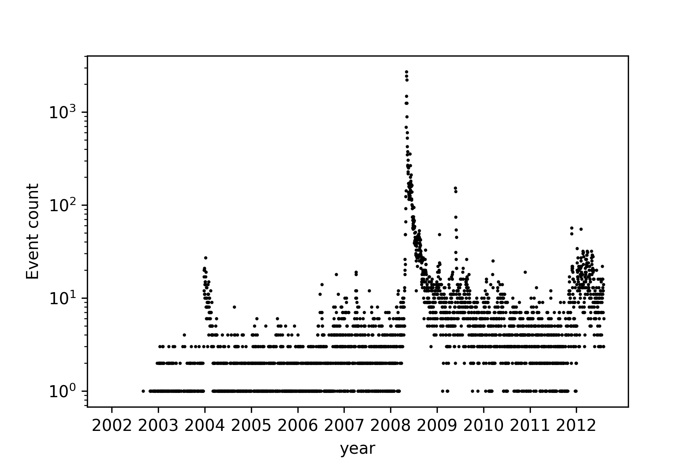
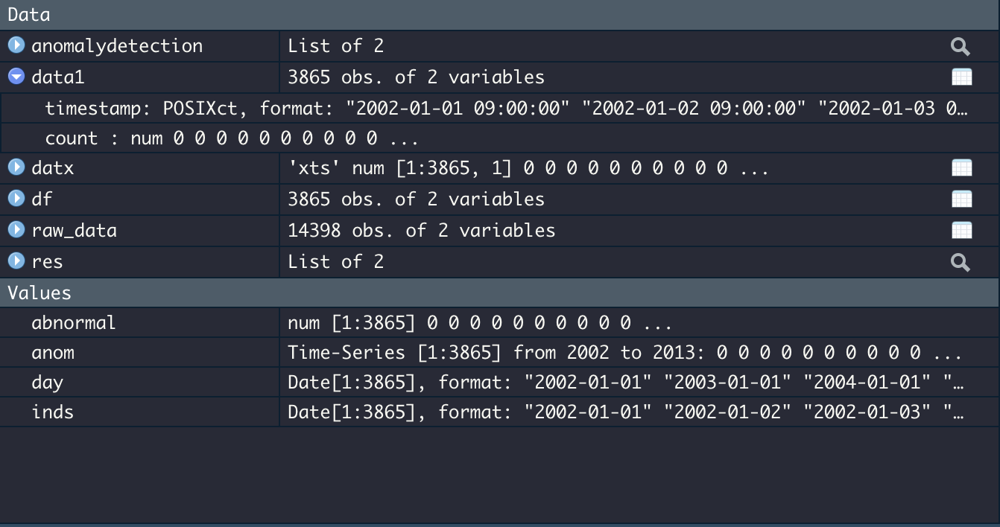

# Assignment 3

## Department of Information System 2017029134 이하민

## 1.Code

### 1) * Must be runned in jupyter notebook *

~~~python
import pandas as pd
import numpy as np
import matplotlib.pyplot as plt
from pylab import figure, axes, pie, title, savefig
%matplotlib inline

data = np.load("/Users/hamin/Documents/GitHub/Today_I_Learned/ComputerSecurity/abnormalEvents/abnormal.npy")  # 데이터 로드

data.size

plt.plot(data, 'ko', markersize=1) # 마커 사이즈 작게
plt.xlabel('year')   # x축은 연도
plt.ylabel('Event count')  # y축은 이벤트의 수

x = range(0,data.size)   # 연도를 계산하기 위해 데이터의 날짜수를 대입
x_ticks = [day for day in x if day%365 == 0]   # 365를 1년으로 계산
x_labels = [str(i+2002) for i in range(len(x_ticks))]  # x축 라벨 표시

plt.xticks(x_ticks, x_labels)
  
plt.yscale('log')   # y축 스케일을 조정
plt.savefig('/Users/hamin/Documents/GitHub/Today_I_Learned/ComputerSecurity/abnormalEvents/timeseries.png', dpi='300')
plt.show()
~~~

### 2) * Runned in R studio *

~~~R
library(RcppCNPy)
library(hrbrthemes)
library(AnomalyDetection)
library(zoo)
library(xts)
library(tidyverse)
library(scales)
abnormal = npyLoad("/Users/hamin/Documents/GitHub/Today_I_Learned/ComputerSecurity/abnormalEvents/abnormal.npy")

inds <- seq(as.Date("2002-01-01"), as.Date("2012-07-31"), by = "day") # array is 3865 -> 2002.01.01 ~ 2012.07.31
set.seed(25)    ## Create a time series object
anom <- ts(abnormal, start = c(2002, as.numeric(format(inds[1], "%j"))), frequency = 365) # Time-series [1:3865]

data1 = data.frame(timestamp=inds, count = coredata(datx))  # dataframe : timestamp*count
data1$timestamp <- as.POSIXct(data1$timestamp)  # convert to POSIXct (inorder to draw plot)
res <- AnomalyDetectionTs(data1, max_anoms=0.02, direction='both', plot=FALSE)  # AnomalyDetectionTs library
res$anoms$timestamp <- as.POSIXct(res$anoms$timestamp)  # convert to POSIXct (inorder to draw plot)
ggplot(data = data1, aes(x=timestamp, y=count)) + 
  geom_line(data=data1, aes(timestamp, count), color='black') + 
  geom_point(data=res$anoms, aes(timestamp, anoms), color='red') +
  scale_y_continuous(labels = function(x) format(x, scientific = FALSE)) +
  ggtitle("Anomalies (Alpha = 0.02, direction=both)") +
  xlab("Timestamp") + ylab("Abnormal Events Count") +
  theme(plot.title = element_text(hjust = 0.5))

~~~

## 2. Result figures

## 1)

## 2)

 

## 3. 
My 1) program is simple. Load npy data and labeling year and count to x-axis and y-axis. In order to calculate year and apply it to loaded data, I use x_ticks variable. And in order to represent y-axis to exponentially, I use yscale('log'). And then draw a plot and save it.
In 2) program, I labeled the timestamp to loaded data, and just draw a plot using AnomalyDetection library and ggplot. The hardest thing in program 2) was plotting function requires POSIXct format. So I have to convert format from loaded npy (array) to POSIXct. And also in program 1) was labeling timestamp. Since not all years were 365 days, labeling had to be taken into account of leap years. So I made array of days of each year. And they referred to an array, divide by it not by 365. This part was simple, but it was the most annoying part.