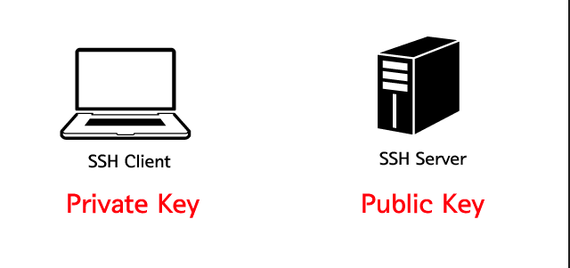
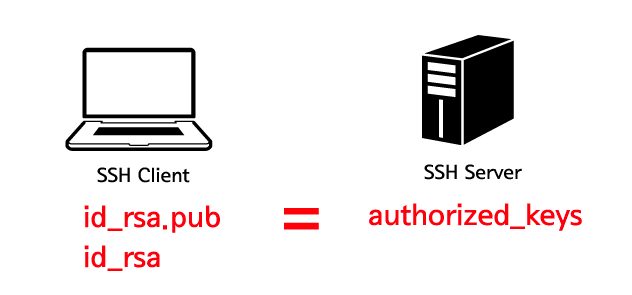

# SSH Key란?

서버에 접속할 때 비밀번호 대신 key를 제출하는 방식이다.
SSH key는 언제 사용하는가?
- 비밀번호보다 높은 수준의 보안을 필요로 할 때
- 로그인 없이 자동으로 서버에 접속할 때

# SSH Key가 동작하는 방식

SSH Key는 공개키(public key)와 비공개 키(private key)로 이루어지는데 이 두개의 관계를 이해하는 것이 SSH Key를 이해하는데 핵심이다. 키를 생성하면 공개키와 비공개키가 만들어진다. 이 중에 비공개키는 로컬 머신에 위치해야 하고, 공개키는 리모트 머신에 위치해야 한다. (로컬 머신은 SSH Client, 원격 머신은 SSH Server가 설치된 컴퓨터를 의미한다.)

SSH 접속을 시도하면 SSH Client가 로컬 머신의 비공개키와 원격 머신의 비공개키를 비교해서 둘이 일치하는지를 확인한다. 

# How to create SSH key?

SSH Key를 통해서 서버에 접속 할 때 Unix 계열(리눅스, 맥)에서는 ssh-keygen이라는 프로그램을 이용하면 된다. 윈도우 머신에서는 SSH Client 프로그램이 자체적으로 제공하는 키 생성 프로그램을 이용하면 된다. 각 프로그램의 메뉴얼을 참조하자. 이번 수업에서는 Unix 계열에서 key를 생성하는 방법을 알아본다.&nbsp;

<h2>ssh-keygen 사용하기</h2>

아래와 같이 입력한다. -t &nbsp;rsa는 rsa라는 암호화 방식으로 키를 생성한다는 의미다.&nbsp;

<pre class="brush: shell">
[axl@asterisk1 axl]$ ssh-keygen -t rsa
Generating public/private rsa key pair.</pre>

SSH 키를 저장할 위치를 지정한다. 엔터를 누르면 기본 경로에 저장된다. 기본 경로는 로그인 한 사용자의 홈디렉토리 아래에 .ssh이다. ($HOME/.ssh) SSH Client는 기본적으로 이 디렉토리에 있는 키를 이용해서 인증을 시도한다.&nbsp;

<pre class="brush: shell">
Enter file in which to save the key (/home/axl/.ssh/id_rsa): &lt;return&gt;</pre>

passphrase 를 입력한다. passphrase는 일종의 비밀번호로 비공개키를 입력한 값으로 암호화한다. 권장 값은 10~30 문자이고 생략 가능하다. 생략하면 이 부분이 보안 홀이 될 수 있기 때문에 주의한다. 자동 로그인을 원한다면 생략해야 한다.&nbsp;

<pre class="brush: shell">
Enter passphrase (empty for no passphrase): &lt;Type the passphrase&gt;</pre>

비밀번호를 확인한다. 같은 값을 입력하면 된다. 아래와 같이 출력된다면 키가 생성된 것이다.

<pre class="brush: shell">
Enter same passphrase again: &lt;Type the passphrase&gt;
Your identification has been saved in /home/axl/.ssh/id_rsa.
Your public key has been saved in /home/axl/.ssh/id_rsa.pub.
The key fingerprint is:
0b:fa:3c:b8:73:71:bf:58:57:eb:2a:2b:8c:2f:4e:37 axl@myLocalHost
</pre>

키를 확인한다.&nbsp;

<pre class="brush: shell">
[axl@asterisk1 axl] ls -al ~/.ssh/</pre>

아래와 같이 출력되면 성공한 것이다.&nbsp;

drwx------ &nbsp;2 egoing egoing 4096 Feb 18 18:54 . 
drwxr-xr-x 16 egoing egoing 4096 Mar &nbsp;1 06:02 .. 
-rw-rw-r-- &nbsp;1 egoing egoing &nbsp;790 Feb 19 06:04 authorized_keys 
-rw------- &nbsp;1 egoing egoing 1675 Feb 18 18:51 id_rsa 
-rw-r--r-- &nbsp;1 egoing egoing &nbsp;395 Feb 18 18:51 id_rsa.pub 
-rw-r--r-- &nbsp;1 egoing egoing 2216 Feb 19 18:34 known_hosts

authorized_keys 파일은 없을수도 있다.&nbsp;

각 파일에 대한 설명은 아래와 같다.&nbsp;

비밀번호를 확인한다. 같은 값을 입력하면 된다. 아래와 같이 출력된다면 키가 생성된 것이다.

<pre class="brush: shell">
Enter same passphrase again: &lt;Type the passphrase&gt;
Your identification has been saved in /home/axl/.ssh/id_rsa.
Your public key has been saved in /home/axl/.ssh/id_rsa.pub.
The key fingerprint is:
0b:fa:3c:b8:73:71:bf:58:57:eb:2a:2b:8c:2f:4e:37 axl@myLocalHost
</pre>

키를 확인한다.&nbsp;

<pre class="brush: shell">
[axl@asterisk1 axl] ls -al ~/.ssh/</pre>

아래와 같이 출력되면 성공한 것이다.&nbsp;

drwx------ &nbsp;2 egoing egoing 4096 Feb 18 18:54 . 
drwxr-xr-x 16 egoing egoing 4096 Mar &nbsp;1 06:02 .. 
-rw-rw-r-- &nbsp;1 egoing egoing &nbsp;790 Feb 19 06:04 authorized_keys 
-rw------- &nbsp;1 egoing egoing 1675 Feb 18 18:51 id_rsa 
-rw-r--r-- &nbsp;1 egoing egoing &nbsp;395 Feb 18 18:51 id_rsa.pub 
-rw-r--r-- &nbsp;1 egoing egoing 2216 Feb 19 18:34 known_hosts

authorized_keys 파일은 없을수도 있다.&nbsp;

각 파일에 대한 설명은 아래와 같다.&nbsp;

<table border="1" cellpadding="1" cellspacing="1" style="width: 500px;">
	<tbody>
		<tr>
			<td>id_rsa</td>
			<td>private key, 절대로 타인에게 노출되면 안된다.</td>
		</tr>
		<tr>
			<td>id_rsa.pub</td>
			<td>public key, 접속하려는 리모트 머신의 authorized_keys에 입력한다.</td>
		</tr>
		<tr>
			<td>authorized_keys</td>
			<td>리모트 머신의 .ssh 디렉토리 아래에 위치하면서 id_rsa.pub 키의 값을 저장한다. 자세한 내용은 다음 단락을 참조</td>
		</tr>
	</tbody>
</table>

.ssh 디렉토리는 매우 중요한 보안 정보가 담긴 디렉토리다. 따라서 퍼미션 설정을 꼭해야 하는데 아래와 같은 설정을 권장한다. 아래의 명령을 순차적으로 실행한다.

<pre class="brush: shell">
chmod 700 ~/.ssh
chmod 600 ~/.ssh/id_rsa
chmod 644 ~/.ssh/id_rsa.pub  
chmod 644 ~/.ssh/authorized_keys
chmod 644 ~/.ssh/known_hosts</pre>

# How to add SSH key to where?

이제 id_rsa.pub 파일을 리모트 서버의 $HOME/.ssh/authorized_keys 파일에 추가해줘야 한다. 아래의 그림을 보자.&nbsp;

SSH Server의 authorized_keys 의 내용이 SSH Client의 id_rsa.pub 파일과 같아야 한다. 그래서 ssh 접속을 할 때 id_rsa 파일과 authorized_keys 파일의 내용을 비교 할 수 있다. 일반적으로 SCP를 사용한다. SCP는 파일을 전송하는 프로그램인데, 아래와 같은 형식을 갖는다.

scp $HOME/.ssh/id_rsa 리모트 머신의 아이디@리모트 머신의 호스트 주소:저장할 파일

위의 형식에 따라서 로컬 머신의 id_rsa.pub 파일을 리모트 머신의 홈디렉토리로 전송해보자. 아래는 SSH Client가 설치된 로컬 머신에서 실행하는 명령이다.

<pre class="brush: shell">
scp $HOME/.ssh/id_rsa.pub egoing@egoing.net:id_rsa.pub</pre>

아래와 같은 메시지가 뜬다면 전송에 성공한 것이다.&nbsp;

id_rsa.pub &nbsp; &nbsp; &nbsp; &nbsp; &nbsp; &nbsp; &nbsp; &nbsp; &nbsp; &nbsp; &nbsp; &nbsp; &nbsp; &nbsp; &nbsp; &nbsp; &nbsp; &nbsp; &nbsp; &nbsp; &nbsp; &nbsp; &nbsp; &nbsp; &nbsp; &nbsp; &nbsp; &nbsp; &nbsp; &nbsp; &nbsp; &nbsp; &nbsp; &nbsp; &nbsp; &nbsp; &nbsp; &nbsp; &nbsp; &nbsp; &nbsp; &nbsp; &nbsp; 100% &nbsp;395 &nbsp; &nbsp; 0.4KB/s &nbsp; 00:00&nbsp;

이제 원격 머신에서&nbsp;전송한 id_rsa.pub 파일을&nbsp;authorized_keys 파일에 추가해보자. 아래의 명령에서 cat는 뒤에 따라오는 파일의 내용을 화면에 출력하는 것이고, &gt;&gt; 는 cat이 출력한 내용을 authorized_keys 파일에 추가하는 것이다. 내용을 교체하는 것이 아니라 추가하는 것이라는 점에 주의하자. 만약 리모트 머신으로 접속하는 여러개의 로컬 머신이 있다면 각각의 로컬 머신의 id_ras.pub 파일을 authorized_keys에 추가해주면 된다.&nbsp;

<pre class="brush: shell">
cat $HOME/id_rsa.pub &gt;&gt; $HOME/.ssh/authorized_keys</pre>

# How to enable SSH key access?

접속을 시도한다.&nbsp;egoing.net에 접속을 한다고 하면 아래와 같다. 접속 방법은 SSH 클라이언트를 참고한다. (<a href="http://opentutorials.org/module/432/3739" target="_blank">Mac</a>, <a href="http://opentutorials.org/module/432/3747" target="_blank">리눅스</a>)

<pre class="brush: shell">
ssh egoing.net</pre>

비밀번호 없이 접속 되었다면 성공적으로 설정한 것이다.&nbsp;

만약 id_rsa 파일을 $HOME/.ssh/id_rsa에 만들지 않고 다른 디렉토리에 만들었다면 -i 옵션을 사용한다.&nbsp;

홈디렉토리에 auth라는 이름의 파일에 id_rsa의 내용이 담겨 있다면 아래와 같이 한다.&nbsp;

<pre class="brush: shell">
ssh -i $HOME/auth egoing.net</pre>

접속하는 과정에서 많은 오류 상황이 있을 수 있다. 이럴 때는 ssh의 옵션 중에 -v를 이용하면 어디에서 문제가 발생했는지 추적하는데 도움이 된다. 더 자세한 정보는 -vv, -vvv를 통해서 열람 할 수 있다.&nbsp;

<pre class="brush: shell">
ssh -v egoing.net </pre>
