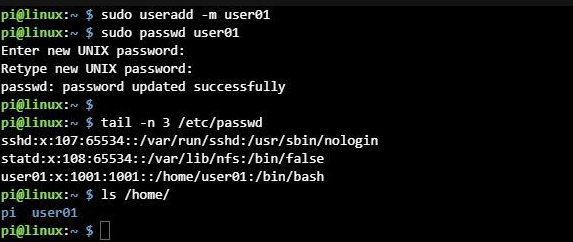

# Assignment 0.5

## 정보시스템학과 2017029134 이하민

## 1. How to add a user in Linux Command?

The useradd command adds a user account.
An account is a system that creates a user ID and password to grant a license.
The password generation command is passwd.

The Linux Unix operating system is a multi-user system.
When installing Linux, there is basically an administrator named super user, namely root,
This administrator has the authority to create and manage users who can access the system.

In other words, this command is used when the root authority creates a user other than root. It can be called useradd, but it can also be written as addUser.

~~~markdown
useradd [option] username(ID)
~~~

# Simple user add example

sudo useradd -m user01

The useradd command's -m option also creates the user's home directory.

There are many other options.

-g group assignment

-d directory

-s shell

-p Specify password (password)

## Set password

sudo passwd user01

After creating a user, you must create a password.

(You can change the user password expiration date using the chage command.)

## Check the created user (user)

tail -n 3 / etc / passwd

I used the tail command to check the contents at the bottom of the file.

Created user information can be found in the / etc / passwd user file.

User Name: Password: User ID: Group ID: Additional Information: Home Directory: Shell

(For reference, group file is / etc / group, password file is / etc / shadow)

ls / home /

Confirm that the user's home directory has been created.

Use the su command to change users on the console or terminal.

## Change User

su user01

Changing the user does not change the directory.

Type exit to return to the previous user.

## 2. How to look the user into their home directory?

## Status comparison with or without home directory

If you log in while you have a home directory, you will see your account name (hamin) and current directory (~) on the command line as shown in the picture below.
'~' Means the home directory.
And if you look at files and folders with "ls -al" in your home directory, there are hidden files and folders that contain your account information.

If you log in while your home directory is missing
1) An error message is displayed saying that the home directory cannot be found.
2) Connect to '/', the root home directory
3) The account name and current directory are not visible.

## Create a home directory manually

If you look at the error phrase, you can see where your home directory is set.

~~~markdown
Could not chdir to home directory /home/testUser:No such file or directory
~~~

First, create a directory that matches the address to create a home directory.
However, root authority may be required depending on the location, so use the root account or "sudo" appropriately.
After creating the directory, change the directory owner to "chown" so that testUser (ID) becomes the owner.

~~~markdown
$ sudo mkdir /home/testUser
$ sudo chown testUser.testUser /home/testUser
~~~

If you create a directory and log in again
1) The error phrase disappears
2) You will be connected to the directory you just created.

## Get basic account information

The home directory contains hidden files and directories for account information. However, since the newly created directory is empty, you cannot use the account normally even if you access the home directory.

The basic information (hidden files) that user accounts should have is contained in "/ etc / skel", and you can copy it and save it in the newly created directory.
The sub-contents of "/ etc" are information for the root account, so when copying, use the root account or "sudo" privilege.
It also changes the owner of the copied files after copying.

~~~ markdown
$ cd / home / testUser
$ sudo cp -r / etc / skel /. .
$ sudo chown -R testUser.testUser.
~~~

If you do the above, you can see that the home directory was created normally.

## 3. How to create SSH key?

### What is SSH Key?

This is a method of submitting a key instead of a password when accessing the server.
When to use SSH key
- When you need a higher level of security than your password
- When connecting to the server automatically without login

### How SSH Key works

The SSH Key consists of a public key and a private key. Understanding the relationship between the two is key to understanding the SSH key. Generating a key creates a public and private key. The private key must be located on the local machine, and the public key must be located on the remote machine. (The local machine is the SSH Client, and the remote machine is the computer where the SSH Server is installed.)

When you try to connect to SSH, the SSH Client compares the private key on the local machine with the private key on the remote machine and checks if they match.

When connecting to the server through SSH Key, you can use the program called ssh-keygen in Unix (Linux, Mac). On Windows machines, you can use the key generation program provided by the SSH Client program itself. Please refer to the manual of each program. In this lesson, we will learn how to create a key in Unix series.&nbsp;

<h2>Using ssh-keygen</h2>

Enter as below. -t &nbsp;rsa means that the key is generated using the encryption method rsa..&nbsp;

<pre class="brush: shell">
[axl@asterisk1 axl]$ ssh-keygen -t rsa
Generating public/private rsa key pair.</pre>

Specifies the location to store the SSH key. Press Enter to save to the default path. The default path is .ssh under the home directory of the logged in user. ($HOME/.ssh) SSH Client basically tries to authenticate using the key in this directory.&nbsp;

<pre class="brush: shell">
Enter file in which to save the key (/home/axl/.ssh/id_rsa): &lt;return&gt;</pre>

Enter passphrase. The passphrase is a type of password that encrypts the private key with the entered value. Recommended value is 10 ~ 30 characters and can be omitted. Note that this part can be a security hole if omitted. If you want automatic login, you should omit it.&nbsp;

<pre class="brush: shell">
Enter passphrase (empty for no passphrase): &lt;Type the passphrase&gt;</pre>

Confirm the password. Just enter the same value. If the following output is displayed, the key has been created.

<pre class="brush: shell">
Enter same passphrase again: &lt;Type the passphrase&gt;
Your identification has been saved in /home/axl/.ssh/id_rsa.
Your public key has been saved in /home/axl/.ssh/id_rsa.pub.
The key fingerprint is:
0b:fa:3c:b8:73:71:bf:58:57:eb:2a:2b:8c:2f:4e:37 axl@myLocalHost
</pre>

Check the key.&nbsp;

<pre class="brush: shell">
[axl@asterisk1 axl] ls -al ~/.ssh/</pre>

If it prints out as below, it is successful.&nbsp;

drwx------ &nbsp;2 egoing egoing 4096 Feb 18 18:54 . 
drwxr-xr-x 16 egoing egoing 4096 Mar &nbsp;1 06:02 .. 
-rw-rw-r-- &nbsp;1 egoing egoing &nbsp;790 Feb 19 06:04 authorized_keys 
-rw------- &nbsp;1 egoing egoing 1675 Feb 18 18:51 id_rsa 
-rw-r--r-- &nbsp;1 egoing egoing &nbsp;395 Feb 18 18:51 id_rsa.pub 
-rw-r--r-- &nbsp;1 egoing egoing 2216 Feb 19 18:34 known_hosts

authorized_keys 파일은 없을수도 있다.&nbsp;

The authorized_keys file may not exist.&nbsp;

비밀번호를 확인한다. 같은 값을 입력하면 된다. 아래와 같이 출력된다면 키가 생성된 것이다.

<pre class="brush: shell">
Enter same passphrase again: &lt;Type the passphrase&gt;
Your identification has been saved in /home/axl/.ssh/id_rsa.
Your public key has been saved in /home/axl/.ssh/id_rsa.pub.
The key fingerprint is:
0b:fa:3c:b8:73:71:bf:58:57:eb:2a:2b:8c:2f:4e:37 axl@myLocalHost
</pre>

키를 확인한다.&nbsp;

<pre class="brush: shell">
[axl@asterisk1 axl] ls -al ~/.ssh/</pre>

아래와 같이 출력되면 성공한 것이다.&nbsp;

drwx------ &nbsp;2 egoing egoing 4096 Feb 18 18:54 . 
drwxr-xr-x 16 egoing egoing 4096 Mar &nbsp;1 06:02 .. 
-rw-rw-r-- &nbsp;1 egoing egoing &nbsp;790 Feb 19 06:04 authorized_keys 
-rw------- &nbsp;1 egoing egoing 1675 Feb 18 18:51 id_rsa 
-rw-r--r-- &nbsp;1 egoing egoing &nbsp;395 Feb 18 18:51 id_rsa.pub 
-rw-r--r-- &nbsp;1 egoing egoing 2216 Feb 19 18:34 known_hosts

The authorized_keys file may not exist.&nbsp;

The description of each file is as follows.&nbsp;

<table border="1" cellpadding="1" cellspacing="1" style="width: 500px;">
	<tbody>
		<tr>
			<td>id_rsa</td>
			<td>private key, You should never be exposed to others.</td>
		</tr>
		<tr>
			<td>id_rsa.pub</td>
			<td>public key, Enter the authorized_keys of the remote machine you want to access.</td>
		</tr>
		<tr>
			<td>authorized_keys</td>
			<td>It is located under the .ssh directory on the remote machine and stores the value of the id_rsa.pub key. See the next paragraph for details.</td>
		</tr>
	</tbody>
</table>

The .ssh directory is a directory of very important security information. Therefore, you must set the permission, but the following settings are recommended. Execute the following commands sequentially.

<pre class="brush: shell">
chmod 700 ~/.ssh
chmod 600 ~/.ssh/id_rsa
chmod 644 ~/.ssh/id_rsa.pub  
chmod 644 ~/.ssh/authorized_keys
chmod 644 ~/.ssh/known_hosts</pre>

## 4. Add SSH key to where?

Now you need to add the id_rsa.pub file to the remote server's $ HOME / .ssh / authorized_keys file. Look at the picture below.&nbsp;

The contents of authorized_keys of the SSH Server should be the same as the id_rsa.pub file of the SSH Client. So, when you connect to ssh, you can compare the contents of id_rsa file and authorized_keys file. SCP is generally used. SCP is a program for transferring files, and has the following format.

scp $HOME/.ssh/id_rsa Remote machine ID @ remote machine host address: file to save

Send the id_rsa.pub file of the local machine to the home directory of the remote machine according to the above format. Below is the command to run on the local machine where the SSH Client is installed.

<pre class="brush: shell">
scp $HOME/.ssh/id_rsa.pub egoing@egoing.net:id_rsa.pub</pre>

If the following message appears, the transmission was successful.&nbsp;

id_rsa.pub &nbsp; &nbsp; &nbsp; &nbsp; &nbsp; &nbsp; &nbsp; &nbsp; &nbsp; &nbsp; &nbsp; &nbsp; &nbsp; &nbsp; &nbsp; &nbsp; &nbsp; &nbsp; &nbsp; &nbsp; &nbsp; &nbsp; &nbsp; &nbsp; &nbsp; &nbsp; &nbsp; &nbsp; &nbsp; &nbsp; &nbsp; &nbsp; &nbsp; &nbsp; &nbsp; &nbsp; &nbsp; &nbsp; &nbsp; &nbsp; &nbsp; &nbsp; &nbsp; 100% &nbsp;395 &nbsp; &nbsp; 0.4KB/s &nbsp; 00:00&nbsp;

Now let's addthe id_rsa.pub file sent from &nbsp; the remote machine&nbsp; to the authorized_keys file. In the command below, cat prints the contents of the following file on the screen, &gt;&gt; is to add the output of cat to the authorized_keys file. Note that the content is not replaced, but added. If there are multiple local machines connecting to a remote machine, add the id_ras.pub file of each local machine to authorized_keys.&nbsp;

<pre class="brush: shell">
cat $HOME/id_rsa.pub &gt;&gt; $HOME/.ssh/authorized_keys</pre>

## 5. How to enable SSH key access?

Try to connect.&nbsp;If you connect to egoing.net, it is as follows. 

<pre class="brush: shell">
ssh egoing.net</pre>

If you are connected without a password, you have successfully set up.&nbsp;

If the id_rsa file is not created in $ HOME / .ssh / id_rsa but in another directory, use the -i option.&nbsp;

If the contents of id_rsa are contained in a file named auth in the home directory, do the following.&nbsp;

<pre class="brush: shell">
ssh -i $HOME/auth egoing.net</pre>

There can be many error situations during the connection process. In this case, using -v in ssh's options will help you track where the problem occurred. For more information, please visit -vv, -vvv.&nbsp;

<pre class="brush: shell">
ssh -v egoing.net </pre>