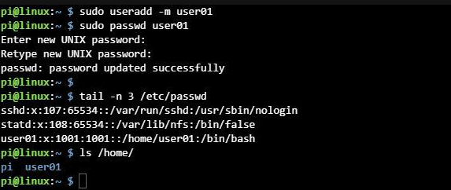
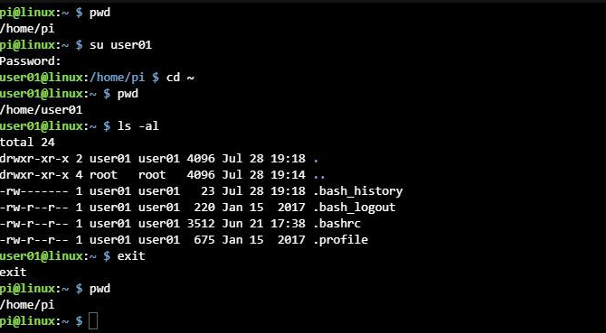

# How to add in Linux command

리눅스는 멀티유저 운영체제이기 떄문에 많은 사람들이 한 컴퓨터를 사용할 수 있습니다.

## USERADD 명령어

useradd 명령어는 사용자 계정을 추가 해줍니다.
계정이란 시스템에 아이디와 패스워드를 생성하여 사용권을 부여하는 것을 말합니다.
패스워드를 생성하는 명령어는 passwd입니다.

리눅스 유닉스 운영체제는 다중 사용자 시스템입니다.
리눅스를 설치하면 기본적으로 root라는 이름을 가진 관리자 즉 슈퍼유저가 있고,
이 관리자는 시스템에 접속할 수 있는 사용자들을 생성하고 관리하는 권한을 가지고 있습니다.

즉 root 권한자가 root이외의 사용자를 생성할 때 사용하는 명령어로, useradd라 해도 되지만 addUser라 써도 됩니다.

~~~markdown
useradd [option] 사용자 계정 이름
~~~

# 간단한 사용자 추가 예제

- useradd giancarlo : giancarlo라는 계정을 아무 옵션 없이 추가했습니다.
이렇게 사용자만 만들어줬을 경우에는 비번이 설정되어 있지 않아서 사용자가 접속할 수가 없습니다.
로그인 하면 바로 비밀번호 입력하라는 커맨드가 뜨기 때문입니다.

- passwd giancarlo
따라서 계정을 생성한 뒤에는 그 계정의 초기 비밀번호를 설정해줍니다.

이제 로그인을 하려면 alt+F2를 눌러서 가상터미널 tty2로 가서 만들어준 계정으로 로그인을 해주면 됩니다.

로그인을 하면 해당 계정은 홈 디렉터리가 없다는 알람이 뜹니다.
useradd는 단순히 사용자 계정을 추가해주는 역할만 하는게 아니라 여러 옵션으로 설정을 진행할 수 있습니다.

## 사용자 만들기

sudo useradd -m user01

useradd 명령의 -m 옵션을 사용하면 사용자의 홈 디렉토리도 함께 만듭니다.

그 밖에도 다양한 옵션이 있습니다.

-g 그룹 지정

-d 디렉토리 지정

-s 쉘(shell) 지정

-p 패스워드(암호) 지정

## 비밀번호 설정하기

sudo passwd user01

사용자 생성 후 비밀번호를 꼭 만들어야 합니다.

(chage 명령어를 사용하면 사용자 비밀번호 만기일을 변경할 수 있습니다.)

## 생성된 사용자(유저) 확인

tail -n 3 /etc/passwd

파일의 밑에 있는 내용을 확인하기 위해 tail 명령어를 사용했습니다.

만들어진 사용자 정보는 /etc/passwd 사용자 파일에서 확인할 수 있습니다. 

사용자이름:암호:사용자ID:그룹ID:추가정보:홈디렉토리:쉘

(참고로 그룹파일은 /etc/group, 비밀번호파일은 /etc/shadow)

ls /home/

사용자의 홈 디렉토리가 만들어진 것을 확인합니다.

콘솔이나 터미널에서 사용자를 변경하기 위해서는 su명령을 사용합니다.

## 사용자 변경

su user01

사용자를 변경한다고 해서 디렉토리까지 변경되는 것은 아닙니다.

이전 사용자로 돌아가기 위해서는 exit를 입력합니다.