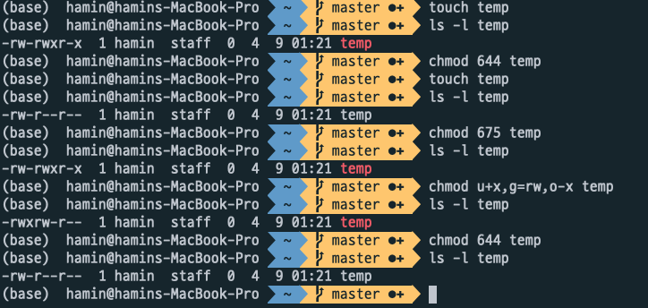

# Chmod란?

유닉스 및 유닉스 유사 운영 체제에서 chmod는 파일 시스템 개체(파일 및 디렉토리)의 액세스 권한을 변경하는 데 사용되는 명령 및 system call이다. 
특수 모드 플래그를 변경할 때도 사용된다. 요청은 umask로 필터링된다. 이름은 Change mode의 약칭이다.

접근 권한 변경 (chmod)
- chmod 명령 : 기존 파일 또는 디렉토리에 대한 접근 권한 (파일 모드)을 변경할 때 사용
- 파일 모드의 변경은 파일 소유자나 슈퍼 유저만 가능
- 파일 모드는 기호(문자)나 8진수로 지정

## 주요 옵션

옵션|설명
-|-
-R|하위 디렉토리와 파일의 권한 까지 변경 (동일 권한을 디렉토리와 파일에 저장)

### 접근 권한을 기호 (문자)로 표현
- 문자 표기법은 변경할 사용자(대상), 수행할 명령(연산), 설정할 퍼미션(접근 권한) 세 부분으로 분류 됨
- 다른 대상의 속성을 건드리지 않고 한 대상 속성만 설정할 수 있는 장점을 가짐
- 복수 지정은 콤마(,)를 사용하여 구분

<table>
       <thead>
           <tr>
               <th>구분</th>
               <th>기호</th>
               <th>설명</th>
           </tr>
       </thead>
       <tbody>
           <tr>
               <td rowspan=5>사용자   (대상) </td>
               <td>u</td>
               <td>user의 약자, 파일이나 디렉토리 소유자를 의미</td>
           </tr>
           <tr>
               <td>g</td>
               <td>그룹 소유자</td>
           </tr>
           <tr>
               <td>o</td>
               <td>others의 약자, 기타 사용자를 의미</td>
           </tr>
           <tr>
               <td>a</td>
               <td>all의 약자, u, g, o의 조합</td>
           </tr>
           <tr>
               <td></td>
               <td>아무 문자를 사용하지 않으면 all로 추정</td>
           </tr>
           <tr>
               <td rowspan=3>수행할 명령   (연산) </td>
               <td>+</td>
               <td>추가</td>
           </tr>
           <tr>
               <td>-</td>
               <td>제거</td>
           </tr>
           <tr>
               <td>=</td>
               <td>지정, 기존의 속성 값은 사라짐</td>
           </tr>
           <tr>
               <td rowspan=3>설정 할 퍼미션   (접근 권한) </td>
               <td>r</td>
               <td>읽기</td>
           </tr>
           <tr>
               <td>w</td>
               <td>쓰기</td>
           </tr>
           <tr>
               <td>x</td>
               <td>실행</td>
           </tr>
        </tbody>
</table>

### 사용 예시
표기법|의 미
-|-
u+x|소유자에게 실행 권한을 추가
u-x|소유자의 실행 권한 제거
+x|모든 사용자 (소유자, 그룹, 기타 사용자)에게 실행 권한 추가)
o-rw|기타 사용자의 읽기, 쓰기 권한 제거
go=rw|그룹, 기타 사용자에게 읽기. 쓰기 권한 지정, 이전에 실행 권한을 가지고 있다면 제거 됨
u+x,go=rw|소유자에게 실행 권한을 추가하고 그룹, 기타 사용자에게 읽기, 쓰기 권한 지정
a=rw|모든 사용자에게 읽기, 쓰기 권한 지정
g-w|그룹 소유자의 쓰기 권한 제거
g+w, o-x|그룹 소유자에게 쓰기 권한 추가, 기타 사용자의 쓰기 권한을 제거

### 접근 권한을 8진수로 표현
- 원하는 파일의 접근 권한을 설정하기 위해 8진수 표기법을 사용
- 3자리의 8진수로 소유자, 그룹 소유자, 기타 사용자를 위한 파일 모드를 설정 할 수 있음.
- r(읽기, 4), w(쓰기, 2), x(실행, 1)
- 2진법과 9진법의 파일 모드

8진법|2진법|파일모드
-|-|-
0|000|---
1|001|--x
2|010|-w-
3|011|-wx
4|100|r--
5|101|r-x
6|110|rw-
7|111|rwx

### chmod 사용 예시

https://eunguru.tistory.com/93 참고