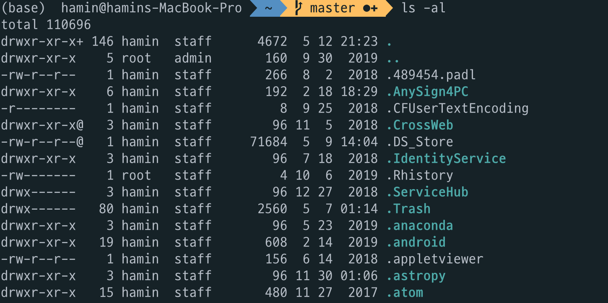

# How to look the user into their home directory?

## 홈 디렉토리 유무에 따른 상태 비교

홈 디렉토리가 있는 상태에서 로그인을 하면 아래 사진처럼 커맨드라인에 계정 이름(hamin)과 현재 디렉토리(~)가 보입니다.
'~'은 홈 디렉토리를 의미합니다.
그리고 홈 디렉토리에서 "ls -al"로 파일 및 폴더를 살펴보면, 계정 정보가 담겨있는 숨겨진 파일 및 폴더들이 있다.

홈 디렉토리가 없어진 상태에서 로그인을 하면 
1) 홈 디렉토리를 찾을 수 없다고 에러 문구가 보이며
2) root의 홈 디렉토리인 '/'으로 접속하고
3) 계정 이름과 현재 디렉토리가 보이지 않는다.

## 홈 디렉토리를 수동으로 만들기

에러문구를 살펴보면 자신의 홈 디렉토리가 어디로 설정되어 있는지 알 수 있다.

~~~markdown
Could not chdir to home directory /home/testUser:No such file or directory
~~~

먼저 주소에 맞는 디렉토리를 생성하여 홈 디렉토리를 만들도록 한다.
단, 위치에 따라 root 권한이 필요할 수 있으므로, root 계정 또는 "sudo"를 적절히 이용한다.