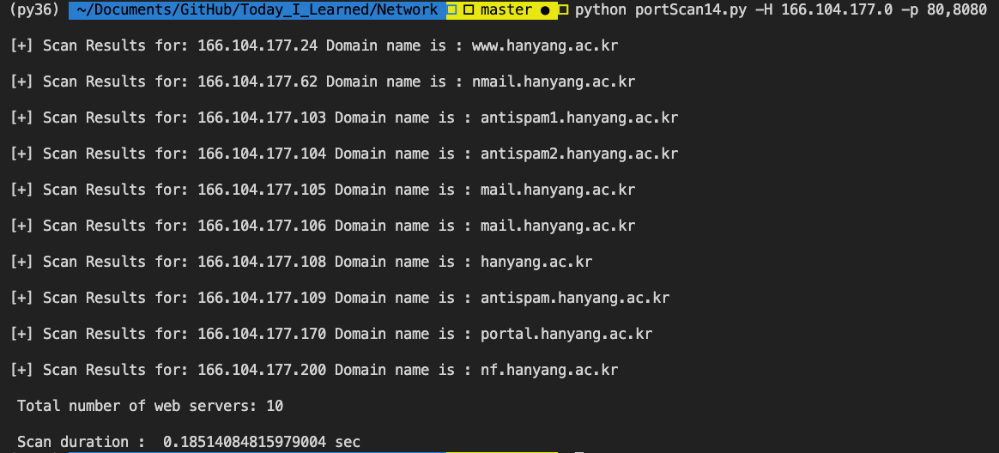
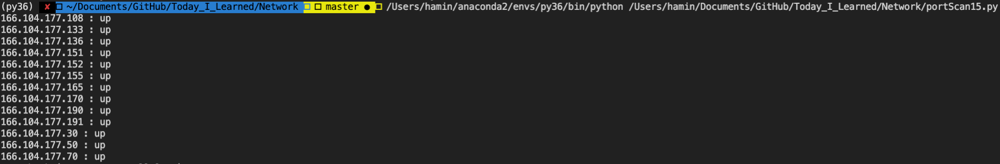
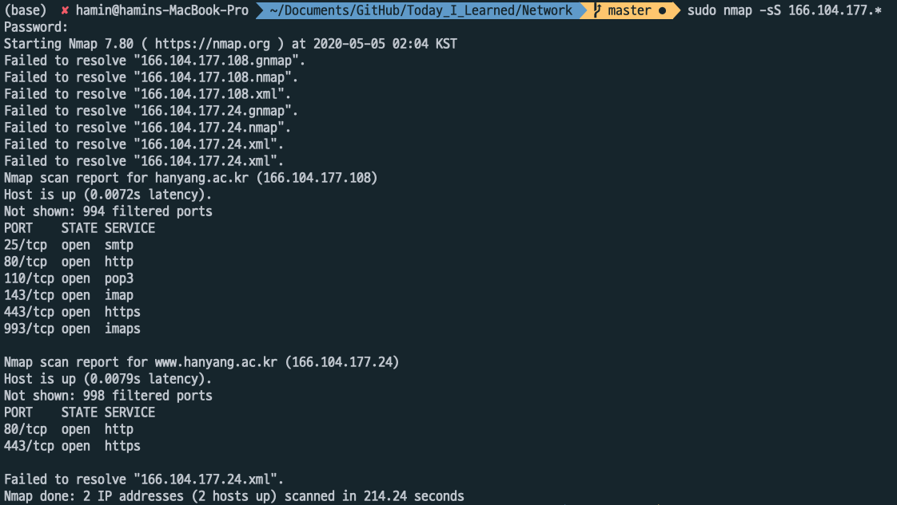
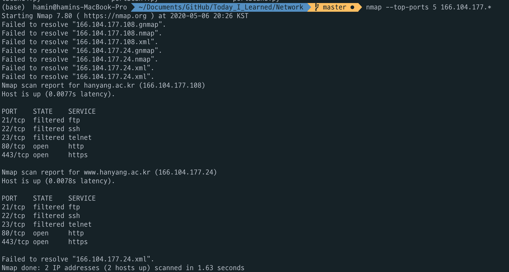

# Assignment 2.1

## Department of Information System 2017029134 Hamin Lee.

### 1. Source code for Task-1

~~~python
import optparse
from threading import *
from socket import *
import ipaddress
import time

screenLock = Semaphore(value=1)
cnt = 0

def printResult():
    print('\n Total number of web servers: ' + str(cnt))
    print('\n Scan duration : ', time.time() - start, 'sec')

def connScan(tgtHost, tgtPort):
    try:
        connSkt = socket(AF_INET, SOCK_STREAM)
        connSkt.connect((tgtHost, tgtPort))
        connSkt.send('Hi Hanyang\r\n')
        results = connSkt.recv(100)
        print('[+] %d/tcp open' % tgtPort)
        result = str('[+] %d/tcp open' % tgtPort)
        return result
    except:
        result = str('[-] %d/tcp closed' % tgtPort)
        return result
    finally:
        connSkt.close()

def portScan(tgtHost, tgtPorts):
    global cnt
    try:
        tgtHost = str(tgtHost)
        tgtIP = gethostbyname(tgtHost)
    except:
        print("[-] Cannot resolve '%s' : Unknown host" %tgtHost)
        return
    
    try:    
        tgtName = gethostbyaddr(tgtIP)
        cnt += 1
        screenLock.acquire()
        print('\n[+] Scan Results for: ' + tgtIP + " Domain name is : " + tgtName[0])
        # for tgtPort in tgtPorts:
        #     result = connScan(tgtHost, int(tgtPort))
        #     print(result)
    except:
        return
    finally:
        screenLock.release()
    
def main():
    parser = optparse.OptionParser('usage %prog -H <target host> -p <target port>')
    parser.add_option('-H', dest = 'tgtHost', type = 'string', help = 'specify target host')
    parser.add_option('-p', dest = 'tgtPort', type = 'string', help = 'specify target port[s] separated by comma')

    (options, args) = parser.parse_args()

    if (options.tgtHost == None) | (options.tgtPort == None):
        print (parser.usage)
        exit(0)
    else:
        tgtHost = options.tgtHost
        if tgtHost.endswith('.0'):
            hosts = ipaddress.ip_network(tgtHost+'/24')
        else:
            hosts = [tgtHost]

        if '-' in str(options.tgtPort):
            tgtPorts = options.tgtPort.split('-')
            tgtPorts = range(int(tgtPorts[0]),int(tgtPorts[1]))
        else:
            tgtPorts = str(options.tgtPort).split(',')

        for tgtHost in hosts:
            setdefaulttimeout(1)
            # 스레드 생성
            t = Thread(target=portScan, args=(tgtHost, tgtPorts))
            t.start()
        
        t.join()    # 스레드가 종료될 때까지 기다림
        printResult()
        
if __name__ == '__main__':
    start = time.time() # 시작 시간 설정
    main()
~~~

### 2. Output of program

- output of Task-1
  

- Script of Task-2 (import nmap and scan hosts and ports)

~~~python
import nmap
import time

def main():
    nm = nmap.PortScanner(nmap_search_path=('./venv/lib/python3.7/site-packages','nmap', '/usr/bin/nmap', '/usr/local/bin/nmap', '/sw/bin/nmap', '/opt/local/bin/nmap')) 
    nm.scan(hosts='166.104.177.0/24', arguments='-n -sP')   # 스캔할 호스트 및 argument 설정.
    hosts_list = [(x, nm[x]['status']['state'])
                for x in nm.all_hosts()]

    for host, status in hosts_list:
        print(host + ' : ' + status)

    print('\n Total number of web servers: ' + str(len(hosts_list)))
    print('\n Scan duration : ', time.time() - start, 'sec')

if __name__ == '__main__':
    start = time.time() # 시간 측정 시작
    main()
~~~

- output of Task-2 script

- output of Task-2 (Use nmap in terminal)

### 3. Explain my program and difficulties I had.

My program is started with excecute the program by command like 
"python portScan.py -H 166.104.177.0 -p 80,8080"
That means user want to scan 80 and 8080 port in ip address of 166.104.177.1 ~ 255.
When command like above is executed, main function exchane .0 to /24. So the target host address becomes 166.104.177.0/24. And split the ports by comma. Splitted ports are strigified and are inputted into the variable tgtPorts.
And for each target host, thread that targetting portScan function is created and started.

The portScan function can scan the target host by each target port. If it cannot find (server is down) the host name, it print "Unknown host'. And if it find (server is up) the target host, it print scan result. 

In order to count the open servers, global variable cnt is used. It is increased when thread find the open server.

I also used the semaphore inorder to each thread print only when it has a turn. After print the result, thread release the screenLock.

The connScan function scan open port. It use socket to check target port is open or not. If socket is connected, the port is opend, if it is not, the port is closed.

I also count the scan duration. Before the main function is executed, timer is started. And aftert the all thread is terminated (thread.join()), the timer print the scan duration.

My first difficulty was hanyang server ignore the ping. So I used the socket programming. And also socket connection is sometimes failed, but sometimes succeeded for same ip and same port. At that moment I also can't enter to hanyang webpage(166.104.177.24). But other web pages are availabe to enter. So I chage my Ip address (use another Wifi), then I can use socket connection. Additionally I did stupid mistake. At first, I can't import nmap. Later I realized that I have nmap.py file that I maded is in the same directory of my port scan source. After chage the name of nmap.py, then I can import nmap.

If you go to https://hamin7.github.io/2020/05/04/nmap2/ , you can see detailed development process.